# 臥龍傳 remake

把 NEO･GETEN《臥龍傳－三國制霸之計》（1994 日文 PC-98 版 ／ 1995 松崗 DOS/V 繁中版）
完整逆向，在 Go / Ebiten 上重寫引擎，保存松崗繁中版原文並以日文原版對照校訂。

定位是文化資產保存。**不散布原版執行檔、資料檔、美術或音樂**——
公開產出只有引擎程式碼與校訂紀錄，玩家自備合法原版。

| | |
|---|---|
| 原名 | 臥竜伝 三国制覇の計 |
| 開發／原發行 | NEO･GETEN（ホクショー） |
| 日文版 | 1994，PC-9801 |
| 繁中版 | 松崗，1995，DOS/V |
| 類型 | **即時制**戰略。玩家扮演軍師，不是君主 |
| 規模 | **每個劇本武將 127 人**、據點 192 個（「146 人」是社群說法，一手資料不支持） |
| 劇本 | 呂布歸天、赤壁之戰、蜀地偏安、劉禪即位 |

## 現在做到哪裡

**核心規則與可玩垂直切片已接通；完整交付集中在 `dist-all/`（三平台桌面包、Linux AppImage、Android APK、推廣片）。目前是一致的 `wolong-remake-20260828` 批次（[`docs/release/10`](docs/release/10-full-20260828.md)），**四個遊戲包連 APK 都各帶 32 個 ogg**。Windows／macOS 原生 GUI 與 Android 的實機驗收仍待完成。**

⭐ **靜態反組譯收斂**：739 支函式每一支都有 `docs/re/` 筆記
（[`docs/re/21`](docs/re/21-function-census.md)）。那代表「每一支都有人寫過」，
不代表全部讀懂——缺口以各文件的「未解」表與
[`docs/re/43`](docs/re/43-open-questions.md) 為準。

⭐ **同狀態逐區對拍**：拿原版存檔開同一個局面逐區比像素。主畫面五區逐像素相同；
**野戰九區裡七區逐像素相同、戰場區 0.05%＝原版錄影裡的滑鼠游標**
（含**單挑開場**的台詞與版面，[`docs/playtest/43`](docs/playtest/43-field-battle-parity.md)）；
**五張清單視窗（武將／編成候選／軍團／勢力／交戰目標）、財政、數值輸入器
全部 0 px**，據點情報卡與據點清單版面逐格一致
（[`docs/playtest/42`](docs/playtest/42-window-parity.md)）。
攻城那一組的側欄四區也是 0 px，戰場區 0.86%——那 0.86% 是兩邊開的**不是同一場**，
不是畫錯（[`docs/playtest/51`](docs/playtest/51-siege-deadlock.md)）。
⭐ **對拍會過期，所以要重跑**：2026-08-27 把記錄過的四組全部重量一次，
攻城那一組挖出兩個真的缺口（城壁一撞就垮、門強度量表少畫外框），
修好之後戰場區從 4.32% 回到 0.86%（[`docs/playtest/49`](docs/playtest/49-parity-retest-20260827.md)）。
2026-09-02 兵的戰力接回統率力之後再重跑一次，**沒有回歸**——野戰七區依舊 0 px、
戰場區 95 px，攻城前兩個取樣點同值；這一輪挖到的兩個缺陷都在**驗收路徑**
（`-shot-frames` 推不動戰場、驗收捷徑推完才武裝開場喊話），
不在規則層（[`docs/playtest/58`](docs/playtest/58-parity-retest-20260902.md)）。
兩個缺陷修完之後補了 `-shot-when`／`-auto-messages` 兩個驗收旗標
（[`docs/spec/118`](docs/spec/118-shot-when-condition.md)）：取樣點寫得出局面條件、
條件不成立就失敗而不是截一張別的局面。⭐ **野戰的自然流程與 `-open-battle` 捷徑
截出的畫面九區逐像素相同**——捷徑第一次有了正對照
（[`docs/playtest/59`](docs/playtest/59-shot-when-natural-flow.md)）。

⭐ **單挑子系統全還原**（[`docs/spec/80`](docs/spec/80-duel-opening.md)）：
挑戰／拒戰／應戰、回合互嗆、對打段、決著，含應戰全程的實機錄影參照；
24 組 × 8 變體台詞逐組抽驗、九句實機反查零反例
（[`docs/re/75`](docs/re/75-duel-talk-audit.md)）。

狀態的單一真相來源是 [`CONTEXT.md`](CONTEXT.md)。

| 已完成 | 進行中 | 尚未完成 |
|---|---|---|
| 素材格式、存檔改寫、時間模型、經濟、災害、中文顯示、外交、軍團結構、一覽表、進言與說得、行軍與戰術戰鬥垂直切片、四槽存檔 overlay、敵方 AI 正常遭遇接點、事件 2–10 的既定 fixture／時鐘驗收、**勝負條件**（存活勢力數減到 1）、**音樂與音效**（OPL3 合成 → ogg，含場景對應）、**原版／remake 同狀態逐區對拍**（主畫面五區逐像素相同；野戰九區裡七區 0 px、攻城側欄四區 0 px；五張清單視窗／財政／數值器 0 px）、**單挑子系統**（含台詞逐組抽驗）、**結局過場**（十二幕 ＋ 逐字結尾文字，**節拍照原版 3 分 21 秒**）、**倒地動畫**、縮小地圖點擊捲鏡頭與勢力一覽視窗、戰場的右鍵熱區層、**新遊戲的四層流程**（劇本 → 勢力清單 → 君主卡，[`docs/spec/79`](docs/spec/79-new-game-faction-list.md)）、**財政的數值輸入器**、Linux AppImage、三平台候選封裝 ＋ Android APK、推廣片 | Windows／macOS 原生 GUI short smoke、**Android 實機驗收**（模擬器已驗指紋與畫面，見 [`docs/mobile/android-plan.md`](docs/mobile/android-plan.md)）、完整戰術／長程遊戲抽樣 | `ICONGRF` 段 1 的 UI 語意、原版事件 10 的自然 producer 等未解研究項 |

### 與原版差多少（2026-08-28）

先講量法的邊界，數字才有意義：**逐像素對拍做過十個局面**——開局主畫面、
三個視窗開著、系統選單開著、一場攻城戰、野戰開場（單挑挑戰幀）、
五張清單視窗、財政（含數值輸入器）、編成視窗、據點情報卡與據點清單。
其餘畫面是「版面照機器碼重做並目視驗收」，沒有逐像素數字。
**「照著機器碼做」與「量過等於原版」不是同一件事。**

⚠ **攻城那一組的取樣點要用局面條件描述，不能寫死步數。** 「第 61 步」在
2026-08-18 是「攻方正在攻門」那一刻，規則層改過之後同一個步數落在
「攻方剛要出發」——**數字會安靜地爛掉，而且沒有任何測試會紅**
（[`docs/spec/91`](docs/spec/91-tactical-parity.md) §6）。

| 層 | 量到的差距 | 出處 |
|---|---|---|
| 開局主畫面（5 區）| **0 px**（256,000 px 一個不差）| [`playtest/37`](docs/playtest/37-main-screen-parity.md) |
| 三個視窗開著（命令列／自勢力／縮小地圖）| **0 px** | [`playtest/38`](docs/playtest/38-window-parity.md) |
| 系統選單開著（選單本身 ＋ 4 區）| **0 px** | [`playtest/39`](docs/playtest/39-system-window-parity.md) |
| 攻城戰（9 區）| 側欄四區 **0 px**（標題／自軍將旗／兩塊純美術）、底列 2 px、對方將旗 14 px；`field` **0.86%**、小地圖 1.64%。那 0.86% 的成因是兩邊開的**不是同一場**，不是畫錯 | [`playtest/51`](docs/playtest/51-siege-deadlock.md) §1 |
| ↳ 這一組怎麼從 0.17% 變成 4.32% 再回到 0.86% | 2026-08-18 量到 0.17%；2026-08-27 重跑 4.32%，拆開之後是**兩個真的缺口**（城壁一撞就垮、門強度量表少畫外框）加上取樣點被 `spec/59`／`spec/80` 作廢 | [`playtest/49`](docs/playtest/49-parity-retest-20260827.md) §3 |
| ↳ 規則層的時間序列對拍 | **攻城計時器的速率**與**進城的機制**都對上；殘差是破牆花多久，而原版那一側的體力同時被計時器與挨打扣，單張畫面回推不出幀 | [`playtest/52`](docs/playtest/52-siege-timeseries-parity.md) |
| 野戰（9 區，含單挑開場對白）| 7 區 **0 px**；`field` **0.05%**＝95 px 全是原版錄影裡的滑鼠游標、小地圖 0.18%＝時刻 | [`playtest/43`](docs/playtest/43-field-battle-parity.md) |
| 清單視窗五張（武將／編成候選／軍團／勢力／交戰目標）| **各 0 px** | [`playtest/42`](docs/playtest/42-window-parity.md) §4 |
| 財政／數值輸入器 | **0 px**；編成視窗 0.20%＝原版錄影的游標 | 同上 §4.1 |
| 據點情報卡／據點清單 | 版面與數字格網**逐格一致**；剩餘差＝兩邊擷取日期差八天的數值漂移（每日成長的欄位）| 同上 §4.4–4.5 |
| 文字 | 1,022 則全保存、byte-for-byte round-trip；**單行超寬 0 行**；60 筆校訂可重跑 | [`playtest/32`](docs/playtest/32-talk-layout-fit.md) |
| 結局文字 | 200 字 10 行，從 `D7END.EXE` 取出（不在 `TALK.DAT` 裡）| [`re/70`](docs/re/70-d7end-ending-player.md) |
| 音訊 | 會出聲、場景對應已解、與原版錄音比對過；**音色的諧波結構沒量化比對** | [`spec/29`](docs/spec/29-audio.md) |
| 規則規格 | **117 份**（不含索引與 `TEMPLATE.md`）：**116 CONFORMED**／1 READY（`83-initial-strategy-pass`）／0 DRAFT | [`spec/00`](docs/spec/00-index.md) |
| 反組譯 | 739/739 支有筆記；`docs/re/` 自己標成未解的有 **172 列**（每寫一份新的反組譯筆記就帶進自己的未解表）| [`re/21`](docs/re/21-function-census.md)、[`re/43`](docs/re/43-open-questions.md) |
| 全專案的未解 | **558 列**（另有 6 列是 DOS／BIOS 平台層與編譯器 runtime，不計入）。⚠ **這個數字比較接近「文件有多少份」**——558 列分布在 228 份文件、平均每份 2.4 列，而每寫一份新文件就帶進約三列自己的未解 | [`re/43`](docs/re/43-open-questions.md) §0 |

#### 那 558 列對 remake 代表什麼

**它不衡量「離做完還有多遠」。** 最直接的證據是這兩個數字同時成立：
未解 558 列，而開局主畫面 **256,000 個像素與原版一個不差**。
兩者量的是不同的軸——未解列數量的是「**原版還有多少我們解釋不了**」，
parity 量的是「**我們做出來的東西對不對**」。

⭐ **這個數字比較接近「文件有多少份」。** 分類是照來源目錄機械算的，
不是逐條判斷過的優先序；每寫一份新文件就帶進約三列自己的未解，
所以「解出新東西 → 寫一份文件 → 總數上升」是常態，不是退步。
反過來也一樣：**變小不自動等於進度**——2026-08-21 的稽核把它從 570 降到 431，
那 −139 沒有一列是靠解出新東西減掉的。
逐類的列數、讀法與那次稽核的組成在
[`re/43`](docs/re/43-open-questions.md) §0–§1 與 [`WORKLIST.md`](WORKLIST.md)。

**要看進度看別的**：規格的 CONFORMED 份數（82/84）、
逐像素對拍的數字（主畫面 0 px）、[`re/21`](docs/re/21-function-census.md) 的覆蓋地圖。
這一份回答「還有什麼沒解」，**不回答「還剩多少」**。

**真正擋著發行的只有四件事**，而且**同一件事會被數很多列**——
`re/43` 是把各文件的未解表集中起來，一個事實寫在四份文件裡就佔四列：

| 擋什麼 | 為什麼卡住 |
|---|---|
| Windows／macOS 原生 GUI 實機驗收 | ⛔ 沒有那兩個平台的機器。交叉建置的產物只驗了檔頭；完整版「解開就能跑」在那兩個 OS 上也沒實跑過 |
| Android 實機驗收 ＋ release signing | ⛔ 沒有裝置；keystore 怎麼保管還沒決定，目前出的是 debug 簽章 |
| 16 KB page size 的實測 | `.so` 的 LOAD 段已是 `0x4000`，但沒有那種裝置或 AVD 實際載過 |
| **沒有音效裝置時遊戲會掛** | 完整版會自己找到音檔並開音訊，而 Ebiten 沒有可查詢的音訊 API——一般啟動遇到沒有音效卡的機器就結束（[`docs/spec/75`](docs/spec/75-bundled-audio.md) §5）。**它還有一個下游**：無頭驗收拍不到啟動殼層（[`docs/release/06`](docs/release/06-appimage-20260824.md) §4.1）|

其餘的十幾列是設計取捨（手機小卡放哪些欄位、戰場要不要能縮放）與
流程小事（`verification/` 截圖不進管線），不擋發行。

⭐ **另有 4 列是 DOS／BIOS 平台層，不計入總數**（`INT 61h` 的音效 TSR
服務號、VRAM 寫入迴圈、`YNFONT.EXE` 怎麼畫字）。remake 跑在 Go／Ebiten 上，
**不跟 DOS TSR 講話**——知道 `ah=4` 是什麼不會改變任何一行 Go。

### 自評分數（2026-08-28）

每一軸的分數都綁著上面的量測，扣分理由寫明；
**沒量過的部分不計入加分**。

| 軸 | 分數 | 依據 | 扣分在哪 |
|---|---:|---|---|
| 資料格式保存（M1）| **90%** | 全部檔種有 Go 解碼器＋測試，`TALK.DAT`／存檔 byte-for-byte round-trip，過場、音訊、地圖族全解 | `ICONGRF` 段 1 的 UI 語意；`formats` 還有 33 列登記在案的細節 |
| 文字保存與校訂（M2／M7）| **92%** | 1,022 則全保存、60 筆校訂可重跑、兩版 1,022 則逐句對照讀完、排版 parity 全量 0 超寬；**四個語系端到端可玩且能在遊戲中切換**（`-lang` 或 F9／啟動殼層／手機系統面板，[`docs/spec/86`](docs/spec/86-runtime-language-switch.md)）：日文直接取 PC-98 原版（含 34 個外字靠兩版對齊反推）、簡體 OpenCC 機轉＋逐則校訂、英文 1,022 則逐則英譯、343 個人名地名三語對照（[`docs/spec/84`](docs/spec/84-multilanguage.md)）；半形語系的版面另排一套（清單四家 [`85`](docs/spec/85-latin-list-layout.md)、其餘畫面 [`87`](docs/spec/87-latin-screen-layout.md)）| 缺兩版並排的畫面對照這最後一格；簡體與英文已第二人覆核（簡體 23 則校訂、英文無誤，[`docs/spec/84`](docs/spec/84-multilanguage.md) §6），但沒有母語者看過 |
| 反組譯理解（M3）| **70%** | 739/739 支函式都有筆記、四個分級收斂；單挑這種末端子系統都能讀到逐 tick | 「有筆記」≠「讀懂」——`docs/re/` 自己登記的未解還有 182 列 |
| 規則還原（M4／M5）| **83%** | 政略／行軍／戰術／外交／說服／單挑都以機器碼出處實作，規則層 5 年長跑不變量成立；2026-08-25 把上一輪列的七條缺口全數收掉：災害傷害量（[`docs/spec/81`](docs/spec/81-disaster-quantities.md)）、應戰挑選＝評價的去向（[`docs/spec/82`](docs/spec/82-defender-selection.md)）、信賴度增減全帳本與初始值 `0xFF`（實機定案，[`docs/playtest/44`](docs/playtest/44-trust-init-oracle.md)）、行軍中間節點（查證後**缺口不存在**）、事件 10 訊息（端到端已通）；**AI 長程對照完成**：原版半年四大擴張事件與 remake 方向幅度一致、呂布／曹操終值逐城相同；孫策攻劉繇的分歧定案為 `sub_12BD9` 缺新遊戲開局呼叫點，已補（[`docs/spec/83`](docs/spec/83-initial-strategy-pass.md)、[`docs/playtest/45`](docs/playtest/45-ai-longrun-comparison.md)）| 剩：對照只有一次原版跑、孫策擴張節奏比原版快（戰鬥節奏層）、`docs/re/` 登記的未解細項 |
| 畫面一致（M6）| **90%** | 十個局面逐像素：主畫面／系統選單／三視窗／五張清單／財政全 0 px，野戰 0.05%（2026-08-27 重驗仍成立）；攻城側欄四區 0 px、戰場區 0.86%，而那 0.86% 是兩邊開的不是同一場 | 分數只涵蓋量過的局面——沒量過的畫面仍是「照機器碼做＋目視」 |
| 音訊 | **72%** | 格式與場景對應全從機器碼讀出、OPL3 合成與原版錄音人耳比對過；選曲規則抽成一份給桌面與手機共用，**Android 的完整版也內嵌 32 個 ogg**（[`docs/spec/92`](docs/spec/92-android-music.md)）| 諧波結構沒有量化比對；無音效裝置會掛的問題還在；手機端沒有實機聽過 |
| 發行與平台（M8／M9）| **50%** | 四平台包出得來且批次一致、Linux 有 GUI smoke、Android 模擬器指紋與桌面相同、發行閘擋原版資產 | Windows／macOS／Android 都沒有實機驗收；Android 只有 debug 簽章 |
| **整體** | **81%** | 量過的地方幾乎都對到 0 px、規則層可玩且穩定、保存目標（格式＋文字）接近完備、AI 長程行為首輪對照通過 | 拉低整體的是平台實機驗收（外部條件：缺機器）、孫策渡江等長程分歧與未解細項 |

讀法同上一節：**分數對應「量過的部分對不對」**，不是進度條。
70% 那兩軸的天花板是「未解列數收斂」，50% 那一軸的天花板是實機——
後者不是工作量，是缺裝置。
它們仍然列在 [`re/43`](docs/re/43-open-questions.md) §9，只是分開數。

#### 還沒對過的

| 項目 | 現況 |
|---|---|
| 一覽表、編成、進言、財政等視窗 | 版面照機器碼重做並目視驗收過，**沒有逐像素數字** |
| 野戰打起來之後的戰場 | **開戰第一拍已經對過**（九區裡七區 0 px、`field` 0.05%，[`playtest/43`](docs/playtest/43-field-battle-parity.md)）。沒對過的是**開戰之後**——野戰的地形是從大地圖即時長出來的，兩邊要走到同一個 tick 比攻城更難湊 |
| 跑完一整局 | 沒對過。目前最長的是規則層長跑，不是畫面 |
| 日文原版逐句對照 | 1,022 則**兩批逐句讀完**、60 筆校訂已定案、校訂後的畫面抽樣也做了（[`playtest/41`](docs/playtest/41-m7-corrected-text-on-screen.md)）。**沒做的是兩版並排的畫面對照** |

#### 刻意不一樣的（remake 差異）

這些是**有意的**，不是缺口，各自在規格裡標記：

| 差異 | 為什麼 |
|---|---|
| 固定時間基準 | 原版沒有固定 tick rate，速度上限跟著機器跑（說明書 3.5）；照抄會得到一個在現代機器上快到不能玩的遊戲（[`spec/34`](docs/spec/34-speed-steps.md)）|
| 鍵盤操作 | 原版是純滑鼠；remake 保留滑鼠熱區，另外加鍵盤（[`spec/26`](docs/spec/26-yes-no-dialog.md)、[`27`](docs/spec/27-lord-select-window.md)）|
| 遷都與勢力選擇的視窗 | 原版在地圖上選點／有專屬視窗，remake 先用簡化版（[`spec/49`](docs/spec/49-advise-relocate-and-sortie.md)、[`35`](docs/spec/35-strategy-minimap.md)）|
| 存檔多幾個欄位 | 原版沒有的欄位另外存，**未解區域一個 byte 都不動**（[`spec/20`](docs/spec/20-save-format.md)）|
| 結局第一幕不捲動 | 原版是逐列捲上來，remake 用整張淡入（[`spec/67`](docs/spec/67-ending-playback.md) §3）|
| 訊息模板 | 原版是「片段 ＋ 控制位元組」，remake 用具名參數；原版機制仍完整記錄在 `docs/formats/` |

### 候選封裝與推廣片

- 完整交付根目錄：[`dist-all`](dist-all)，包含**四平台完整包**（Linux／Windows／macOS／Android）、Linux AppImage、**一支合成推廣片**、雜湊與 GUI smoke 截圖。目前是一致的 `wolong-remake-20260902` 批次（[`docs/release/12`](docs/release/12-full-20260902.md)）。⚠ **「全平台重建」是兩支腳本**：`tools/release_all.sh` 不會重建 APK（Android 是另一條管線，檔名取的是 APK 自己的 mtime），要一起換得再跑 `WOLONG_BUNDLE_DATA=1 tools/android_build.sh`。
- ⛔ **本機這一批內含原版資產，不可外流**（`dist-all/DO-NOT-DISTRIBUTE.md`）。四個平台的包裡都有原版資料與倚天字型，解開或裝上去就能玩。要一份可散布的：`WOLONG_BUNDLE_DATA=0 tools/release_all.sh <YYYYMMDD>`，出來的包不含任何原版資產（[`docs/spec/72`](docs/spec/72-bundled-game-data.md)）。
- Linux AppImage：[`wolong-remake-linux-amd64-20260902.AppImage`](dist-all/packages/wolong-remake-linux-amd64-20260902.AppImage)。已通過 Linux／Xvfb 固定種子 smoke（含結局過場，且**不帶任何資料旗標**就跑得起來），並與原版逐關卡對拍過（[`docs/release/12`](docs/release/12-full-20260902.md) §4）。**公開散布的版本仍要由玩家提供合法 DOS/V 資料與中文字型。**
- 三平台候選包與 SHA-256：[`dist-all/packages`](dist-all/packages)。Windows／macOS 是交叉建置候選，尚未在目標作業系統完成原生 GUI runtime 驗收。
- 推廣片：[`wolong-remake-promo.mp4`](dist-all/promo/wolong-remake-promo.mp4)，176 秒，**發行目錄裡唯一的一支**。三段接成一支：主預告（大地圖、野戰、攻城是逐幀錄的實跑畫面，另有四語系切換與原版並排）、原版實機對照（原版側是自己跑的受控 DOSBox-X 實機遊玩）、手機版。**全片鋪原版曲子**——remake 自己的 OPL3 從玩家自備的 `BGM.DAT` 算出來的，不是取樣原版錄音；那條音軌只用在推廣片，不進任何遊戲包（[`docs/promo/combined.md`](docs/promo/combined.md)）。
- 三支素材片與兩支研究用對照片留在 `dist/promo/`，製作紀錄與重錄命令都還在（[`docs/promo/README.md`](docs/promo/README.md)），**只是不進發行**。原版並排段與 DOS/V 對照段都不是同日期／同輸入的逐像素 parity，片上已標明。
- Android：見下一節。APK 與另外三個平台並列在 [`dist-all/packages`](dist-all/packages)，**仍不宣稱 Android release**（只有 debug 簽章、沒有實機驗收）。完整版 APK 內含 32 個原版 ogg，遊戲內走的是與桌面同一份 `internal/ui/sound`（[`docs/promo/android.md`](docs/promo/android.md)）。

`wlgame` 的持久化要明確指定可寫路徑，例如：

```text
tools/shot.sh /tmp/wlgame-save.png KEYS=4,s,Return \
  -orig workplace/orig/dosv -save-file /out/SAVE.DAT
```

遊戲中先開「系統」視窗，按 `S` 儲存或 `L` 讀取，再以方向鍵／`1`–`4` 選槽。
`-save-file` 是 overlay；原始 `SINARIO.DAT` 只讀，且儲存會先寫同目錄暫存檔再改名。

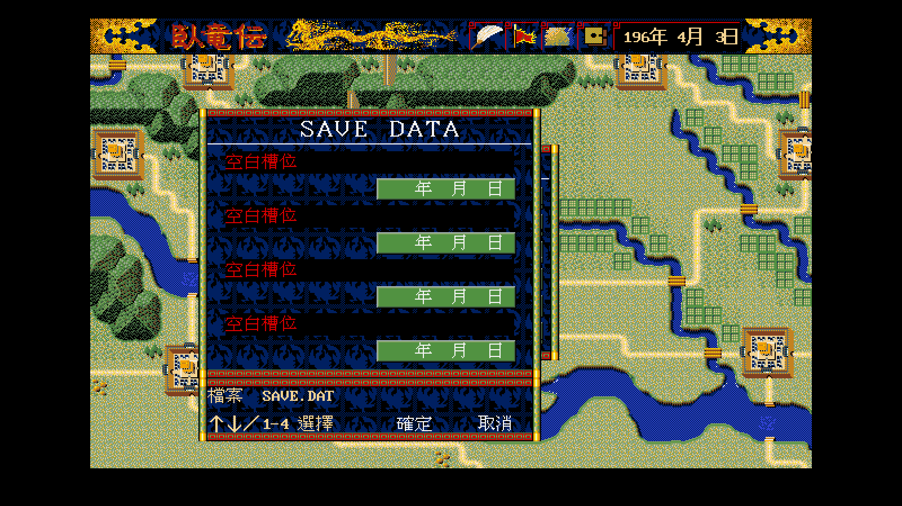

### 已解出的格式

| 格式 | 狀態 | 文件 |
|---|---|---|
| `TALK.DAT` 訊息表 | READY，兩版 byte-for-byte round-trip | [`docs/formats/01`](docs/formats/01-talk-dat.md) |
| `.BRG` 調色盤 | READY | [`docs/formats/02`](docs/formats/02-brg-palette.md) |
| `*GRF.DAT` 圖庫 | READY（`ICONGRF` 剩兩段） | [`docs/formats/03`](docs/formats/03-grf-images.md) |
| `MMAP.MDL` 地形圖塊 | READY，256 塊 16×16 | [`docs/formats/05`](docs/formats/05-mmap-worldmap.md) |
| `MMAP.MAP` 世界地圖 | READY，RLE → 384×256 格 | [`docs/formats/06`](docs/formats/06-mmap-rle.md) |
| `.MAP`/`.SCH` 容器 | 索引層 READY | [`docs/formats/04`](docs/formats/04-map-sch-container.md) |
| `BATTLE.*` 戰場 | 分段結構、子圖塊與人物圖形的像素格式都已解 | [`docs/formats/07`](docs/formats/07-battle.md) |
| `*BGM.DAT` 音樂 | 事件編碼、音色、音量、速度全解；**音源是 OPL3** | [`docs/re/56`](docs/re/56-bgm-track-events.md)、[`57`](docs/re/57-opl3-register-map.md) |
| `SOUND.DAT` 音效 | 19 筆 × 16 B，含接續鏈 | [`docs/re/57`](docs/re/57-opl3-register-map.md) §6 |
| `ICONGRF` 段 3 | 視窗外框圖塊（8×8） | [`docs/formats/03`](docs/formats/03-grf-images.md) |

### 引擎已經跑得出可玩的戰略／戰術垂直切片

`cmd/wlgame` 從真實的 `SINARIO.DAT` 載入劇本，用反組譯出來的規則驅動：

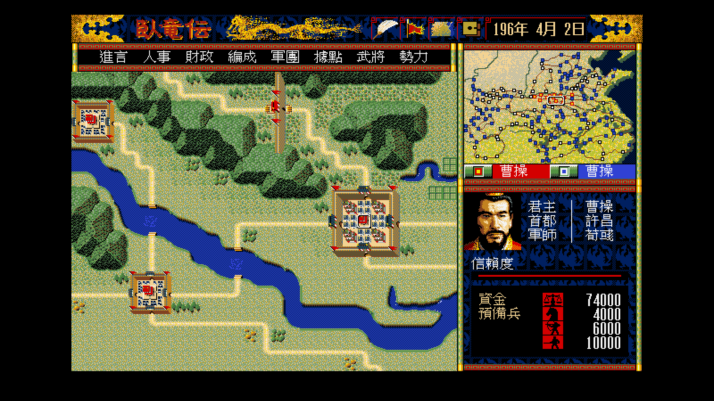

版面照 DOS/V 自然畫面重做：**最上方 32 px 是原版的橫幅美術**（`ICONGRF` 段 0，
日期填進它印好的「年 月 日」欄位）。**大地圖鋪滿橫幅以下的整片畫面**
（640×368 ＝ 40×23 格），命令列、縮小地圖、自勢力情報、系統四個視窗
疊在它上面，橫幅右側五格 32×32 是它們的開關（左鍵開、右鍵關）。
開新遊戲時四個全關——這張圖是把三個點開之後的樣子。
使用者提供的 [自然遊戲錄製](https://www.youtube.com/watch?v=af6xqcicXoI) 作為
DOS/V 畫面參考；視窗外框仍是原版美術（`ICONGRF` 段 3；數值面板的 96×64 內框與
3×6 靜態 glyph 已直接解碼），君主頭像取自 `KAOGRF`。

> 版面的三個數字與 16 px 格位先由既有原始素材／說明書固定，再以使用者影片的
> 478×360 自然畫面交叉核對；影片對拍是結構／色彩／位置 oracle，不把壓縮後像素
> 冒充無損同狀態 diff。

畫面上的每個數字都是原版資料算出來的：曹操的 14 個據點、74,000 起始資金、
騎馬 400／弓兵 600／步兵 1000 的預備兵、稅率 18%。
時鐘照原版的五層單位跑（子刻 → 時 → 日 → 月 → 年，**一天 216 tick**），
月結會依 `Σ(生產力 ÷ 距離除數) × 稅率 ÷ 100` 入帳。
自然 smoke 截圖是遊戲內的 196 年 4 月 1 日。秋天的樣子見
`docs/images/wlgame-cht.png`（劇本 2，208 年 9 月）——**地表整片轉成金黃**。
四季調色盤直接吃時鐘算出的季節，而且是在 3／6／9／12 月的前 16 天**漸變**過去的，
那張正好落在 9 月的漸變區間裡。

### 開新遊戲照原版的四層

```
ＹＥＳ／ＮＯ → 劇本 → 勢力清單 → 君主卡
```

**每一層右鍵／ESC 退回上一層**（原版 `sub_11AC3` 的四個 `jb`，
[`docs/re/73`](docs/re/73-new-game-faction-list.md)）。
勢力清單是原版的一覽表引擎，五欄——君主／軍師／武將數／據點數／首都——
視窗與欄位 X 都照機器碼（[`docs/spec/79`](docs/spec/79-new-game-faction-list.md)）。

⭐ **背景是大地圖，鏡頭固定在 (170, 98) 格**（`sub_11A6E` 在進選單前先跑
`sub_1D615`／`sub_1D66A`）。**據點是空白的**——那一支只複製圖塊編號，
歸屬換圖塊與軍團疊圖都不在這條路上，所以畫的是 `MMAP.MAP` 的原始圖塊，
沒有勢力徽記。**那不是還沒畫完，是這一層本來就沒有歸屬可畫。**

⭐ **君主卡上沒有換勢力的熱區**，換勢力就是退回清單。這一點是靠讀
`sub_18E5A` 才確定的：它的 `sub al, 20h` 只認「確定」與「自定」兩個熱區，
其他位置一律回等待迴圈。remake 先前少了清單那一層，於是那一頁的滑鼠
沿用啟動殼層看不見的清單列——**滑鼠移過去就換君主，點下去就直接決定**。
使用者玩出來的，修法與正對照在 [`docs/spec/27`](docs/spec/27-lord-select-window.md) §2.1。

### 暫停規則是規格，不是 UI 細節

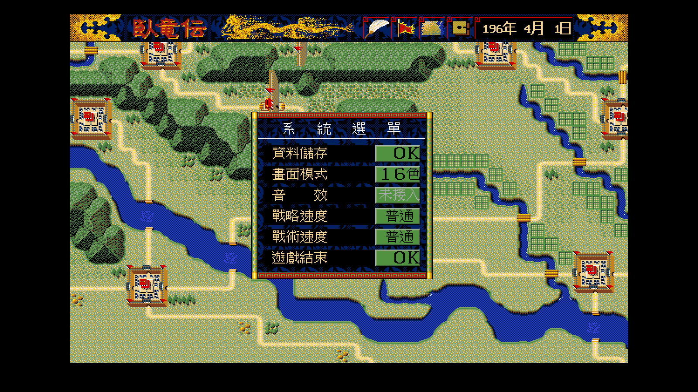

> 命令、自勢力情報、縮小マップの３つのウインドウ以外が表示されている状態では、
> **ゲームの時間が進みません**（日文原版說明書 3.1）

上圖開著 SYSTEM 視窗跑了相當於 89 天份的 tick，日期仍停在 196 年 4 月 1 日。
規則寫成一條式子而不是散在各視窗的開關程式碼裡：

```
時間推進 ⟺ 開啟中的視窗集合 ⊆ {命令, 自勢力情報, 縮小地圖}
```

### 進言與說得：玩家是軍師，指令要先過君主那一關

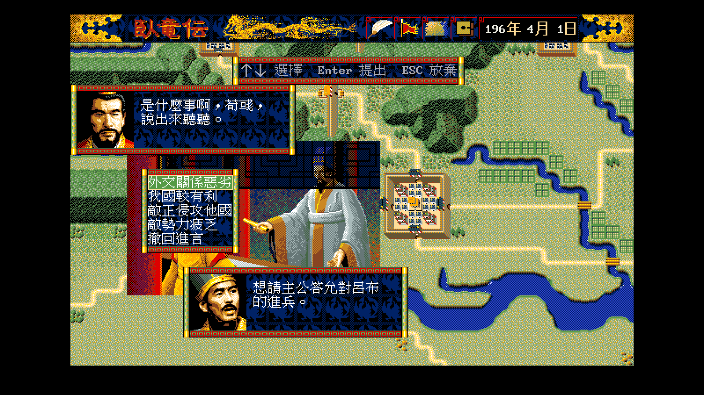

畫面上正好是說明書描述的那個兩難。曹操（好戰 14）對呂布提敵對，
五個理由裡**只有「我國有利」成立**——呂布沒在侵攻誰、資金不是負的、
沒在打我方，交友值也還沒差到門檻。而曹操要聽兩個理由才點頭。

這時的正解是**進言撤回**（信賴度不變），不是硬選一個不成立的理由
（信賴度會掉）。說明書 3.9 把這個取捨寫得很清楚：

> 状況に合うものを総て選択しても君主が納得しない場合は、
> **進言撤回でキャンセルする事が出来ます。この場合は信頼度は変化しません。**

判定全在 `internal/rules/persuasion`（23 條測試），
畫面只負責呈現。各指令四個理由的成立條件裡有兩個直接用已解出的資料：
**國力 ＝ 據點數**、**疲弊 ＝ 資金 < 0**。

### 軍團：編成 → 行軍 → 遭遇

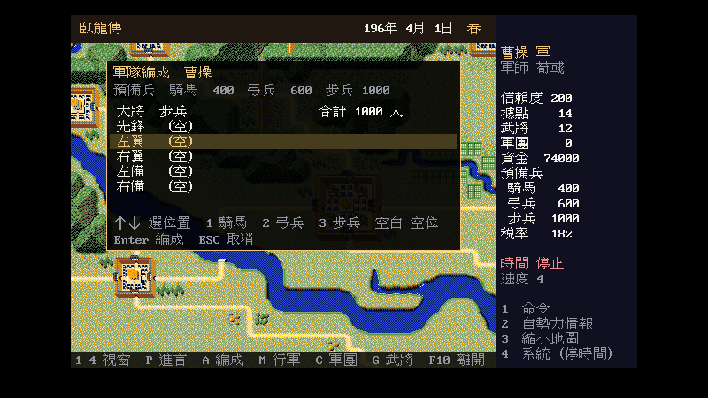

編成一個位置固定 1,000 人，兵從預備兵扣（說明書 5.5）。
上圖的曹操六個位置都湊得滿，總兵力 6,000——右側的預備兵數同步扣到
騎馬 0、弓兵 4,000、步兵 10,000。**畫面照實際數字長，不是擺樣子的**：
湊不出六槽時就只編得出幾槽。

**大將的位置一定要有兵**：原版的壞滅判定 `sub_1474A` 直接看第一槽是不是 0，
所以大將空著的軍團一編出來就會被判掉。這條在規則層擋，不是在畫面層擋。

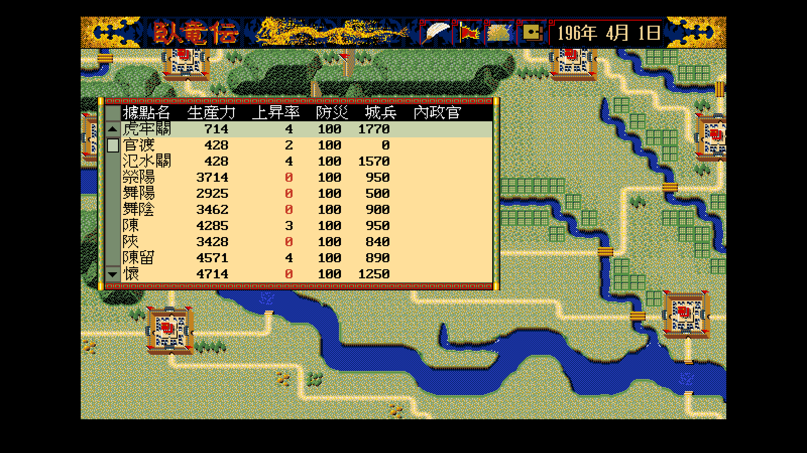

目的地一覽**預設照距離排序**——192 個據點按編號排的話，
玩家要翻半天才找得到隔壁那座城。距離用的是切比雪夫距離，
與月結收入衰減用的是同一種（`docs/re/07` §4）。

軍團走到敵方軍團所在的格子就打野戰，走進敵方據點就攻城；
城裡沒有軍團就打城兵。整條鏈跑在 `internal/state`，
勝負與傷亡在 `internal/rules/combat`（`docs/re/09`）。

敵方政略 AI 也已接到這條正常路徑：`sub_12C52` 的原始鄰接槽、
`sub_12EFB` 的宣戰三閘、`CS:6C4C` 六槽編成表與道路行軍都會在真實劇本中生效。
使用 `-seed 17` 只固定驗收亂數，正常按鍵即可重播「呂布 對 曹操／攻城／戰鬥指揮／委任」；
證據見 [`docs/playtest/08`](docs/playtest/08-wlgame-normal-strategy-path.md) 與
[`wlgame-ai-normal-encounter.png`](docs/images/wlgame-ai-normal-encounter.png)。

⚠ **判定順序與原版相反，而且是刻意的。** 原版先問野戰再問攻城，
但那建立在「**一個據點佔好幾格地圖**」上（圖塊值 `0xCE`–`0xDD` 一整段）：
攻方踏進的通常是據點的別格，那幾格沒有人，所以走攻城，再由 `sub_14C72`
用據點座標把守軍找出來。本專案的據點是一個點，照抄順序的話
攻城永遠走不到——**抄邏輯之前要先確認它依賴的資料結構也一樣**。

### 戰術戰鬥

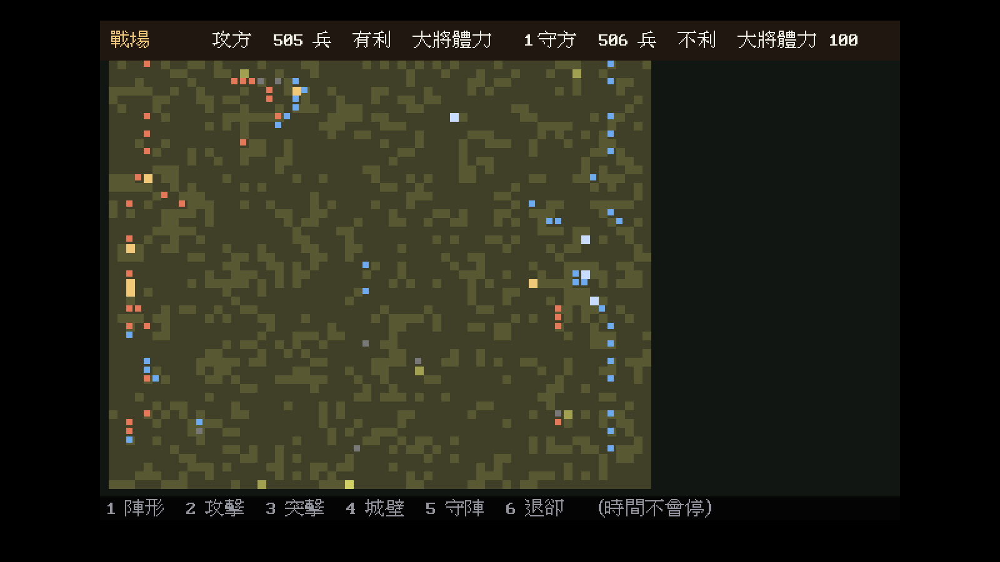

玩家的勢力捲進去就開戰場畫面，其餘自動判定——**這是原版的分派規則**
（`sub_14E5C`），連「打空城不進戰術畫面」那條例外都照抄。

畫面上：攻方暖色、守方冷色、**退卻中的兵畫成灰的**。橫幅是兩軍的兵數、
有利／不利、大將體力。底下六個指令的編號與原版一致，而且**沒有暫停鍵**——
說明書 4.1：「戦闘中は絶対に時間を止められません」。

規則層在 `internal/rules/tactical`，每一條都對得上反組譯（`docs/re/11`）：

| 規則 | 出處 |
|---|---|
| 64 × 64 × 7 的立體格，可站立層由地圖圖塊的堆疊決定 | `sub_1BA2E`／`sub_1BB6D` |
| 一側 48 個兵 ＝ 6 隊 × 8 人，其餘畫面外待機 | `sub_1A754` 的 1 + 7 迴圈 |
| 疲勞度：走到陣形位置補滿、攻擊時上限 40、移動每幀 −1 | `sub_1AA2C`／`sub_1AB7C` |
| 有利／不利：兩軍餘力兵數相減，**差距 ≤ 8 判普通** | `sub_1ADC8` |
| **騎馬與大將爬不上城牆** | `cmp [si+4], 12h / jbe` |
| **步兵挨箭只吃四分之一** | `cmp [bx+4], 36h / jz` |
| 箭往上飛減威力、往下落加威力 | `sub_1BAB7` |
| 大將不會陣亡、體力 < 50 全軍退卻 | `sub_1B97E`／`sub_1AE56` |
| 陣形表 16 種 × 48 組相對座標 | `sub_1AA2C` 查 `cs:0xCCE4` |
| 尋路：波前擴散 ＋ 回溯，**只在轉彎時記點**、上限 64 個 | `loc_1BD46` |
| 撞到人：敵人就打、**自己人就對調位置**（陣線靠互換穿透） | `loc_1B533`／`sub_1B732` |
| 地形成本表**永遠是 0**（配置了、讀了，沒有人寫）→ 實際是純 BFS | `sub_1BBA6` ＋ 窮舉 |
| **士氣直接變成每個兵的開場體力** | `sub_19B6D` 的 `mov es:[di+3], ah` |
| 城壁耐久 ＝（守方**城兵數** ＋ 50）× 10，野戰 300、門 80 | `sub_19CE2`／`sub_19DA1` |
| 城壁垮掉時**同一排的一起垮** | `sub_1B799` |

地形是**原版 `BATTLE.MAP` 的 214 張戰場**：一格存圖塊編號，圖塊展開成
1–7 層的堆疊，堆疊高度就是地面高度（`internal/assets/battle`）。
敵方由**原版 `BATTLE.DAT` 的 AI 腳本**驅動，段編號 ＝ 帶兵武將的
`+0x16` × 4 ＋ 戰場類別——呂布那一型跟諸葛亮那一型跑的是不同的腳本。
**十九個指令全部解出語意了**（`docs/re/11` §3.5）：AI 看得到玩家擺什麼陣、
擺在哪一條線上、兩軍各剩多少兵、城壁還剩多少耐久，再據此換陣、下令、等待。

### 攻城戰

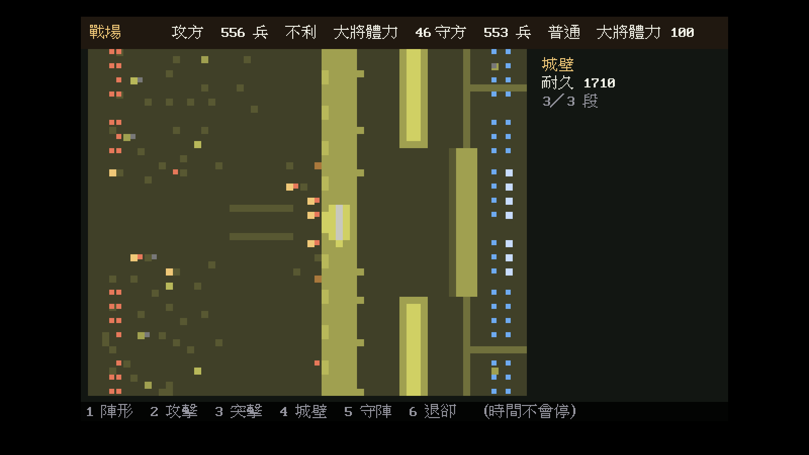

門與城壁**不是地形，是和兵一樣的實體**——載入時從戰場的圖塊值長出來
（`0xD0`–`0xDF` 是城壁、`0xF0`–`0xF7` 是門），最多 16 段，
記錄接在兵的後面（`docs/re/11` §5.11）。

- **守軍越多，城牆越耐打**：耐久 ＝（據點的城兵數 ＋ 50）× 10
- 兵撞上去一次掉一點；歸零那一下**整排一起垮**，那幾格跟著變成平地
- 突擊（指令 3）會把門全開，而且**開了關不回去**（說明書 4.2）
- 打完扣據點的上昇值、防災值、城兵數，**扣多少由城壁被打掉多少決定**——
  說明書 6.1 那句「打って出た方が拠点への被害は小さくなります」就是這條

場上還會插旗：載入時掃過每一格，**最頂層子圖塊落在 `0xBA`–`0xBF` 就插一支**
（`sub_19E10`）。旗色是圖塊編號的最低位選的，**與交戰雙方無關**——
那是戰場美術的一部分。每張圖 0–48 支，正好塞得進原版留的 80 筆額度。
**旗子會飄**：四張一循環，開場給亂數相位，所以滿場的旗不會同步揮舞。

圖塊區間拿原版的 `BATTLE.MAP` 全掃過：**186 張攻城戰場全部命中，零例外**，
而且每張圖的「城壁段數 ＋ 門數」都塞得進那 16 筆的額度——
原版沒有為溢位留後路，所以「剛好塞得下」本身就是解對了的證據。

地形畫的是**原版的美術**：`BATTLE.MDL` 的像素格式解出來了——
192 個子圖塊 × 320 B，五個 64 B 位元平面（一張遮罩 ＋ 4bpp 的四張），
每張 16 × 32（`docs/formats/07` §9）。視角也照原版：`sub_1DAAA` 是
**等角投影**，欄 ＝ X＋Y、列 ＝ (Y−X)÷2＋32−Z，看得到 31 欄 × 24 列。

兵畫的也是原版的人物圖形：`BATTLE.SCH` 用的是**同一個格式**——
360 個 320 B 的單位，兩側各 180 張（`docs/formats/07` §10）。
同一條「遮罩為 0 處色平面全 0」的檢查換到這個檔案照樣 100%。

⭐ **兵種的儲存值就是圖形表的索引**。一張圖是 16 × 64（兩個單位疊起來，
奇數在上），一側 90 張分成五組、每組 18 張，分界落在 0／18／36／54／72——
正是兵種的值。**兵種存成「× 18」就是為了當索引用**。第五組是**軍旗**，
白桿紅旗，插在大將身邊。

圖號的算法也照原版（`sub_1B240` 尾段）：**兵種 ＋（面向 × 2 ｜ 狀態旗標）＋ 側 × 90**。
狀態旗標的 bit 0 是**走路的動畫幀**——原版每次更新完 `xor [si+2], 1`。
那個 `+192` 是地形子圖塊的張數：**地形與人物在同一張表裡**。

野戰的戰場是**從大地圖上即時算出來的**，不是隨機挑一張
（`internal/rules/battlefield`）：取軍團所在格與下方四格的地形類型，
拿其中兩格去配一張 21 筆的表。⭐ **換過順序才配上時要把戰場轉 180 度**——
戰場轉不轉取決於兩格地形誰在前，不是另外算方向的。

### 驗證：不只驗單條規則，也驗「組合起來」

單元測試把每一條公式釘在反組譯上，但那只保證**單次呼叫**正確。
佔領、壞滅、招降、陣亡、編成、月結會互相牽動同一批欄位——
跑久了會不會歪，單元測試看不出來。

所以另有一層**不變量檢查**（`internal/state/invariant.go`），
準繩是**原版檔案自己維護的冗餘**：同一件事在兩個地方各存一份，
一致就代表兩邊的更新路徑都對。

    據點表數出來的各勢力據點數  ==  勢力記錄 +0x23
    武將表數出來的各勢力武將數  ==  勢力記錄 +0x18
    軍團兵力  ==  六個編成槽之和
    城兵 ≤ 上限、預備兵不為負、帶兵的武將必須標著出陣中…

跑法：

    tools/go.sh run ./cmd/wlsim -scenario 0 -years 30 -check

四個劇本各跑 30 年（**每個劇本 233 萬個 tick，每個 tick 檢查一次**）全部通過；
另有一條測試主動編成軍團互相攻打，五年打了 99 場、佔了 127 次城，
不變量全程成立。

#### 這一層抓到的兩件事

**一、劇本 3、4 開局就對不上**——武陵與南昌的 `+0x01`（執行期）與
`+0x1A`（作者填的）互相矛盾，而 `+0x23` 是照 `+0x1A` 算的。
那是**原版自己的資料瑕疵**，本專案照抄執行期那一側；
月結會重算，差額到此消失。所以驗的不是「相等」而是「**差額不會變**」——
反而更嚴格。

**二、三十年下來火災一次都沒有**（暴動好幾千次）。查下去是資料決定的：
火災的閘是 `rng & 0x3F >= 防災值`，左邊只到 63，
而**開局 192 個據點的防災值全部是 100**——在沒有攻城的世界裡
**火災在數學上不可能發生**。防災值只有被攻城打掉才會降。
看起來像 bug，其實是原版的設計。兩件事都寫成測試釘住了。

### 一覽表：規格來自說明書，不是我設計的

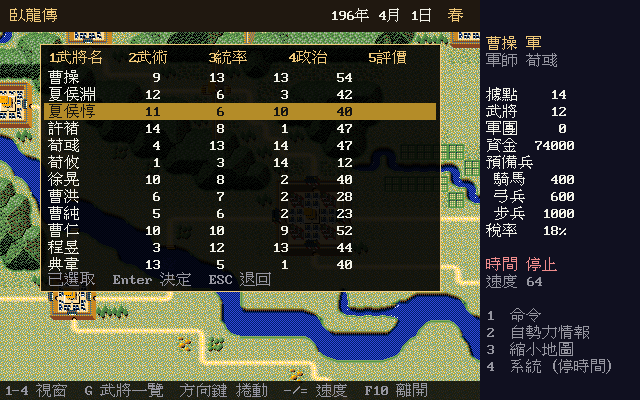

日文原版說明書 3.8 節把一覽表的操作寫得很精確，四條規則都影響手感：

1. 點欄位名排序
2. **兩段式選取**——第一次點只反白，第二次點才決定
3. 右鍵取消；**反白狀態下取消只退回選取層，不關視窗**
4. **排序狀態以視窗種類為單位記住**，不是每次重來

`internal/ui/listwin` 只做狀態機與排序，**不含畫面**，
所以這四條可以用測試釘住（11 條）。畫面怎麼畫是 `cmd/wlgame` 的事。

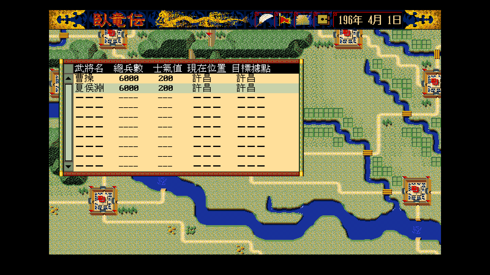

上圖的「時間 停止」是紅的——一覽表是非常駐視窗，
**暫停規則自動延伸到它**，不需要另外寫一次。編成畫面也一樣。

### 四個語系

同一個局面、同一顆種子，四種語言。**日文不是翻譯，是原版**——PC-98 版與
松崗版的 `TALK.DAT` 逐則對應，所以直接讀原版的文字，連 34 個 PC-98 外字
都靠兩版逐字對齊反推出來（[`docs/spec/84`](docs/spec/84-multilanguage.md)）。

| 繁體中文（母本，松崗版原文） | 简体中文（OpenCC 詞級轉換） |
|---|---|
| 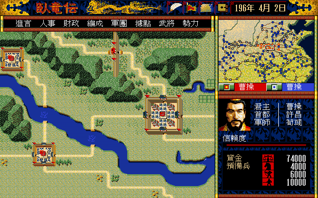 | 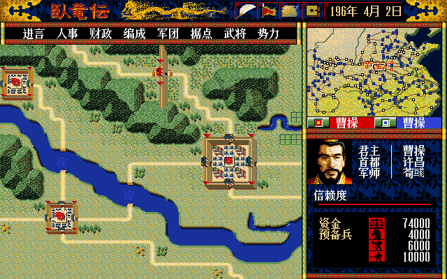 |

| 日本語（PC-98 原版的文字） | English（逐則英譯 ＋ 漢語拼音） |
|---|---|
|  | 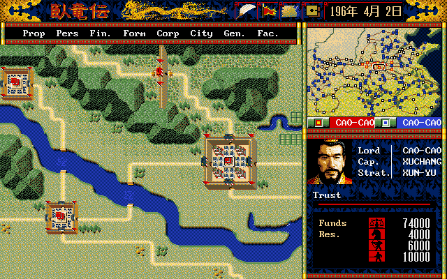 |

**遊戲中隨時切**：桌面按 `F9` 循環，或在啟動殼層選；手機在系統面板的
「語言」那一頁點一下（[`docs/spec/86`](docs/spec/86-runtime-language-switch.md)）。
語系包內嵌在執行檔裡，不必另外放檔案。

| 桌面的啟動殼層 | 手機的系統面板 |
|---|---|
| 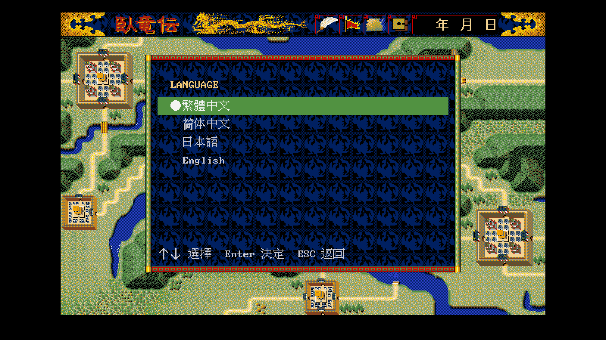 | 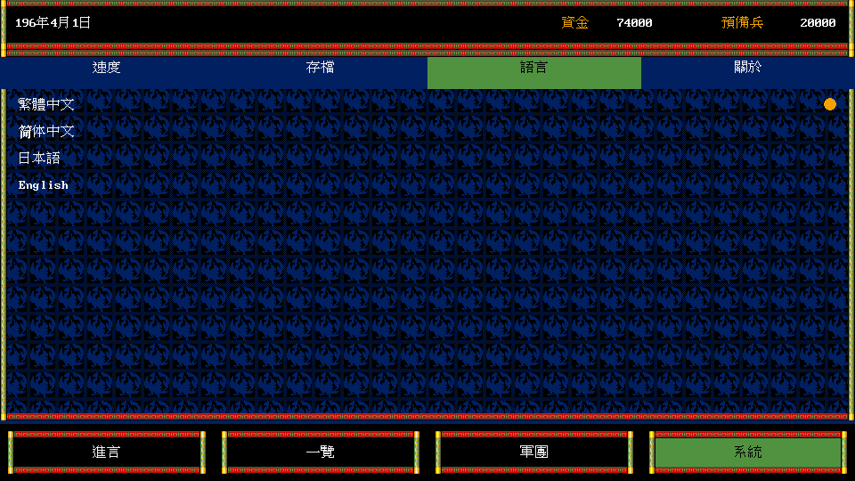 |

#### 半形語系的版面要另排一套

羅馬化的人名比原版的三個全形字寬得多——武將最長 12 個字母、據點 12 個、
君主 11 個。照原版的欄界畫，`夏侯淵` 與 `夏侯惇` 會雙雙被裁成 `XIAHOU`，
**兩個不同的人在畫面上長得一樣**，那已經不是美觀問題。所以半形語系
另有一套欄界（[`docs/spec/85`](docs/spec/85-latin-list-layout.md)），
清單以外的畫面也逐張調過（[`docs/spec/87`](docs/spec/87-latin-screen-layout.md)）。

| 繁中：三個全形字一欄 | 英文：姓名欄 12 個字母 |
|---|---|
| 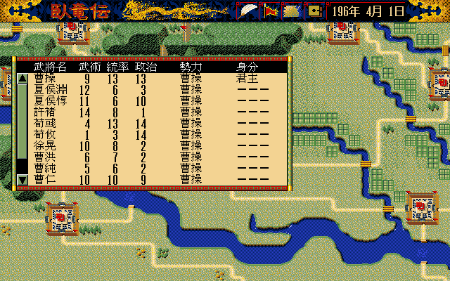 | 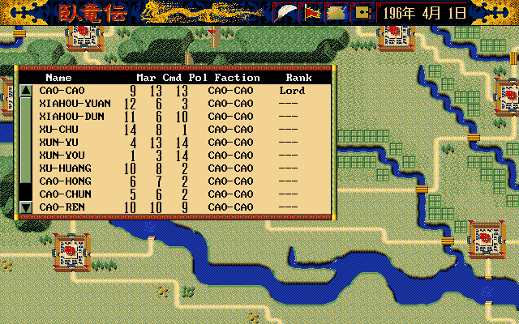 |

⚠ **原版美術上的中文不翻**：頂端橫幅的「年」「月」「日」、金額鍵盤的
按鍵、戰場的六個指令鈕、將旗上的「軍」——那些是原版圖庫的像素，
翻它們等於重畫原版美術。這是保存專案，不做。

### 中文用倚天 16×15 點陣字

不用 TTF 縮到 16px（會糊、筆劃比例也不對），走 1990 年代 DOS 中文遊戲
實際用的倚天點陣字。**字型檔不隨本專案散布**——執行時用 `-font` 指到
自備的字庫，與原版資料同一個處理方式。

沒帶字型也跑得起來，只是字會畫成空心方框：**缺字要看得見**。
Ebiten 內建的除錯字型會把中文靜靜吃掉，那種畫面看起來像排版 bug，很難查。

字型層的驗收樣本不是手打的詞彙表，是**從 `SINARIO.DAT` 抽出來的**——
四個劇本全部武將名（含呼び名）加 192 個據點名的 377 個相異字。
憑印象列詞會漏掉「叡」「懿」「廮」這種只在特定劇本出現的字。

### 素材檢視器

`cmd/wlview` 的大地圖模式：384×256 格的世界地圖，可捲動，頂端是原版的
標題橫幅（`ICONGRF` 段 0）。

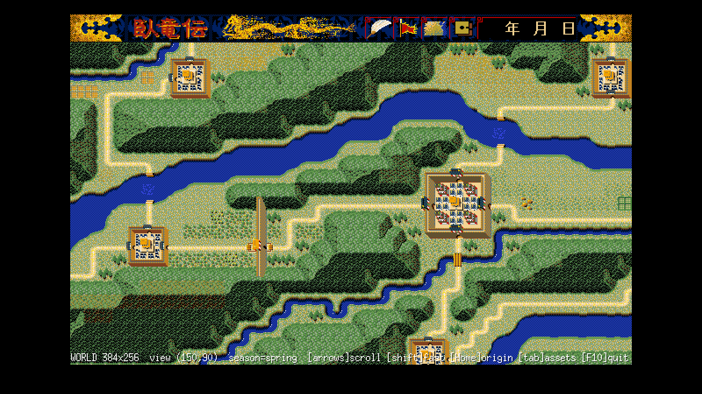

**按 `4` 換到冬天** —— 只換調色盤的色號 14 這**一個顏色**，
21 萬個像素改變，而樹林、河流、道路、城池全部保持原色。
這是原版 1994 年在 16 色機器上的做法，remake 照做（`docs/formats/02` §4）。

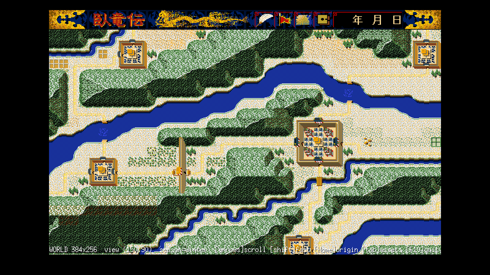

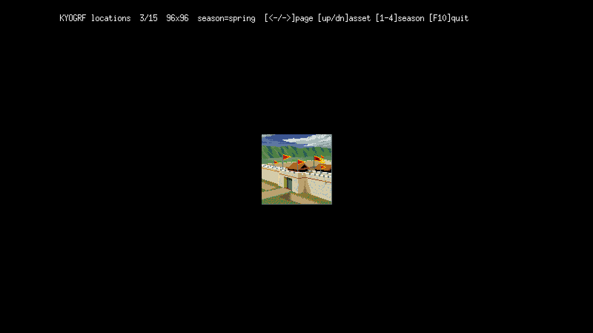

### 已有的程式

**解碼與載入層（一律不 import Ebiten）**

```
internal/assets/palette   .BRG 解碼（純函式）
internal/assets/gfx       *GRF.DAT 4bpp planar 解碼
internal/assets/text      TALK.DAT 解析與寫回
internal/assets/rle       原版的 RLE 解壓（MMAP.MAP 用）
internal/assets/world     大地圖：384×256 格 + 256 塊地形圖塊
internal/assets/battle    BATTLE.MAP／MDL／SCH／DAT：214 張戰場、圖塊堆疊、AI 腳本
internal/assets/cutscene  過場 OPEN_S*／END_S*（640×400 EGA 四平面，上下兩半各 200 列）
internal/assets/library   把素材目錄載成可檢視的項目
internal/assets/cjk       倚天 16×15 點陣字（全形 + 半形）
internal/scenario         劇本的載入與寫回（沿用 state 的改寫策略）
internal/savefile         存檔檔案層：帶著載入當時的 22,208 B 原始區塊
internal/savepath         存檔 overlay 的檔案系統邊界（刻意不依賴 Ebiten，路徑安全可無頭測）
internal/audio            純 Go 的 OPL3（YMF262）＋ *BGM.DAT／SOUND.DAT 的重放
```

**規則層（不認識畫面，以 tick 驅動）**

```
internal/rules/clock      五層遊戲時鐘（子刻→時→日→月→年，一天 216 tick）
internal/rules/speed      速度檔位 0–4，桌面與手機共用一份
internal/rules/economy    月結：收入、募兵、赤字懲罰、生產力複利、三種災害
internal/rules/governor   內政官：政治值怎麼補回據點的整備
internal/rules/general    武將評價（＝適性和 ＋ 2×武術 ＋ 2×統率）
internal/rules/army       軍團編成、行軍節拍、單位佔用圖
internal/rules/march      沿原版道路的行軍路由（點遠處據點是操作差異，走的還是同一條路）
internal/rules/combat     戰略層的戰鬥自動判定：戰力、傷亡、壞滅、敗將的下場
internal/rules/tactical   戰術戰鬥：立體格戰場、六個指令、陣形、疲勞、飛道具
internal/rules/battlefield 野戰的戰場從大地圖即時算（地形配對 ＋ 旋轉）
internal/rules/diplomacy  交友度矩陣與外交官
internal/rules/persuasion 進言與說得（玩家扮軍師，指令要先說服君主）
internal/rules/capital    遷都
internal/rules/strategyai 電腦勢力的政略：鄰接排序、國力評分、sub_12EFB 的三道侵攻閘
internal/rules/threat     據點的威脅掃描（原版每 tick 只掃一個據點，192 tick 一輪）
internal/rules/bgm        選曲規則（出自 KI.EXE 的呼叫端，桌面與手機共用）
internal/rules/rng        原版的亂數產生器（置換表 ＋ 兩個 byte）
internal/battlesetup      從世界狀態擺出一場戰術戰鬥（野戰翻轉、攻城守方、腳本段編號）
internal/state            劇本／存檔的載入與**寫回**（改寫而非重建）＋ 世界迴圈
                          （時鐘、月結、每小時的勢力更新、軍團編成與行軍、遭遇戰）
```

**呈現層**

```
internal/ui/textdraw      把點陣字畫到 Ebiten，缺字畫成方框而不是吃掉（排版不依賴 Ebiten）
internal/ui/uitext        字串到字串的轉換（人名地名的 raw Big5 在這裡處理），不認識畫面
internal/ui/langpack      四個語系包，內嵌進執行檔；同名檔存在時檔案系統優先
internal/ui/listwin       一覽表的狀態機：兩段式選取、排序、跨開關記住排序
internal/ui/talkmenu      把一則 TALK 訊息的數行拆成選單（進言五項是 #77）
internal/ui/chrome        原版的視窗外框與底色；沒有素材時退回純色框而不是整個畫不出來
internal/ui/isoview       等角投影畫布（不認識版面）
internal/ui/sound         Ebiten 的 ogg 播放層（沒有音檔就靜音跑）
internal/ui/phone         手機版的畫面與操作，縮放交給 Ebiten 的 Layout 契約
```

**執行檔**

```
cmd/wlgame                遊戲本體（戰略 ＋ 戰術）
cmd/wlandroid             手機 UI 的桌面開發殼（同一份 internal/ui/phone）
cmd/wlsim                 無頭世界模擬器，用長期行為驗證公式
cmd/wlshot                解素材成 PNG，無頭環境可跑
cmd/wlview                Ebiten 互動檢視器（素材模式 / 大地圖模式，Tab 切換）
cmd/wlscen                劇本檔工具（含 round-trip 驗證）
cmd/wlaudio               把原版音樂與音效渲染成 WAV（再由 tools/bgm2ogg.sh 轉 ogg）
```

```

規則層的每一條公式都是從 `KI.EXE` 的機器碼讀出來的，不是猜的
（反組譯筆記見 [`docs/re/`](docs/re/)）。每個套件都有測試，
期望值全部用反組譯出的常數，不是用實作反推的。

分層是刻意的：**Ebiten 在 init 期就要求顯示器**，
所以解碼層與載入層一律不 import 它，否則無頭環境連截圖工具都跑不起來。

## 怎麼跑

```bash
tools/go.sh test ./...                                  # 全部測試
tools/go.sh run ./cmd/wlgame -orig workplace/orig/dosv -font workplace/eten
tools/go.sh run ./cmd/wlsim  -years 15 -tax 25          # 無頭模擬，看十五年的軌跡
```

### 音樂與音效要自己從原版產生

音檔是**原版衍生物**，不隨發行包散布。玩家用自己的原版跑一次：

```sh
tools/bgm2ogg.sh          # 14 首音樂 ＋ 18 個音效 → workplace/audio/*.ogg
tools/go.sh run ./cmd/wlgame -audio workplace/audio …   # 要給 -audio 才有聲音
```

`cmd/wlaudio` 用一顆純 Go 的 OPL3（YMF262）照原版的暫存器語意重放，
不是近似合成——`YNSOUND.COM` 初始化就寫了 OPL3 的 `0x104`／`0x105`
（[`docs/re/57`](docs/re/57-opl3-register-map.md)）。ogg 那一段走 docker ffmpeg，
因為 Go 這邊沒有 vorbis 編碼器。

**`-audio` 預設留白（靜音）**：Ebiten 的音訊錯誤沒有可查詢的 API，
沒有音效裝置的機器（CI、無頭驗收）一開音訊就會整個結束。
給了目錄但裡面沒有 ogg 時同樣靜音跑，系統選單第 3 列顯示「未接入」。
**哪一首配哪個場景是從機器碼讀出來的**——大地圖是四季配樂、
事件與對話一首、攻城分玩家攻守兩首、野戰與地形戰場各一首
（[`docs/re/58`](docs/re/58-bgm-scene-mapping.md)）。

原版素材不隨本專案散布。自備之後放進 `workplace/orig/dosv/`（松崗版）
或 `workplace/orig/pc98/`（PC-98 版）。PC-98 的磁片映像可以用
`tools/fdi_extract.py` 抽出來。

**建置一律走 docker**，不污染主機環境：

```sh
tools/go.sh test ./...                       # 測試
tools/go.sh run ./cmd/wlshot -list           # 列出素材
tools/go.sh run ./cmd/wlshot -asset 0 -sheet 15 -out kao.png
tools/go.sh run ./cmd/wlview                 # 互動檢視器
tools/go.sh run ./cmd/wlview -world          # 直接開大地圖
tools/shot.sh out.png KEYS=Right,Down        # headless 截圖驗收
```

Python 工具（只用標準函式庫，不裝套件）：

```sh
tools/py.sh tools/fdi_extract.py <image.fdi> <輸出目錄>
tools/py.sh tools/talkdat.py verify workplace/orig/dosv/TALK.DAT cp950
tools/py.sh tools/brg.py swatch workplace/orig/dosv/GAMEPAL.BRG out.png
tools/py.sh tools/grf.py sheet workplace/orig/dosv/KAOGRF.DAT 64 64 \
        workplace/orig/dosv/GAMEPAL.BRG 0 out.png 15
```

Python 與 Go 兩套解碼器是刻意重複的——**兩邊的輸出逐像素比對過，完全相同**。
獨立實作互相驗證，比單一實作加測試更有說服力。

反組譯用 IDA Pro 9.4（`tools/ida.sh`），DOSBox-X 設定在 [`dosbox/`](dosbox/)。

### 存檔是「改寫」不是「重建」

`internal/state` 從載入時保留的原始位元組出發，只覆寫已解出的欄位，
**還沒解的區域一個 byte 都不動**（事件佇列、軍團表、那 69 byte 不載入的空隙…）。

驗收條件是 round-trip：四個劇本載入後原封不動寫回，
必須與原始位元組**完全相同**。另外有一條測試會先跑 24 個月的模擬再存檔，
確認未解區域仍然一致——那才是最容易把不懂的地方寫壞的時機。


## Android 版

手機版接的是**與桌面同一套規則層**（`internal/state`、`internal/rules`、
`internal/assets`），畫面與操作為手機重新設計——原版是 640×400 的滑鼠式
視窗 UI，命令列一格 16×16，在五吋螢幕上約 2–3 mm，手指按不準。

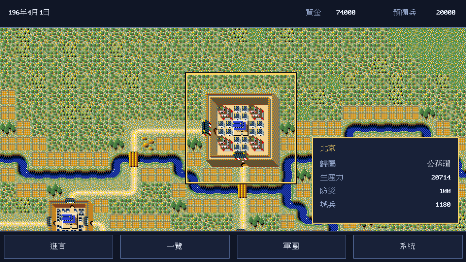

**規則、原版美術、原版文字三樣都不動**，重畫的是「怎麼擺、怎麼按」。
版面規格在 [`docs/mobile/android-ux.md`](docs/mobile/android-ux.md)，
工具鏈與踩過的坑在 [`docs/mobile/android-plan.md`](docs/mobile/android-plan.md)。

### 核心真的在 Android 上跑

最強的一條驗收不看畫面：同一個 seed 跑同樣的幀數，**Android 與桌面要算出
相同的世界指紋**（`World.Fingerprint`，[`docs/spec/69`](docs/spec/69-world-fingerprint.md)）。
模擬器實測 frame 1／60／120 三個取樣點與桌面完全相同：

```text
2b58e7b58f4826f9   5b3585cf005a6ec5   36eb02d379333f95
```

指紋涵蓋時鐘、據點整備游標、軍團 tick 與亂數——跨平台最會出事的那幾條
（整數寬度、浮點、map 走訪順序）。**這是判準的範圍，不是「驗過整個遊戲」。**

### 畫面

| | |
|---|---|
| 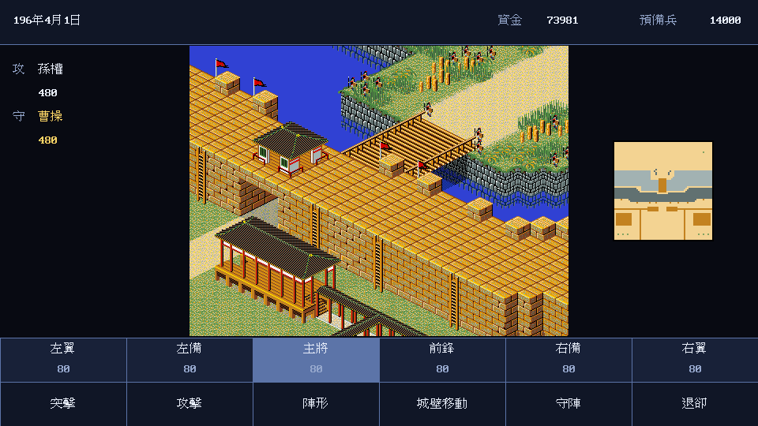 | 戰場：45 度視角沿用原版子圖塊，上排是六個編成位置（原版的空間排列：左翼 左備 主將 前鋒 右備 右翼），下排六個命令，兩側是兩軍資訊與戰場縮圖 |
| 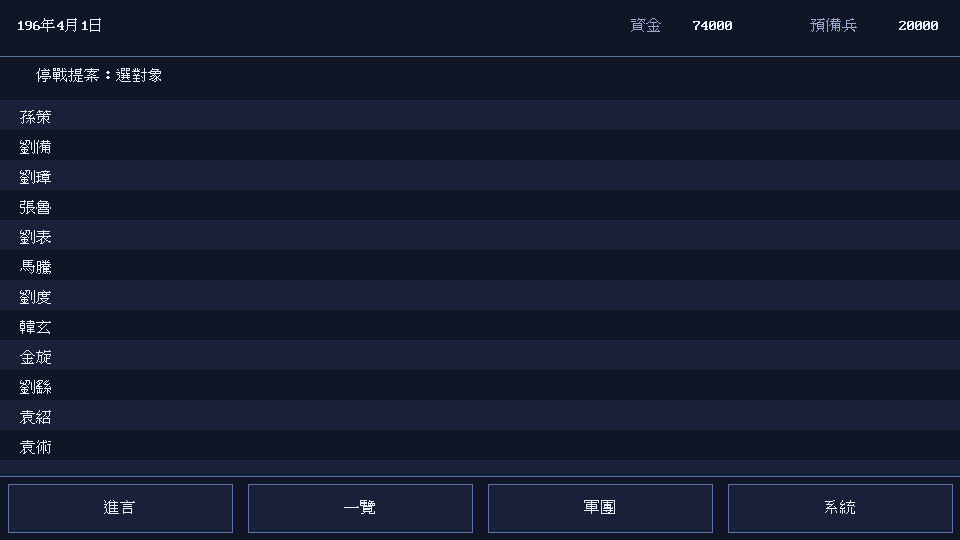 | 進言：玩家是軍師，指令要先過君主那一關。五項齊全，用字取自 `TALK.DAT` |
| 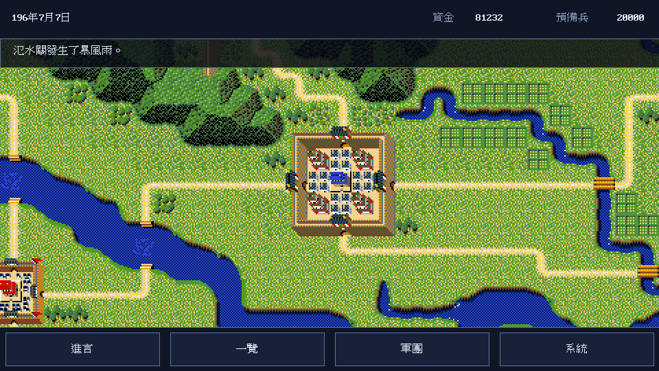 | 事件訊息貼在地圖上緣，六秒自己消 |
| 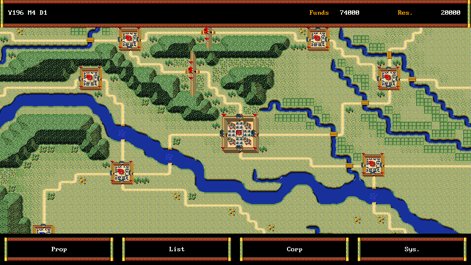 | 四個語系手機端也都在。**手機沒有命令列**，所以語言掛在系統面板的「語言」那一頁 |
| — | **音樂也在**：完整版 APK 內嵌 32 個 ogg，開機解到 app 私有目錄，選曲規則與桌面共用同一份（[`docs/spec/92`](docs/spec/92-android-music.md)）|

底部四個入口：**進言**（五項）、**一覽**（武將／據點／勢力／軍團四張表）、
**軍團**（現有 ＋ 編成）、**系統**（速度檔位 0–4 ＋ **音效**、四個存檔槽、**語言**、關於）。

### 第一次啟動要匯入原版資料

**原版資料與倚天點陣字都不隨程式散布**（與桌面版同一條界線），要自己準備。
Android 11 以上，使用者選的資料夾給的是 `content://`，而遊戲讀的是檔案路徑
——所以 app 的入口是匯入畫面：選一次資料夾，檔案會複製進 app 的私有目錄，
字型自動分到另一個目錄。

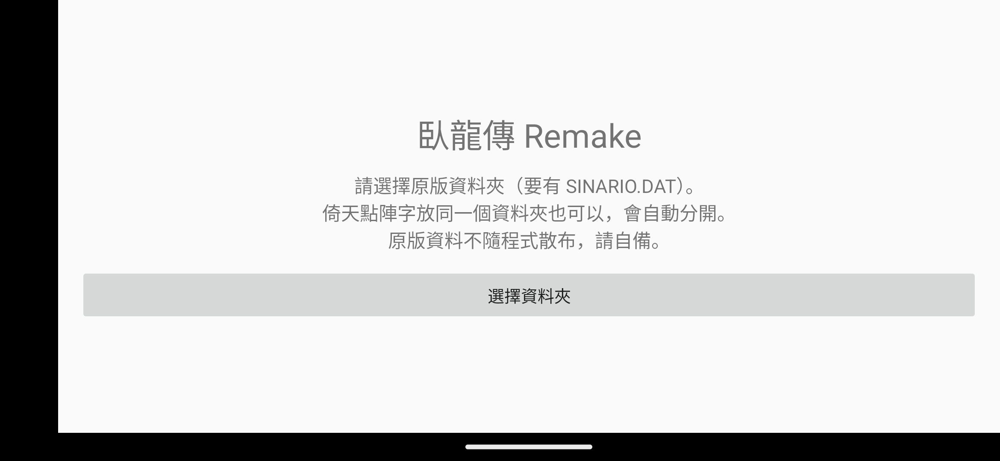

### 推廣片

48 秒，全部是手機版自己的畫面：大地圖 → 據點小卡 → 一覽 → 軍團編成 → 進言 →
戰場。**逐幀輸出而不是錄螢幕**，所以同一個 seed 跑兩次得到同一批圖
（[`docs/promo/android.md`](docs/promo/android.md)）。

```bash
tools/phone_capture.sh    # 錄 1200 張畫面（＝ 40 秒 × 30 fps）
tools/promo_android.sh    # 切段、上標題、混配樂
```

### 自己建與驗

```bash
tools/android_build.sh          # ebitenmobile bind → AAR → gradle assembleDebug
tools/android_smoke.sh          # 起模擬器 → 安裝 → 推資料 → 抓指紋 → 截圖
tools/phone_shot.sh out.png 60  # 手機 UI 的桌面截圖（一輪約 30 秒）
```

手機 UI 的開發迴圈**在桌面上跑**：同一份 `internal/ui/phone`，用 Xvfb 截圖，
最後才進模擬器。模擬器一輪要好幾分鐘，拿來當開發迴圈太慢。

### 還沒完成的

- **實機驗收**：手上只有 Docker 模擬器，它驗不到觸控手感、真實 GPU、
  高 DPI 上點陣字的可讀性，也驗不到各廠商的瀏海與手勢列。
- **release signing**：目前是 debug 建置。
- 外交提案的「提示金額」有數字鍵盤了（`docs/spec/103`）；SAF 選完資料夾之後的複製
  流程沒有自動驗（要驅動系統的檔案選擇器）。

## 文件導航

| 想知道 | 看哪一份 |
|---|---|
| **現況**（唯一真相來源）| [`CONTEXT.md`](CONTEXT.md)——現況一覽、術語表、**已被推翻的斷言**、worklist |
| 某個欄位／常數解了沒 | [`docs/INDEX.md`](docs/INDEX.md) 的斷言總表（斷言 → 推論等級 → 出處）|
| 還有什麼沒解 | [`docs/re/43`](docs/re/43-open-questions.md) 的缺口總表 |
| 原版的資料長什麼樣 | [`docs/formats/`](docs/formats/) |
| 原版的程式碼在哪 | [`docs/re/00-index.md`](docs/re/00-index.md)；函式覆蓋地圖在 [`docs/re/21`](docs/re/21-function-census.md) |
| 這個遊戲怎麼運作 | [`docs/mechanics/00-index.md`](docs/mechanics/00-index.md) |
| 我們打算怎麼實作 | [`docs/spec/00-index.md`](docs/spec/00-index.md)（`DRAFT`／`READY`／`CONFORMED` 三態）|
| 驗過什麼、量到多少 | [`docs/playtest/`](docs/playtest/) |
| 這一批發行包裡有什麼 | [`docs/release/10`](docs/release/10-full-20260828.md) |
| 每一輪做了什麼 | [`WORKLIST.md`](WORKLIST.md)——逐輪紀錄與勘誤都在這裡，不散回上面那幾份 |
| 動手前要遵守什麼 | [`CLAUDE.md`](CLAUDE.md) |

## 這個專案的兩條硬性原則

1. **完整性 > 投報。** 不得以「成本高、效益低」為由跳過任何素材、任何格式。
2. **SDD：spec 齊了才實作。** 反組譯 → 收攏成規格 → 才動手寫程式。
   只有標 READY 的規格可以動手。

細節見 [`CLAUDE.md`](CLAUDE.md)。

## 兩版對照的副產品

PC-98 日文原版與松崗繁中版是同一份程式的兩次編譯，
**23 個資料檔 byte-for-byte 完全相同**。這讓兩件事變得很便宜：

- **日中對照**：`TALK.DAT` 兩版索引一一對應，
  已掃出 [12 則變數標記不一致](docs/reference/02-jp-cht-diff.md)
  （漏變數、`#192`–`#195` 錯位、`#257`/`#258` 對調），文意層再逐句讀完後合計 60 筆校訂。
- **哪些美術被重繪過**：diff 直接告訴你。
  順帶找到主畫面標題橫幅上寫的是日文「臥竜伝」——
  [松崗版根本沒重繪](docs/reference/03-baked-japanese.md)。

## 授權、致謝與聲明

### 授權

本儲存庫由著作權人創作的部分——程式碼、文件、規格、反組譯筆記與校訂紀錄——
採 [`LICENSE`](LICENSE) 的專有授權：

- **非商業用途免費**：使用、重製、散布都不必事先取得同意，也可以修改並散布
  修改版；條件是保留授權條款、標明自己改了什麼並指回原始出處，
  以及不對作品本身收費。
- **商業用途要先洽談**：販售、付費提供、隨商品或服務散布、加廣告或內購、
  在營利事業的營運中使用，都需要書面授權。寄 wicanr2@gmail.com，
  **歡迎來談**——這一條是為了保留商業條件的決定權，不是拒絕合作。

⚠ **授權不涵蓋原版素材**：原版的執行檔、資料檔、美術、音樂與倚天點陣字
屬於各自的權利人，本專案不散布它們（見下面的致謝與聲明）。

### 致謝與聲明

《臥龍傳－三國制霸之計》（臥竜伝 三国制覇の計）由 NEO･GETEN（ホクショー）
開發並於 1994 年發行，繁體中文版由松崗於 1995 年發行。**本專案與上述任何一方
都沒有隸屬、贊助或授權關係**；相關名稱與商標屬於各自的權利人。

本專案的定位是文化資產保存：公開的產出只有引擎程式碼、規格與校訂紀錄。
**原版執行檔、資料檔、美術、音樂與倚天點陣字一律不進版控、不進發行包**，
要玩得自備合法的原版副本（`WOLONG_BUNDLE_DATA=0` 出的包不含任何原版資產）。
發行前由 `tools/denylist.py` 掃過一次，`tools/check.sh` 會跑它。

日文原版與松崗繁中版的對照素材、DOS/V 自然遊玩錄影由使用者提供；
社群整理的資料只當「往哪裡找」的提示，不當結論（[`CLAUDE.md`](CLAUDE.md) §2）。
