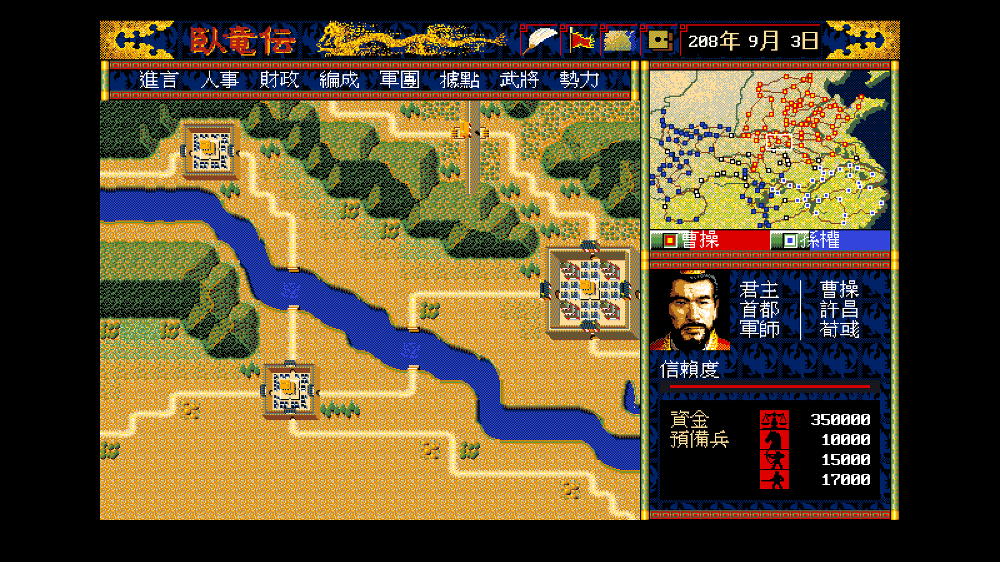

# 臥龍傳 remake

把 NEO･GETEN《臥龍傳－三國制霸之計》（1994 日文 PC-98 版 ／ 1995 松崗 DOS/V 繁中版）
完整逆向，在 Go / Ebiten 上重寫引擎，保存松崗繁中版原文並以日文原版對照校訂。

定位是文化資產保存。**不散布原版執行檔、資料檔、美術或音樂**——
公開產出只有引擎程式碼與校訂紀錄，玩家自備合法原版。

| | |
|---|---|
| 原名 | 臥竜伝 三国制覇の計 |
| 開發／原發行 | NEO･GETEN（ホクショー） |
| 日文版 | 1994，PC-9801 |
| 繁中版 | 松崗，1995，DOS/V |
| 類型 | **即時制**戰略。玩家扮演軍師，不是君主 |
| 規模 | **每個劇本武將 127 人**、據點 192 個（「146 人」是社群說法，一手資料不支持） |
| 劇本 | 呂布歸天、赤壁之戰、蜀地偏安、劉禪繼位 |

## 現在做到哪裡

**格式解析告一段落，規則層開工中。**
狀態的單一真相來源是 [`CONTEXT.md`](CONTEXT.md)。

| 已完成 | 進行中 | 還沒開始 |
|---|---|---|
| 素材格式、存檔、時間模型、經濟、災害、中文顯示、外交、軍團結構、一覽表、進言與說得 | 內政官、行軍推進、AI、指令視窗 | 戰鬥層 |

### 已解出的格式

| 格式 | 狀態 | 文件 |
|---|---|---|
| `TALK.DAT` 訊息表 | READY，兩版 byte-for-byte round-trip | [`docs/formats/01`](docs/formats/01-talk-dat.md) |
| `.BRG` 調色盤 | READY | [`docs/formats/02`](docs/formats/02-brg-palette.md) |
| `*GRF.DAT` 圖庫 | READY（`ICONGRF` 剩兩段） | [`docs/formats/03`](docs/formats/03-grf-images.md) |
| `MMAP.MDL` 地形圖塊 | READY，256 塊 16×16 | [`docs/formats/05`](docs/formats/05-mmap-worldmap.md) |
| `MMAP.MAP` 世界地圖 | READY，RLE → 384×256 格 | [`docs/formats/06`](docs/formats/06-mmap-rle.md) |
| `.MAP`/`.SCH` 容器 | 索引層 READY | [`docs/formats/04`](docs/formats/04-map-sch-container.md) |
| `BATTLE.*` 戰場 | 分段結構已解，像素格式未解 | [`docs/formats/07`](docs/formats/07-battle.md) |

### 引擎已經跑得出一個「時間在走的世界」

`cmd/wlgame` 從真實的 `SINARIO.DAT` 載入劇本，用反組譯出來的規則驅動：



畫面上的每個數字都是原版資料算出來的：曹操的 14 個據點、74,000 起始資金、
騎馬 400／弓兵 600／步兵 1000 的預備兵、稅率 18%。
時鐘照原版的五層單位跑（子刻 → 時 → 日 → 月 → 年，**一天 216 tick**），
月結會依 `Σ(生產力 ÷ 距離除數) × 稅率 ÷ 100` 入帳。
截圖是遊戲內的 196 年 10 月，**季節已經自動換到秋天**——
四季調色盤直接吃時鐘算出的季節，而且是在 3／6／9／12 月的前 16 天**漸變**過去的。

### 暫停規則是規格，不是 UI 細節


> 命令、自勢力情報、縮小マップの３つのウインドウ以外が表示されている状態では、
> **ゲームの時間が進みません**（日文原版說明書 3.1）

上圖開著 SYSTEM 視窗跑了相當於 89 天份的 tick，日期仍停在 196 年 4 月 1 日。
規則寫成一條式子而不是散在各視窗的開關程式碼裡：

```
時間推進 ⟺ 開啟中的視窗集合 ⊆ {命令, 自勢力情報, 縮小地圖}
```

### 進言與說得：玩家是軍師，指令要先過君主那一關


畫面上正好是說明書描述的那個兩難。曹操（好戰 14）對呂布提敵對，
五個理由裡**只有「我國有利」成立**——呂布沒在侵攻誰、資金不是負的、
沒在打我方，交友值也還沒差到門檻。而曹操要聽兩個理由才點頭。

這時的正解是**進言撤回**（信賴度不變），不是硬選一個不成立的理由
（信賴度會掉）。說明書 3.9 把這個取捨寫得很清楚：

> 状況に合うものを総て選択しても君主が納得しない場合は、
> **進言撤回でキャンセルする事が出来ます。この場合は信頼度は変化しません。**

判定全在 `internal/rules/persuasion`（13 條測試），
畫面只負責呈現。九個理由的成立條件裡有兩個直接用已解出的資料：
**國力 ＝ 據點數**、**疲弊 ＝ 資金 < 0**。

### 軍團：編成 → 行軍 → 遭遇


編成一個位置固定 1,000 人，兵從預備兵扣（說明書 5.5）。
上圖的曹操只湊得出一隊步兵——**開局的預備兵就是這麼少**，
畫面照實際數字長，不是擺樣子的。

**大將的位置一定要有兵**：原版的壞滅判定 `sub_1474A` 直接看第一槽是不是 0，
所以大將空著的軍團一編出來就會被判掉。這條在規則層擋，不是在畫面層擋。


目的地一覽**預設照距離排序**——192 個據點按編號排的話，
玩家要翻半天才找得到隔壁那座城。距離用的是切比雪夫距離，
與月結收入衰減用的是同一種（`docs/re/07` §4）。

軍團走到敵方軍團所在的格子就打野戰，走進敵方據點就攻城；
城裡沒有軍團就打城兵。整條鏈跑在 `internal/state`，
勝負與傷亡在 `internal/rules/combat`（`docs/re/09`）。

### 戰術戰鬥


玩家的勢力捲進去就開戰場畫面，其餘自動判定——**這是原版的分派規則**
（`sub_14E5C`），連「打空城不進戰術畫面」那條例外都照抄。

畫面上：攻方暖色、守方冷色、**退卻中的兵畫成灰的**。橫幅是兩軍的兵數、
有利／不利、大將體力。底下六個指令的編號與原版一致，而且**沒有暫停鍵**——
說明書 4.1：「戦闘中は絶対に時間を止められません」。

規則層在 `internal/rules/tactical`，每一條都對得上反組譯（`docs/re/11`）：

| 規則 | 出處 |
|---|---|
| 64 × 64 × 7 的立體格，可站立層由地圖圖塊的堆疊決定 | `sub_1BA2E`／`sub_1BB6D` |
| 一側 48 個兵 ＝ 6 隊 × 8 人，其餘畫面外待機 | `sub_1A754` 的 1 + 7 迴圈 |
| 疲勞度：走到陣形位置補滿、攻擊時上限 40、移動每幀 −1 | `sub_1AA2C`／`sub_1AB7C` |
| 有利／不利：兩軍餘力兵數相減，**差距 ≤ 8 判普通** | `sub_1ADC8` |
| **騎馬與大將爬不上城牆** | `cmp [si+4], 12h / jbe` |
| **步兵挨箭只吃四分之一** | `cmp [bx+4], 36h / jz` |
| 箭往上飛減威力、往下落加威力 | `sub_1BAB7` |
| 大將不會陣亡、體力 < 50 全軍退卻 | `sub_1B97E`／`sub_1AE56` |
| 陣形表 16 種 × 48 組相對座標 | `sub_1AA2C` 查 `cs:0xCCE4` |

地形是**原版 `BATTLE.MAP` 的 214 張戰場**：一格存圖塊編號，圖塊展開成
1–7 層的堆疊，堆疊高度就是地面高度（`internal/assets/battle`）。
敵方由**原版 `BATTLE.DAT` 的 AI 腳本**驅動，段編號 ＝ 帶兵武將的
`+0x16` × 4 ＋ 戰場類別——呂布那一型跟諸葛亮那一型跑的是不同的腳本。

⚠ **畫面上的不是原版美術**：`BATTLE.MDL` 的像素格式還沒解出來，
所以地形用堆疊高度上色、兵用色點。**幾何與地形是對的**，美術是暫代的。
野戰的戰場是**從大地圖上即時算出來的**，不是隨機挑一張
（`internal/rules/battlefield`）：取軍團所在格與下方四格的地形類型，
拿其中兩格去配一張 21 筆的表。⭐ **換過順序才配上時要把戰場轉 180 度**——
戰場轉不轉取決於兩格地形誰在前，不是另外算方向的。

### 一覽表：規格來自說明書，不是我設計的


日文原版說明書 3.8 節把一覽表的操作寫得很精確，四條規則都影響手感：

1. 點欄位名排序
2. **兩段式選取**——第一次點只反白，第二次點才決定
3. 右鍵取消；**反白狀態下取消只退回選取層，不關視窗**
4. **排序狀態以視窗種類為單位記住**，不是每次重來

`internal/ui/listwin` 只做狀態機與排序，**不含畫面**，
所以這四條可以用測試釘住（11 條）。畫面怎麼畫是 `cmd/wlgame` 的事。


上圖的「時間 停止」是紅的——一覽表是非常駐視窗，
**暫停規則自動延伸到它**，不需要另外寫一次。編成畫面也一樣。

### 中文用倚天 16×15 點陣字

不用 TTF 縮到 16px（會糊、筆劃比例也不對），走 1990 年代 DOS 中文遊戲
實際用的倚天點陣字。**字型檔不隨本專案散布**——執行時用 `-font` 指到
自備的字庫，與原版資料同一個處理方式。

沒帶字型也跑得起來，只是字會畫成空心方框：**缺字要看得見**。
Ebiten 內建的除錯字型會把中文靜靜吃掉，那種畫面看起來像排版 bug，很難查。

字型層的驗收樣本不是手打的詞彙表，是**從 `SINARIO.DAT` 抽出來的**——
四個劇本全部武將名（含呼び名）加 192 個據點名的 377 個相異字。
憑印象列詞會漏掉「叡」「懿」「廮」這種只在特定劇本出現的字。

### 素材檢視器

`cmd/wlview` 的大地圖模式：384×256 格的世界地圖，可捲動，頂端是原版的
標題橫幅（`ICONGRF` 段 0）。


**按 `4` 換到冬天** —— 只換調色盤的色號 14 這**一個顏色**，
21 萬個像素改變，而樹林、河流、道路、城池全部保持原色。
這是原版 1994 年在 16 色機器上的做法，remake 照做（`docs/formats/02` §4）。


### 已有的程式

```
internal/assets/palette   .BRG 解碼（純函式，不認識 Ebiten）
internal/assets/gfx       *GRF.DAT 4bpp planar 解碼
internal/assets/text      TALK.DAT 解析與寫回
internal/assets/rle       原版的 RLE 解壓（MMAP.MAP 用）
internal/assets/world     大地圖：384×256 格 + 256 塊地形圖塊
internal/assets/library   把素材目錄載成可檢視的項目（不 import Ebiten）
internal/assets/cjk       倚天 16×15 點陣字（全形 + 半形）
internal/ui/textdraw      把點陣字畫到 Ebiten，缺字畫成方框而不是吃掉
internal/ui/listwin       一覽表的狀態機：兩段式選取、排序、跨開關記住排序

internal/rules/clock      五層遊戲時鐘（子刻→時→日→月→年，一天 216 tick）
internal/rules/economy    月結：收入、募兵、赤字懲罰、生產力複利、三種災害
internal/rules/general    武將評價（＝適性和 ＋ 2×武術 ＋ 2×統率）
internal/rules/army       軍團編成、行軍節拍、單位佔用圖
internal/rules/combat     戰略層的戰鬥自動判定：戰力、傷亡、壞滅、敗將的下場
internal/rules/diplomacy  交友度矩陣與外交官
internal/rules/persuasion 進言與說得（玩家扮軍師，指令要先說服君主）
internal/rules/rng        原版的亂數產生器（置換表 ＋ 兩個 byte）
internal/rules/tactical   戰術戰鬥：立體格戰場、六個指令、陣形、疲勞、飛道具
internal/rules/battlefield 野戰的戰場從大地圖即時算（地形配對 ＋ 旋轉）
internal/assets/battle    BATTLE.MAP／MDL／DAT：214 張戰場、圖塊堆疊、AI 腳本
internal/state            劇本／存檔的載入與**寫回**（改寫而非重建）＋ 世界迴圈
                          （時鐘、月結、每小時的勢力更新、軍團編成與行軍、遭遇戰）

cmd/wlshot                解素材成 PNG，無頭環境可跑
cmd/wlview                Ebiten 互動檢視器（素材模式 / 大地圖模式，Tab 切換）
cmd/wlsim                 無頭世界模擬器，用長期行為驗證公式
cmd/wlgame                戰略主畫面原型
```

規則層的每一條公式都是從 `KI.EXE` 的機器碼讀出來的，不是猜的
（反組譯筆記見 [`docs/re/`](docs/re/)）。每個套件都有測試，
期望值全部用反組譯出的常數，不是用實作反推的。

分層是刻意的：**Ebiten 在 init 期就要求顯示器**，
所以解碼層與載入層一律不 import 它，否則無頭環境連截圖工具都跑不起來。

## 怎麼跑

```bash
tools/go.sh test ./...                                  # 全部測試
tools/go.sh run ./cmd/wlgame -orig workplace/orig/dosv -font workplace/eten
tools/go.sh run ./cmd/wlsim  -years 15 -tax 25          # 無頭模擬，看十五年的軌跡
```

原版素材不隨本專案散布。自備之後放進 `workplace/orig/dosv/`（松崗版）
或 `workplace/orig/pc98/`（PC-98 版）。PC-98 的磁片映像可以用
`tools/fdi_extract.py` 抽出來。

**建置一律走 docker**，不污染主機環境：

```sh
tools/go.sh test ./...                       # 測試
tools/go.sh run ./cmd/wlshot -list           # 列出素材
tools/go.sh run ./cmd/wlshot -asset 0 -sheet 15 -out kao.png
tools/go.sh run ./cmd/wlview                 # 互動檢視器
tools/go.sh run ./cmd/wlview -world          # 直接開大地圖
tools/shot.sh out.png KEYS=Right,Down        # headless 截圖驗收
```

Python 工具（只用標準函式庫，不裝套件）：

```sh
python3 tools/fdi_extract.py <image.fdi> <輸出目錄>
python3 tools/talkdat.py verify workplace/orig/dosv/TALK.DAT cp950
python3 tools/brg.py swatch workplace/orig/dosv/GAMEPAL.BRG out.png
python3 tools/grf.py sheet workplace/orig/dosv/KAOGRF.DAT 64 64 \
        workplace/orig/dosv/GAMEPAL.BRG 0 out.png 15
```

Python 與 Go 兩套解碼器是刻意重複的——**兩邊的輸出逐像素比對過，完全相同**。
獨立實作互相驗證，比單一實作加測試更有說服力。

反組譯用 IDA Pro 9.4（`tools/ida.sh`），DOSBox-X 設定在 [`dosbox/`](dosbox/)。

### 存檔是「改寫」不是「重建」

`internal/state` 從載入時保留的原始位元組出發，只覆寫已解出的欄位，
**還沒解的區域一個 byte 都不動**（事件佇列、軍團表、那 69 byte 不載入的空隙…）。

驗收條件是 round-trip：四個劇本載入後原封不動寫回，
必須與原始位元組**完全相同**。另外有一條測試會先跑 24 個月的模擬再存檔，
確認未解區域仍然一致——那才是最容易把不懂的地方寫壞的時機。

## 這個專案的兩條硬性原則

1. **完整性 > 投報。** 不得以「成本高、效益低」為由跳過任何素材、任何格式。
2. **SDD：spec 齊了才實作。** 反組譯 → 收攏成規格 → 才動手寫程式。
   只有標 READY 的規格可以動手。

細節見 [`CLAUDE.md`](CLAUDE.md)。

## 兩版對照的副產品

PC-98 日文原版與松崗繁中版是同一份程式的兩次編譯，
**23 個資料檔 byte-for-byte 完全相同**。這讓兩件事變得很便宜：

- **日中對照**：`TALK.DAT` 兩版索引一一對應，
  已掃出 [15 則譯文缺陷](docs/reference/02-jp-cht-diff.md)
  （漏變數、漏名詞、`#192`–`#195` 錯位、`#257`/`#258` 對調）。
- **哪些美術被重繪過**：diff 直接告訴你。
  順帶找到主畫面標題橫幅上寫的是日文「臥竜伝」——
  [松崗版根本沒重繪](docs/reference/03-baked-japanese.md)。
