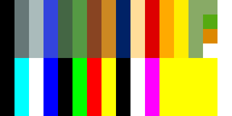

# 02 — `.BRG` 調色盤格式

**狀態：READY**（可以照這份實作）

- 日期：2026-08-07
- 出處：`docs/re/02-palette-routine.md`（兩版 `KI.EXE` 的機器碼）
- 工具：`tools/brg.py`
- 檔案：四個，**兩版 byte-for-byte 完全相同**

## 1. 結構

```
每色 3 byte：   [0] 藍   [1] 紅   [2] 綠        ← 副檔名 BRG 就是通道順序
每通道         4 bit，值域 0–15（高 4 位固定為 0）
每 16 色       一組（bank），硬體一次只吃一組
```

| 檔案 | 大小 | 色數 | 組數 |
|---|---:|---:|---:|
| `GAMEPAL.BRG` | 384 | 128 | 8 |
| `OPENPAL.BRG` | 288 | 96 | 6 |
| `ENDPAL.BRG` | 576 | 192 | 12 |
| `OVERPAL.BRG` | 48 | 16 | 1 |

## 2. 轉成 8 bit sRGB

原版的亮度縮放（淡入淡出也走同一條）：

```
scaled = ((v << 4) * brightness + 0x80) >> 8        brightness 0–16，16 = 全亮
```

`brightness = 16` 時 `scaled == v`。轉 8 bit：

```
srgb = scaled * 255 // 15
```

**不要用 `v << 4`**（那會讓 15 變成 240 而不是 255，白色會發灰）。

> PC-98 把 `scaled` 直接寫進 4 bit 的類比調色盤；
> DOS/V 再左移 2 位變成 6 bit 的 VGA DAC 值。
> **兩者是同一個顏色**，所以 remake 只需要一條轉換式。

## 3. 顯示是 16 色 planar

兩版都是 4 平面 16 色（DOS/V 走 VGA Graphics Controller ＋ Sequencer，
PC-98 走 GRCG）。**`*GRF.DAT` 的圖像因此是 4 bpp。**

畫面上同時只有 16 色；`.BRG` 的多組是**切換**用的，不是同時生效。

## 4. `GAMEPAL.BRG` 的分組

| 組 | 用途 |
|---|---|
| 0 | 春（色 14 ＝ `#88aa66` 灰綠） |
| 1 | 夏（`#55aa11` 鮮綠） |
| 2 | 秋（`#dd8800` 橙褐） |
| 3 | 冬（`#ffffff` 雪白） |
| 4–7 | **「液晶」畫面模式**的四季（`docs/re/02` §6.2）|

**季節只換色號 14 這一個顏色**，其餘 15 色四季共用。
地表植被統一畫成色號 14，換調色盤就換季。

> **remake 要照這個機制做**，不要改成四套素材——
> 換素材與換調色盤的視覺行為不一樣（換調色盤是整個畫面所有色 14 的像素同時變）。

## 5. 工具

```sh
tools/py.sh tools/brg.py info   workplace/orig/dosv/GAMEPAL.BRG
tools/py.sh tools/brg.py swatch workplace/orig/dosv/GAMEPAL.BRG out.png 24
```

四個調色盤的色票在 `docs/images/palette-*.png`。



上四列是四季（肉眼幾乎看不出差別，因為只差一個顏色），下四列是未解的那四組。

## 6. 還沒解的

- 誰載入、誰選組（`docs/re/02` §7）。
- `OPENPAL` 6 組與 `ENDPAL` 12 組各自對應哪些畫面。
