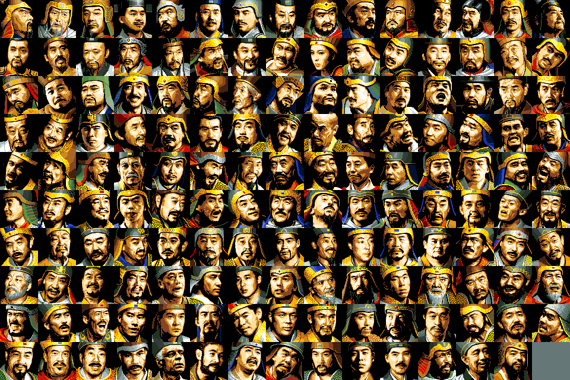

# 03 — `*GRF.DAT` 圖庫格式

**狀態：`KAOGRF.DAT` READY，其餘三個未解。**

- 日期：2026-08-07
- 出處：`docs/re/03-image-blitter.md`（`KI.EXE` 的載入器與繪製常式）
- 工具：`tools/grf.py`
- 驗收：150 張全部解出、**餘 0 byte**、視覺正確（`docs/images/kaogrf-sheet.png`）

## 1. 像素格式

**4 bpp planar，plane-major。** 一張圖：

```
plane 0  整張      width/8 × height byte
plane 1  整張      同上
plane 2  整張
plane 3  整張
```

像素值 = `p0 | p1<<1 | p2<<2 | p3<<3`，每個 byte 的**最高位在最左**。

沒有檔頭、沒有壓縮（熵 3.4–5.2 bit/byte），檔案就是一張接一張。

> **為什麼是 plane-major 而不是逐列交錯**：繪製常式 `sub_1FA37` 對四個平面
> 各呼叫一次 `sub_1FAA2`，而 `sub_1FAA2` 不重設來源指標 `si`——
> 四次呼叫連續吃掉四段資料。見 `docs/re/03` §2。

## 2. `KAOGRF.DAT`：武將頭像（confirmed）

| 項目 | 值 | 依據 |
|---|---|---|
| 尺寸 | **64 × 64** | 繪製常式跑 64 列 × 每列 8 byte |
| 每張 | **2,048 byte** | 載入器 `mov di, 800h` |
| 定位 | **編號 × 2048** | 載入器的 `shl ax,1 / rcl cx,1` ×3 |
| 張數 | **150** | 307,200 ÷ 2,048，餘 0 |
| 調色盤 | `GAMEPAL.BRG` 第 0 組 | 同一支常式先載入 `GAMEPAL` |

**150 張對上遊戲的 146 名武將**（社群資料），多出來的四格是空白或備用。



### 載入器有 4 格快取

`sub_107D2` 維護一張 4 格的快取表（`[bx+846h]`），未命中時以 round-robin
挑一格（`byte_10845`）覆寫。**remake 不需要照做**——那是為了省 1994 年的記憶體，
不影響行為。但要記錄，那是保存的一部分。

## 3. 其餘三個圖庫：未解

| 檔案 | 大小 | 狀態 |
|---|---|---|
| `ICONGRF.DAT` | 47,776 | 未解。**大小不是 2 的次方倍數**（＝32×1493，1493 是質數）→ 尺寸與頭像不同 |
| `KYOGRF.DAT` | 69,120 | 未解 |
| `IVENTGRF.DAT` | 76,032 | 未解 |

**不要用大小去湊尺寸。** `CLAUDE.md` §8 第 10 條：猜三次沒中就停手，去讀反組譯。
正確做法是照 `KAOGRF` 的路徑走一次：

1. 在 `.asm` 找檔名字串的位址（例：`ICONGRF.DAT` 在 seg000 偏移 `0D6Ah`）
2. grep 那個立即值（`mov dx, 0D6Ah`）找到載入器
3. 從載入器讀出「每筆多少 byte」與「怎麼定位」
4. 從繪製常式的 `ax` 參數讀出寬高（`ah` ＝ 列數、`al` ＝ 每列的 2-byte 次數）

## 4. 工具

```sh
# 全部排成總覽
python3 tools/grf.py sheet workplace/orig/dosv/KAOGRF.DAT 64 64 \
        workplace/orig/dosv/GAMEPAL.BRG 0 out.png 15

# 單張放大
python3 tools/grf.py one workplace/orig/dosv/KAOGRF.DAT 64 64 \
        workplace/orig/dosv/GAMEPAL.BRG 0 42 one.png 6
```

`sheet` 會印出「餘 N byte」。**餘數不是 0 就代表尺寸猜錯了**，是最便宜的檢核。

## 5. 兩版共用

`KAOGRF`／`KYOGRF`／`ICONGRF`／`IVENTGRF` **四個檔在 PC-98 與松崗版 byte-for-byte
完全相同**（`docs/re/01`）。解碼器兩版通用。
