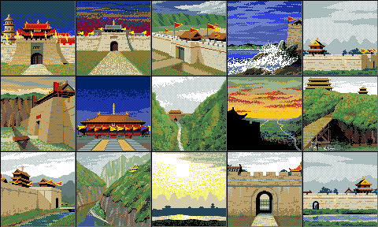
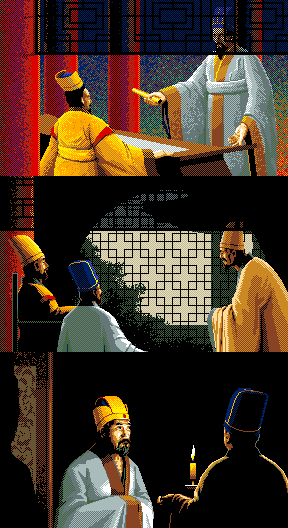
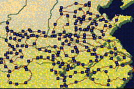

# 03 — `*GRF.DAT` 圖庫格式

**狀態：`KAOGRF`／`KYOGRF`／`IVENTGRF` READY，`ICONGRF` 部分解。
⭐ 視窗底紋的點陣找到了——`ICONGRF.DAT` 的最後 128 byte（§5.5），
兩版相同；剩螢幕上 96 列週期的排法沒驗。**

- 日期：2026-08-17
- 出處：`docs/re/03-image-blitter.md`（載入器與繪製常式）、
  `docs/re/18-tactical-button-glyphs.md`（`ICONGRF` 段 1 的圖塊定位）
- 工具：`tools/grf.py`
- 驗收：150 張全部解出、**餘 0 byte**、視覺正確（`docs/images/kaogrf-sheet.png`）

## 1. 像素格式

**4 bpp planar，plane-major。** 一張圖：

```
plane 0  整張      width/8 × height byte
plane 1  整張      同上
plane 2  整張
plane 3  整張
```

像素值 = `p0 | p1<<1 | p2<<2 | p3<<3`，每個 byte 的**最高位在最左**。

沒有檔頭、沒有壓縮（熵 3.4–5.2 bit/byte），檔案就是一張接一張。

> **為什麼是 plane-major 而不是逐列交錯**：繪製常式 `sub_1FA37` 對四個平面
> 各呼叫一次 `sub_1FAA2`，而 `sub_1FAA2` 不重設來源指標 `si`——
> 四次呼叫連續吃掉四段資料。見 `docs/re/03` §2。

## 2. `KAOGRF.DAT`：武將頭像（confirmed）

| 項目 | 值 | 依據 |
|---|---|---|
| 尺寸 | **64 × 64** | 繪製常式跑 64 列 × 每列 8 byte |
| 每張 | **2,048 byte** | 載入器 `mov di, 800h` |
| 定位 | **編號 × 2048** | 載入器的 `shl ax,1 / rcl cx,1` ×3 |
| 張數 | **150** | 307,200 ÷ 2,048，餘 0 |
| 調色盤 | `GAMEPAL.BRG` 第 0 組 | 同一支常式先載入 `GAMEPAL` |

**150 張對上遊戲的 146 名武將**（社群資料），多出來的四格是空白或備用。


### 載入器有 4 格快取

`sub_107D2` 維護一張 4 格的快取表（`[bx+846h]`），未命中時以 round-robin
挑一格（`byte_10845`）覆寫。**remake 不需要照做**——那是為了省 1994 年的記憶體，
不影響行為。但要記錄，那是保存的一部分。

## 3. `KYOGRF.DAT`：15 張 96×96（confirmed）

`sub_17F1A`：

| 依據 | 值 |
|---|---|
| `mov dx, 1200h` ＋ `mul dx` | 定位 ＝ 編號 × 4,608 |
| `mov di, 1200h` | 每張 4,608 byte |
| `mov ax, 6006h` | `ah`＝96 列、`al`＝6 → 每列 12 byte ＝ **96 px 寬** |

驗算 12 × 96 × 4 ＝ 4,608 ✓。69,120 ÷ 4,608 ＝ **15 張**，餘 0。
目的 VRAM 偏移 `bx = 5A02h` → 畫面 (16, 288)，也就是據點情報視窗的左半。

**張號來自據點記錄 `+0x16` 的高 4 位**（[`../re/50`](../re/50-city-info-window.md) §3）。
值域 0–14 不是巧合：`sub_17F1A` 算完位移就把高 16 位丟掉，
**張號 15 會溢位指到第一張的中間**——15 張正好用滿。



畫的是**據點景觀**：城門、關隘、宮殿、山道、雪山、水岸、營寨。
`KYO` 應該是「拠点（kyoten）」的頭一個音（**假說**，未驗）。

索引來源是 `[si+16h] >> 4`——某筆記錄的 `+0x16` 欄位取高四位。
**`si` 指向哪一種記錄還沒確認**；圖既然是據點景觀，假說是據點記錄，
而 `>> 4` 取高四位、15 張圖，值域正好吻合 1–15。
確認之後這是一條直通據點資料結構的線。

## 4. `IVENTGRF.DAT`：3 張 288×176（confirmed）

`sub_13D09` 載入、`sub_13D68` 繪製：

| 依據 | 值 |
|---|---|
| `mov dx, 6300h` ＋ `mul dx` | 定位 ＝ 編號 × 25,344 |
| `mov di, 6300h` | 每張 25,344 byte |
| `mov ax, 0B012h` | `ah`＝176 列、`al`＝0x12＝18 → 每列 36 byte ＝ **288 px 寬** |

驗算 36 × 176 × 4 ＝ 25,344 ✓。76,032 ÷ 25,344 ＝ **3 張**，餘 0。
目的 VRAM 偏移 `bx = 2A87h`。



三張都是**劇情過場**：朝堂、密談、燭光夜話。`IVENT` 是 `EVENT` 的拼法。

## 5. `ICONGRF.DAT`：四段組合檔（部分解）

**不是圖庫，是四段不同用途的資料拼起來的。** 四段是分別載入的，
長度加起來 **剛好等於檔案大小 47,776**：

| 段 | 位移 | 長度 | 載入處 | 內容 |
|---|---|---:|---|---|
| 0 | `0x0000` | `0x2800` (10,240) | `sub_1006B` | **640×32 標題橫幅**（`ax=2028h`，`bx=0` → 畫面最頂端）✅ |
| 1 | `0x2800` | `0x3F00` (16,128) | `sub_1C7A9` | 混合尺寸的圖塊。已知有 16×16（`ax=1001h`，128 B／塊）與 16×8（`ax=801h`，64 B／塊）兩種 |
| 2 | `0x6700` | `0x3000` (12,288) | `sub_1006B` | **192×128 縮小地圖底圖**（`ax=800Ch`）✅ |
| 3 | `0x9700` | `0x23A0` (9,120) | `sub_1006B` | 走 `sub_1F888`（**位元對齊**的繪製常式，可放在非 8 倍數的 x）。未解 |

### 5.1 段 0：標題橫幅上是**日文**


橫幅上寫的是「臥竜伝」，不是「臥龍傳」。而 `ICONGRF.DAT`
**兩版 byte-for-byte 完全相同**（`docs/re/01`）——
**松崗版根本沒有重繪這張橫幅。**

這是一個實質的中文化缺口，remake 要補（見 `docs/reference/03`）。

### 5.2 段 2：縮小地圖



與日文說明書第 3.4 節「縮小マップウインドウ」對得上：
可直接點擊移動視角，紅＝自勢力、藍＝敵勢力、黑白＝中立。

`sub_19541` 以像素座標從這一段取任意矩形（`si = bx × 24` → 列跨距 24 byte
＝ 192 寬，與段 2 的尺寸一致），代表它是被當成**來源圖集**用的。

### 5.4 ⭐ 段 3 是**視窗外框**（2026-08-08）

段 3 原本整段標「未解」，只知道它走 `sub_1F888`——那支**位元對齊**的
繪製常式，可以把圖畫在非 8 倍數的 x 上。**這件事本身就是答案**：
地圖圖塊、頭像那些永遠對齊 8 的東西都走另一支，
會需要任意位置的只有「可以開在任何地方的視窗」。

| 段內偏移 | 內容 |
|---|---|
| `0x06C0` | 上下邊的 motif（紅框綠心，8 px 一個） |
| `0x06E0` | 左右邊柱的**柱頭**（金色） |
| `0x0700` | 邊柱的**柱身**，往下重複貼 |

尺寸是 **8×8、4 bpp、32 B／塊**：畫面上量到的 motif 週期正好 8 px，
邊柱也是 8 px 寬（`黑 橙 黃 白 黃 橙 褐 黑`）。9,120 ÷ 32 ＝ 285 整除。

> `0x0700`–`0x0720` 每 8 byte 都相符，那是因為**柱身在垂直方向同紋**，
> 不是有五塊不同的圖。

#### 5.4.1 段 3 裡已定位的兩個 DOS/V 資源

段 3 的載入位址是 `word_10D48`（`sub_1006B` 從檔案位移 `0x9700` 讀進去），
而 `word_10D50` 是同一塊配置裡**往後 `0x9A` 段**的另一個指標，
所以 `word_10D50:X` ＝ 段 3 的 `X + 0x9A0`（推導見
[`../re/48`](../re/48-window-display-list.md) §6.1）。照這條換算：

| 段內位移 | 尺寸 | 內容 | 消費者 |
|---|---|---|---|
| `0x0000` | 24×16 × 6 | **戰術底列的命令圖示**：陣形（陣地）／攻擊（長槍）／突擊（軍旗）／城壁（磚牆）／守陣（盾）／退卻（白旗） | `sub_1C673`（`word_10D48:碼 × 0xC0`，[`../spec/33`](../spec/33-squad-selection.md) §1.5）|
| `0x0480` | 24×16 × 3 | 兵種圖示的**橘色版**：馬／弓／步 | 尚未找到取用端 |
| `0x0FA0` | 96×64 | **數值輸入器的鍵盤**：7 8 9 ◀ 取消／4 5 6 0 最大／1 2 3 00 決定 | `sub_17D0D`（`word_10D50:0600h`）|
| `0x1BA0` | 24×16 × 4 | 資源圖示**紅色版**：天秤／馬／弓／步 | 顯示清單 op `09`（`0x1200` 起）|
| `0x1EA0` | 24×16 × 4 | 同四張的**綠色版** | 顯示清單 op `09`（`0x1500` 起）|

四張圖示與說明書主畫面圖上「予備兵」那一直排逐張相符；
紅綠兩版的分工是「今月底不可改／次月可改」（`../re/48` §8）。

`internal/assets/gfx` 與 `docs/re/13` 固定了這幾個定位與逐格資產測試。
**不推論段 3 其餘 bytes 的用途。**

#### 找法：比「顏色的等價關係」，不比顏色

實機截圖是 PC-98 的調色盤，素材這邊用 DOS/V 的 `GAMEPAL` 解，
**顏色一定對不上**。所以把每個像素換成「它是這塊裡第幾種出現的顏色」，
得到一個與調色盤無關的簽章，再拿畫面上的邊框像素回頭在段裡**逐 byte** 掃。

兩個要點：

- **逐 byte，不要用 64 byte 的格線切**。段 1、段 3 都不是密排的圖塊陣列
  （§5.3），先切格線再比對必然掃不到——第一輪就是這樣空手而回。
- **少於三色的塊要濾掉**。純色塊的簽章全 0，會跟畫面上任何一片純色相符，
  那種「相符」不算數。

### 5.5 ⭐ 視窗內部的龍紋：點陣在 `ICONGRF.DAT` 的**最後 128 byte**

原版的視窗內部不是純色，是**黑底 ＋ 深藍龍紋**。整片可見的樣本是
NEW GAME 的 LOAD DATA 面板（`workplace/dosbox/shots/x04.png`，DOS/V 實跑，
640×400 真實像素）。

| 項目 | 數字 |
|---|---|
| 顏色 | **只有兩色**：調色盤 `0`（黑）與 `8`（深藍）⇒ 只有 plane 3 有位元 |
| 水平週期 | **32**（位移 32／64／96 的自相符 96.9%／92.7%／—）|
| 垂直週期 | **96**（位移 96 ＝ **99.1%**，孤立的尖峰；32／64 只有 70.3%／72.1%）|

#### 點陣在哪

**`ICONGRF.DAT` 檔案位移 `0xBA20`，128 byte，正好是檔尾**
（段 3 的 `+0x2320`；段 3 由 `sub_1006B` 以 `di = 0FFFFh` ＝「讀到檔尾」載入）。

讀法是 **32 寬、1 bpp、每列 4 byte**。逐列拿去對螢幕：

| 列 | 相符率 |
|---|---|
| 0–16、18–21 | **94–99%**（等於逐像素相同，殘差是截圖縮放的雜訊）|
| 17、22、23 | 73–77% |
| 24–31 | 44–86% |

⇒ **磚塊大約 22–24 列高**，不是 32。

**兩版的這 128 byte 完全相同**，符合「平台無關的遊戲資料」（`CLAUDE.md` §4.05）。

#### 螢幕上的 96 列週期還沒解釋完

單純把這塊平鋪都對不到 99%：24 列平鋪 64.5%、32 列平鋪 82.8%。

**磚砌（每一帶橫向位移 ±8／±16／±24 px）已經試過，最高只有 63.5%**，
所以 96 不是「24 列 × 四帶錯位」。目前沒有一個只靠這 128 byte
就能重現整片的排法——**要嘛還有第二塊點陣，要嘛畫法不是平鋪**。

要定案只能找**取用端**，而它在 `KI.EXE` 裡還沒找到：

- `word_10D48:2320h`／`word_10D50:1980h`／`word_10D4A:1C60h`
  三種寫法都**沒有對應的立即值**，所以來源位移是算出來的。
- `sub_1F888`（位元對齊的繪製常式）只有三個呼叫點，來源位移是
  段 1 的 `0x3000`／`0x3900` 與段 3 的圖示區，**都不在段尾**。
- `word_10D50` 的五個用法分別是縮小地圖（`si = 0`）、數值鍵盤
  （`si = 600h`）與三處武將面板，**沒有 `si = 1980h`**。

⇒ 下一步是**掃另外七個執行檔**，或對段 3 尾端那 128 byte 做動態讀取追蹤。

#### 為什麼先前掃不到

前幾輪把整片樣本當一個探針去掃全部 69 個檔（4bpp planar 寬 8／16／32、
1bpp 寬 8／16／32、MSB／LSB、正反相、32 種水平相位），最高只有 86.9%。
**原因是探針比磚塊長**：磚塊約 24 列，而樣本的垂直週期是 96，
所以任何對齊方式都會在第 24 列之後開始不符。

有效的找法是**短探針 ＋ 不假設圖寬**：

1. 取樣本中間一列（4 byte）當鑰匙，找出它在每個檔案裡的所有出現位置。
2. 對每個位置試列跨距 4–160，檢查前後各兩列是否也相符。

兩個命中，而且 `dosv` 與 `pc98` 各出現一次、位移相同：

| 檔案 | 位移 | 跨距 | 意思 |
|---|---|---|---|
| `ICONGRF.DAT` | `0xBA20` | 4 | **32 寬的磚塊本體** |
| `ICONGRF.DAT` | `0x2305` | 80 | 段 0（橫幅 640×32）的 **plane 3** |

### 5.5.1 ⭐ 橫幅背景與視窗底紋是**同一份點陣**

`0x2305` 落在段 0 的 plane 3（`0x1E00`–`0x27FF`），跨距 80 ＝ 640 px 寬。
換算成畫面座標是橫幅的 (40, 16) 附近。

先前把兩者的相似度量成 90.2%（形狀比對），現在是**逐 byte 相同**：
橫幅的背景就是同一條龍紋，只是畫在 640 寬的圖裡，
所以在檔案裡的列跨距是 80 而不是 4。

**remake 這一側**：`internal/assets/gfx` 可以直接從玩家自備的
`ICONGRF.DAT` 取這 128 byte 當底紋來源——它是原版資料，不進版控
（`CLAUDE.md` §9），但執行期讀得到。實作前要先把 96 列的排法驗出來。

### 5.3 段 1：七個圖塊已定位，UI 語意未解

段 1 不是從段首密排的圖塊陣列——繪製常式用的是段內偏移，中間夾著別的東西。
把整段當同尺寸陣列切出來是雜訊。

七個偏移已由 `KI.EXE` 的呼叫端逐一追出（完整證據、blit 參數與目視描述見
[`../re/18-tactical-button-glyphs.md`](../re/18-tactical-button-glyphs.md) §2）：

| 段內偏移 | 尺寸 | 消費者 |
|---|---|---|
| `0x3000` | 80×32，`0x500` B | `sub_1C7F4`，重複 6 次貼在底列 |
| `0x3500` | 128×16，`0x400` B | `sub_1C863` |
| `0x3900`–`0x3D7F` | 24×16 × 6，各 `0xC0` B | `sub_1C7F4` 經 `sub_1F888` 連續消費 |
| `0x3D80` | 16×8 | `sub_1CAA8`，每組重複 8 次 |
| `0x3DC0` | 16×8 | `sub_1CA3B` 四處 |
| `0x3E00`／`0x3E80` | 16×16 各一 | `sub_1CA3B` 的 25 次迴圈 |

**尺寸與偏移互相印證**：16×8 的 4bpp 是 `0x40` B，而 `0x3D80`→`0x3DC0`→`0x3E00`
恰好各差 `0x40`；16×16 是 `0x80` B，`0x3E00`→`0x3E80` 正好差 `0x80`。

**剩下的是 UI 語意**：這些圖塊在畫面上各代表什麼還沒定案，
`0x3000` 背板上的文字／圖示由誰合成也未解（`../re/18` §5）。

段 3 同樣是混合內容：§5.4 那三塊之外整段畫出來還是雜訊，
**只認已經對上實機畫面的部分，不假裝整段都解得開**。

> ⚠ 踩過的坑：`0x3DC0`／`0x3E00`／`0x3E80` 這三個 `si` 除以 64 是
> 247／248／250，剛好落在段 1 當成 16×8 切之後的右下角，
> 而那裡目視「像是外框」。**差一點就把段 1 認成外框的來源**——
> 實際比對簽章才發現外框在段 3。目視相似不是證據。

段 3 走的 `sub_1F888` 是另一支繪製常式，還沒讀。

## 6. 工具

```sh
# 全部排成總覽
tools/py.sh tools/grf.py sheet workplace/orig/dosv/KAOGRF.DAT 64 64 \
        workplace/orig/dosv/GAMEPAL.BRG 0 out.png 15

# 單張放大
tools/py.sh tools/grf.py one workplace/orig/dosv/KAOGRF.DAT 64 64 \
        workplace/orig/dosv/GAMEPAL.BRG 0 42 one.png 6
```

`ICONGRF` 這種組合檔用 `region`：

```sh
tools/py.sh tools/grf.py region workplace/orig/dosv/ICONGRF.DAT 0x6700 192 128 \
        workplace/orig/dosv/GAMEPAL.BRG 0 out.png 1
```

`sheet`／`region` 都會印出「餘 N byte」。**餘數不是 0 就代表尺寸猜錯了**，
是最便宜的檢核。四個圖庫的尺寸全部餘 0。

## 7. 兩版共用

`KAOGRF`／`KYOGRF`／`ICONGRF`／`IVENTGRF` **四個檔在 PC-98 與松崗版 byte-for-byte
完全相同**（`docs/re/01`）。解碼器兩版通用。
