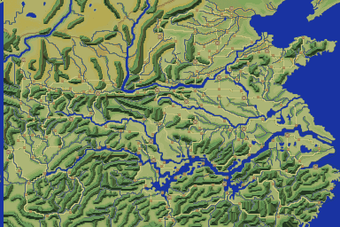

# 06 — `MMAP.MAP` 的 RLE 壓縮

**狀態：READY。** 解出來的地圖已用實機畫面與縮小地圖雙重驗證。

- 日期：2026-08-07（§3 的長度頭 2026-09-02 補）
- 出處：`KI.EXE` 的 `sub_1F5E7` ＋ 開檔子程序 `sub_1F655`
- 工具：`tools/rle.py`、`internal/assets/rle`

## 1. 為什麼會漏掉這一支

`MMAP.MAP` 走的載入器**與其他資料檔不同**：

| 包裝 | 實作 | 誰用 |
|---|---|---|
| `sub_1E378` | `sub_1F4A2` | 一般讀檔（`TALK.DAT`、`SOUND.DAT`…） |
| `sub_1E38C` | `sub_1F4DF` | 帶位移讀檔（`KAOGRF` 那一族） |
| **`sub_1E364`** | **`sub_1F5E7`** | **只有 `MMAP.MAP`** |

三支包裝長得幾乎一樣（都是 push／call／pop ＋ 失敗重試），
**差別只在呼叫的內層函式**。掃過去很容易當成同一件事。

## 2. 演算法：用「連續兩個相同的 byte」當 run 的觸發

沒有逃脫字元。

```
逐 byte 複製；
一旦輸出的 byte 與前一個相同，下一個輸入 byte 是「再重複幾次」；
次數 0 表示那兩個相同的 byte 就只是字面值，回到逐 byte 模式。
```

所以一段 run 的總長是 **2 + count**。原始碼（`sub_1F5E7`）：

```asm
loc_1F602:
        call    sub_1F69E       ; 取一個輸入 byte → al（ah=FFh 表示 EOF）
        cmp     ah, 0FFh
        jz      short loc_1F638
        mov     [si], al        ; 輸出
loc_1F60C:
        mov     dl, al          ; dl ＝ 前一個
        call    sub_1F691       ; 輸出指標前進
        call    sub_1F69E
        cmp     ah, 0FFh
        jz      short loc_1F638
        mov     [si], al        ; 輸出
        cmp     al, dl
        jnz     short loc_1F60C ; 不同 → 繼續逐 byte
        ; 相同 → 進入 run
        call    sub_1F691
        call    sub_1F69E       ; 取重複次數
        cmp     ah, 0FFh
        jz      short loc_1F638
        cmp     al, 0
        jz      short loc_1F602 ; 次數 0 → 只是兩個字面值
loc_1F62E:
        mov     [si], dl
        call    sub_1F691
        dec     ax
        jnz     short loc_1F62E
        jmp     short loc_1F602
```

## 3. ⭐ `[HARD]` 檔案前 4 byte 是解壓長度，**不進解壓器**

開檔的子程序 `sub_1F655` 在讀第一個 byte 之前先 `LSEEK` 到位移 4：

```asm
sub_1F655:
        mov     ax, 4200h       ; LSEEK，從檔頭起算
        xor     cx, cx
        mov     dx, 4           ; ⭐ 跳過 4 byte
        int     21h
        mov     bx, 800h        ; 32 KB 讀取緩衝
```

同一段在 `D7END.EXE` 與 `D7OPEN.EXE`（`sub_10E04`）裡逐指令相同，
所以這是格式的一部分（[`../re/76`](../re/76-d7open-opening-player.md) §5）。
跳過的 4 byte 是**小端 u32 ＝ 解壓後的長度**：`MMAP.MAP` 寫的是
`00 80 01 00` ＝ 98,304 ＝ 384 × 256，**逐格相等，沒有餘數**。

兩版各 20 個檔走這條路（`MMAP.MAP`、`OPEN_S1`–`S6`、`END_S1`–`S12`、
`GAMEOVER.DAT`），宣告值與跳頭解出來的長度逐檔相等。

### 3.1 為什麼「從 0 開始解」在這一個檔上也會對

`00 80 01 00` 四個 byte 裡沒有相鄰重複，RLE 的狀態機原樣吐出它們、
相位也沒跑掉——`decode(檔案)[4:]` 與 `decode(檔案[4:])` **逐 byte 相同**。
所以把長度欄當成「解壓後開頭的四個 byte」也會得到正確的地圖，
`internal/assets/world` 就是這樣寫的（`Map.Header` 保留它以便寫回）。

⚠ **這個運氣不是通例。** 過場圖的頭多半含相鄰重複（`OPEN_S2` 是
`00 dc 05 00`），從 0 解會在某一處掉相位，症狀是長度差幾十個 byte、
畫面整體位移。**判準是長度**：跳頭之後一定等於宣告值，差一個 byte 都是錯的
（[`09`](09-cutscene-images.md) §1.1）。

## 4. 驗收：四件事同時對才畫得出這張圖



（384 × 256，1 px ＝ 1 格，每格取該圖塊的平均色。）

黃河與長江的走向、渤海與黃海的海岸線、山脈與平原的分佈、
黃色的道路網——**全部連貫**。要畫出這張圖，下面四件事必須同時正確：

1. RLE 演算法（錯一個 byte 之後整條就亂）
2. 地圖尺寸 384 × 256（錯了會斜掉）
3. `MMAP.MDL` 的 256 塊圖塊解碼（`docs/formats/05`）
4. `.BRG` 調色盤的通道順序（`docs/formats/02`）

**大輪廓也與 `ICONGRF` 段 2 的縮小地圖（192 × 128）一致**
——河網走向與海岸位置對得上。

> ⚠ 但**縮小地圖不是世界地圖的降採樣**，是另外畫的一張圖。
> 逐格對應不成立（量化結果見 `docs/playtest/03` §2），
> 所以它驗證的是大輪廓，不是逐格的地形分類。

用到 **238 種圖塊**（共 256 種），最常見的一種佔 11,835 格（12%），
分佈合理，不是解壓爆掉的一片同值。

## 5. 兩版

`dosv` 與 `pc98` 的 `MMAP.MAP` **內容不同但解出來的長度相同**
——同一張地圖的兩次壓縮。測試 `TestRLESameShapeBothVersions` 釘住這一點。

## 6. 這支解壓器還有誰在用

目前只在 `MMAP.MAP` 上確認。`BATTLE.MAP`（877,056 B）、`MMAP.MCH`、
`BATTLE.MDL` 走哪一支載入器還沒查——**下一輪先查那個，不要預設同一支**
（`CLAUDE.md` §8 第 9 條）。

<!-- 缺口：無 -->

> 這份文件本身沒有未解項——內文出現的「缺口／未解」字樣指的是別處的缺口或方法論規則。
> `tools/re_open_questions.py` 靠上面那行把「真的沒有」與「抽不到」分開。
