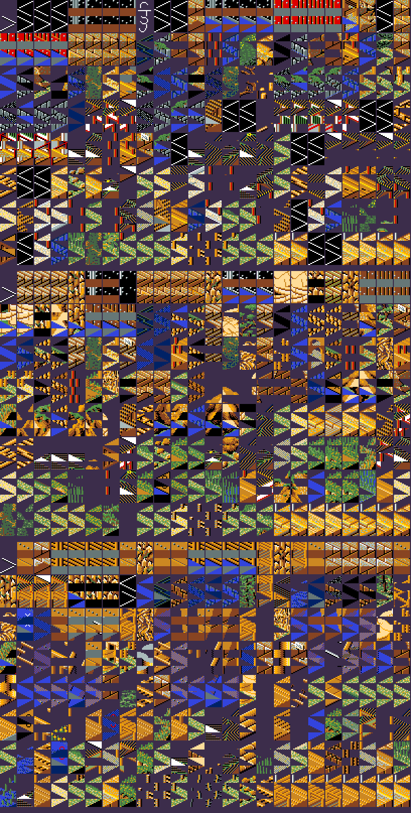

# 07 — `BATTLE.*` 戰場資料

**狀態：分段結構、圖塊定義、子圖塊與人物圖形的像素格式都 confirmed。
剩三項未解（§10）。**
> 圖塊定義、地形組合查表、物件格見 [`docs/re/11`](../re/11-tactical-battle.md) §4。

- 日期：2026-08-07
- 出處：`KI.EXE` 的 `sub_1CAEB`（載入）、`sub_1CC31`（緩衝區配置）
- 推論等級：**分段、筆數、緩衝區大小、子圖塊與人物圖形的像素格式 confirmed**

## 1. 先確認一件事：`BATTLE.*` 不走 RLE

| 檔案 | 載入器 | 壓縮 |
|---|---|---|
| `MMAP.MAP` | `sub_1E364` → `sub_1F5E7` | **RLE**（`docs/formats/06`） |
| `BATTLE.SCH` | `sub_1E378` → `sub_1F4A2` | 無 |
| `BATTLE.DAT`／`BATTLE.MAP`／`BATTLE.MDL` | `sub_1E38C` → `sub_1F4DF` | 無 |
| `MMAP.MCH` | `sub_1E378` | 無 |

**只有 `MMAP.MAP` 是壓縮的。** 這一條特地查過才寫——
`CLAUDE.md` §8 第 9 條禁止跨檔案外推，而「都是地圖資料應該都壓縮」
正是最容易犯的那種外推。

## 2. `BATTLE.MAP`：512 B 索引 ＋ 214 個戰場（confirmed）

`sub_1CAEB`：

```asm
mov     dx, 0DCAh           ; 'BATTLE.MAP'
xor     ax, ax              ; 位移 0
mov     di, 200h            ; 讀 512 B
call    sub_1E38C           ; → 索引表

mov     bl, ds:0D34h        ; 戰場編號
shl     bx, 1               ; ×2 → 每筆索引 2 byte
mov     al, es:[bx+1]       ; → byte_1AB4F（用途未解）
mov     al, es:[bx]         ; → 圖塊組編號

; 位移 = 戰場編號 × 4096 + 512
mov     di, 1000h           ; 讀 4,096 B
call    sub_1E38C
```

| 項目 | 值 |
|---|---|
| 索引表 | 檔頭 512 B，每筆 **2 byte**（`[bx]` 圖塊組編號、`[bx+1]` **城門附近的 X**，見 `docs/re/11` §4.5） |
| 每個戰場 | **4,096 byte** |
| 戰場數 | (877,056 − 512) ÷ 4,096 ＝ **214**，餘 0 |

### 2.1 4,096 B 的內部佈局（confirmed）

`sub_1CB9B`（戰場的 180 度旋轉，見 §2.2）的掃描範圍給出了答案：

```asm
mov     si, 40h             ; 從 0x40 開始
mov     di, 0FBFh           ; 到 0xFBF 結束
mov     cx, 7C0h            ; 1,984 次對調
```

1,984 × 2 ＝ **3,968 byte**，範圍 `0x40`–`0xFBF`。所以：

| 區段 | 位移 | 長度 |
|---|---|---:|
| 表頭 | `0x000`–`0x03F` | 64 |
| **地形格** | `0x040`–`0xFBF` | **3,968** |
| 尾段 | `0xFC0`–`0xFFF` | 64 |

3,968 ＝ **64 × 62**。所以戰場是 **64 × 62 格**（哪一邊是寬還沒定，
但格數是確定的）。表頭與尾段各 64 byte，內容未解。

### 2.2 戰場會依進攻方向轉 180 度（confirmed）

```asm
test    cs:byte_10D35, 40h
jz      short loc_1CB93         ; 旗標沒開就不轉
cmp     cs:byte_1AB4F, 0
jz      short loc_1CB90
mov     al, 3Fh
sub     al, cs:byte_1AB4F       ; 方向值 → 3Fh − 方向值
mov     cs:byte_1AB4F, al
loc_1CB90:
call    sub_1CB9B               ; 地圖整個轉 180 度
```

`byte_1AB4F` 來自 `BATTLE.MAP` 索引表的 `[bx+1]`，值域 0–0x3F，
翻轉時取 `3Fh − 值`。**同一個戰場，兩軍從不同方向打過來時
地圖要轉半圈** —— 214 個戰場因此涵蓋兩倍的實際戰況。

**remake 必須照做。** 少了這一步，一半的戰鬥會用錯誤的地形方向，
而且是那種「看起來能玩但每一場都微妙不對」的錯。

### 2.3 旋轉時圖塊值要換（confirmed）

轉 180 度不是單純把陣列倒過來——有方向性的圖塊（斜坡、河岸、路口）
要換成鏡射版本。`sub_1CBBC` 就是那張對映表：

| 值域 | 對映 |
|---|---|
| `< 0x30` | 不變 |
| `0x30`–`0xCF` | `((v − 0x30) ^ 0x10) + 0x30` —— 翻轉 bit 4，即每 0x10 一組配對 |
| `0xD0`–`0xEF` | `v & 3` 是 0 或 3 → `v ^= 3`（0↔3）；是 1 或 2 → 不變 |
| `≥ 0xF0` | `v ^= 1` |

三段不同的規則，代表圖塊表在這三個值域用了三種不同的排列慣例。

## 3. `BATTLE.MDL`：4,096 B 表頭 ＋ 3 組 × 63,488 B（confirmed）

```asm
mov     di, 100h            ; 讀 256 B，位移 = 組編號 × 256   → 表頭那一筆
call    sub_1E38C
mov     di, 0F800h          ; 讀 63,488 B
mul     di                  ; 位移 = 組編號 × 0xF800 + 0x1000
call    sub_1E38C
```

驗算：`0x1000 + 3 × 0xF800 = 194,560` ＝ **檔案大小，完全對上**。

表頭 4,096 ÷ 256 ＝ **16 筆**，但資料只有 3 組
——表頭筆數多於資料組數，原因未解。

## 4. 緩衝區配置印證（confirmed）

`sub_1CC31` 一次算好戰場用的緩衝區，大小全部對得上：

| 變數 | 段增量 | 位元組 | 對應 |
|---|---|---:|---|
| `ds:0D2F6h` | `+100h` | 4,096 | `BATTLE.MAP` 每個戰場的資料 ✅ |
| `ds:0D302h` | `+0F80h` | 63,488 | `BATTLE.MDL` 一組圖塊 ✅ |
| `ds:0D308h` | `+10h` | 256 | `BATTLE.MDL` 表頭一筆 ✅ |
| `ds:0D304h` | `+1C20h` | 115,200 | **正好是 `BATTLE.SCH` 的整個檔案** ✅ |
| `ds:0D306h` | `+780h` | 30,720 | `ICONGRF` 段 1（16,128 B）放這裡 |

**四個獨立的數字同時對上，分段結構可以當定論。**

## 5. `BATTLE.MDL`：3 個圖塊組（confirmed）

```
0x0000  4,096 B  表頭：每個圖塊組 256 B 的屬性表（位移 ＝ 組編號 × 256）
0x1000  63,488 B 圖塊組 0    ← 位移 ＝ 組編號 × 63,488 + 4,096
0x10800 63,488 B 圖塊組 1
0x20000 63,488 B 圖塊組 2
```

(194,560 − 4,096) ÷ 63,488 ＝ **3**，餘 0。載入器 `sub_1CAEB` 用的正是
這兩個位移算式，緩衝區大小（`sub_1CC31` 切的 `0xF80` 段 ＝ 63,488）也吻合。

每組的前 2,048 B 是 **256 筆 × 8 B 的圖塊定義**：

```
[0]        堆疊高度 k（0–7）
[1..k]     由下往上的子圖塊編號
[k+1..7]   0        ← 三組共 768 筆全部成立，零例外
```

**一格地圖存的是圖塊編號，而一個圖塊是一疊 1–7 層的子圖塊。**
其餘 61,440 B 是像素資料，格式見 §8。

檢視工具：`tools/battlefield.py`。

## 6. ⭐ `BATTLE.DAT`：32 段 × 256 B 的戰場腳本（confirmed）

```
段編號 ＝ 武將記錄 +0x16（0–7）× 4 ＋ 戰場類別（0–3）
檔案位移 ＝ 段編號 × 256
```

每段 128 個 word，一個 word 一個指令：

```
byte 0 低 5 位   指令碼 0–18（對應 cs:A466 那張表的 19 個處理常式）
byte 0 高 3 位   參數 0–7
byte 1          運算元
```

**用資料就驗得掉**：4,096 個 word 的低 5 位沒有一個 ≥ 19，
而位元組若是隨機的，期望會有約 1,664 個超過
（`tools/battledat.py verify`）。

⚠ **一個指令不一定是兩個 byte**：分支指令（10）後面那個 word 是
**跳躍目標**，而它長得像「等待」（低位元組 0）。照直線每兩個 byte 切一刀
會把 564 個目標誤讀成 564 次等待。兩條驗證都是零例外：
分支後面那個 word 的低位元組是 0（564/564）、
跳躍目標落在**指令邊界**上（564/564）。

十九個指令全部讀完，見 `docs/re/11` §3.5。
反組譯與統計工具：`tools/battledat.py`。

## 7. ⭐ 圖塊值裡的城壁與門

戰場的格子值除了決定地形高度，還有兩段是**遊戲物件**：

| 圖塊值 | 是什麼 |
|---|---|
| `0xD0`–`0xDF` | **城壁**（可破壞） |
| `0xE0`–`0xEF` | 城壁的瓦礫（打壞之後換成的值 ＝ 原值 ＋ `0x10`） |
| `0xF0`–`0xF7` | **門** |
| `0xF8`–`0xFF` | 破掉的門（原值 ＋ 8） |

載入時 `sub_19CE2`／`sub_19DA1` 掃過整張圖，把這兩段變成
`0x0C00` 起的 16 筆實體記錄（機制見 `docs/re/11` §5.11）。
**逐行往下掃，一行連續的城壁只算一段**。

拿原版的 `BATTLE.MAP` 全掃過：

| 檢查 | 結果 |
|---|---|
| 186 張攻城戰場（索引第二欄非 0）都含 `0xD0`–`0xDF` | ✅ 零例外 |
| 每張圖的「城壁段數 ＋ 門格數」 | ✅ 全部 ≤ 16，**沒有一張塞滿那 16 筆** |
| 攻城場的城壁段數 | 1–5 |
| 攻城場的門格數 | 2–14 |
| 野戰場含城壁圖塊的 | 8 張（有工事的野戰圖） |

城壁的格數不多（一張圖 3–11 格）——**castle 的牆大部分是普通的高堆疊圖塊，
只有這幾格是打得壞的**。


## 8. ⭐ 子圖塊的像素格式

一個圖塊組 63,488 B 裡，前 2,048 B 是圖塊定義，**剩下 61,440 B 是
192 個子圖塊 × 320 B**。

兩件事互相印證，所以塊大小不是猜的：

- 192 × 320 ＝ 61,440，**剛好用完**，沒有零頭也沒有死區
- 圖塊定義引用的子圖塊編號值域**正好是 0–191**

### 320 B ＝ 五個位元平面

每個平面 64 B，是一張 **16 × 32 的 1bpp 圖**（2 B 一列、MSB 在左）：

| 平面 | 偏移 | 內容 |
|---:|---|---|
| 0 | `+0x00` | **遮罩**：1 ＝ 有畫、0 ＝ 透明 |
| 1 | `+0x40` | 色號 bit 0 |
| 2 | `+0x80` | 色號 bit 1 |
| 3 | `+0xC0` | 色號 bit 2 |
| 4 | `+0x100` | 色號 bit 3 |

色號 0–15 查 `GAMEPAL.BRG` 的色盤組（一組 16 色）。

### 怎麼確定的

先量**位元組流的自相關**（不預設任何結構），扣掉 18.5% 的基準之後：

| stride | 相等率 | 意思 |
|---:|---:|---|
| 2 | 51.4% | 一列 2 B → **寬 16 px** |
| 4 | 43.9% | 兩列 |
| 64 | 38.7% | **一個平面 64 B** |
| 128／192／256 | 34.4%／31.6%／27.0% | 第 2／3／4 個平面 |
| **320** | **45.0%** | **一個子圖塊 320 B** |
| 80／160 | 16.3%／19.6% | 基準以下 → **不是**每平面 80 B |

320 ＝ 5 × 64 而不是 4 × 64，多出來的那一個平面就是遮罩。

哪一個平面是遮罩，用一條**不可能靠巧合成立**的不變量定案：

> **遮罩是 0 的地方，四個色平面全部是 0。**

五個平面各試一次、兩種極性各試一次，只有「平面 0、1 ＝ 有畫」是
**100.0%**，其餘全在 0–51% 之間。3 組 × 192 個子圖塊 × 512 像素
＝ 294,912 個位元，零例外。




## 9. ⭐ `BATTLE.SCH`：人物圖形，與子圖塊同格式

115,200 B ＝ **360 個 320 B 的單位**，格式與 §8 的子圖塊**一模一樣**：
五個 64 B 的位元平面（遮罩 ＋ 4bpp 的四張），16 × 32。

同一條不變量在這裡也成立：**遮罩是 0 的地方，四個色平面全部是 0**，
360 × 512 個位元零例外。**同一條檢查換一個檔案照樣 100%**——
這比在單一檔案上湊出來的解釋有力得多。

### ⭐ 360 ＝ 兩側 × 180

兩條互相獨立的證據：

1. **整份檔案只有兩個單位是全空的：170 與 350**，正好相差 180
2. 前 180 個是紅色系、後 180 個是藍色系（攻方／守方）

### ⭐ 一張圖是 16 × 64：奇數單位在上、偶數在下

量遮罩的接合率（隨機基準約 6%）：

| 接法 | 命中 |
|---|---:|
| 左右：單位 i 的右緣 → i+1 的左緣 | 4.8% |
| 左右：i+1 的右緣 → i 的左緣 | 6.3% |
| 上下：i 的底列 → i+1 的頂列 | 16.7% |
| **上下：i+1 的底列 → i 的頂列** | **27.6%** |

所以一側 180 個單位 ＝ **90 張 16 × 64 的圖**。
順序寫反的話會變成「旗子在腳邊、桿子在頭上」。

### ⭐ 戰場 render 的合併圖形表與投射物

`sub_1D958` 把目前 `BATTLE.MDL` 圖組的像素段（`ds:0D302 + 0x80`）
記成 `word_1E15A`。`sub_1E085` 以每單位 `0x140` byte 的步長取圖；
因此前 192 個單位是該組 MDL 的 192 個子圖塊，下一個單位就是
`ds:0D304` 的 `BATTLE.SCH` 第 0 個單位。這個跨緩衝區的關係由
`sub_1CC31` 的 `0D302 → 0D304` 段增量與兩個檔案大小共同確認，
不是把 raw 圖號直接當成 SCH 檔案位移。

| 原版 producer | raw 圖號 | `BATTLE.SCH` 單位 | 用途 |
|---|---:|---:|---|
| `sub_1AD2D` | `0x210`／`0x211` | 336／337 | 普通箭，方向只取奇偶 |
| `sub_1AD7F` | `0x214`／`0x215` | 340／341 | CH=0x20 特殊效果，低位來自武將 `+0x02 bit 0` |

remake 的 `battle.Sprites.SourceTile` 保留這個 raw 圖號基準；畫面層已把
普通箭接回實際 SCH 單位。特殊效果目前固定第一幀 340，直到規則層保留
原版 bit 0 前不宣稱兩幀動畫 parity。

### ⭐ 兵種的儲存值就是圖形表的索引

90 張分成五組、每組 18 張，分界正好落在 **0／18／36／54／72**——
那就是兵種的儲存值。**兵種之所以存成「× 18」，是因為它就是這張表的索引**
（`sub_1AB7C` 的三個門檻全是 18 的倍數，同一個理由）。

| 圖號 | 兵種 | 用棕色像素驗（GAMEPAL 第 0 組色號 6） |
|---|---|---|
| 0–17 | 大將 | **1%**（沒有馬） |
| 18–35 | 騎馬 | **40%**（馬） |
| 36–53 | 弓兵 | 21%（弓與皮甲） |
| 54–71 | 步兵 | 8% |
| 72–89 | **軍旗** | 白桿 ＋ 紅旗／藍旗，佔滿 64 px |

### ⭐ 18 張裡誰是誰：`sub_1B240` 的尾段（`docs/re/11` §5.13）

    圖號 ＝ 兵種 ＋（面向 × 2 ｜ 狀態旗標 & 0x19） ＋ 側 × 90

| 位 | 作用 |
|---|---|
| 面向 × 2 | 0／2／4／6，四個方向 |
| bit 0 | **走路的動畫幀**——每次更新完 `xor [si+2], 1` |
| bit 3 | 另一個狀態（＋8） |
| bit 4 | **設了就一律用正面**（面向歸零） |

所以 18 張裡實際用到 0–15，最後兩張沒被這個公式選到。

### 順帶：畫面是 640 × 400 的 EGA 平面模式

`sub_1F888` 算目的地位址時用 `bx * 80`，一列 80 B ＝ 640 px；
它連著寫四個平面（set/reset 遮罩 `0x0E`／`0x0D`／`0x0B`／`0x07`，
第一次覆蓋、後三次 OR）。**這支 blitter 沒有遮罩平面**，
所以 `BATTLE.SCH` 那個第五平面是另一條繪製路徑在用的。

## 10. 未解

| 項目 | 現況 |
|---|---|
| 戰場的 `64 × 62` 哪一邊是寬 | 格數確定（§2.1），方向沒定 |
| 每個戰場 4,096 B 的表頭與尾段各 64 byte | 內容未解（§2.1）|
| 表頭 16 筆但資料只有 3 組 | 多出來的 13 筆是什麼未解（§3）|
