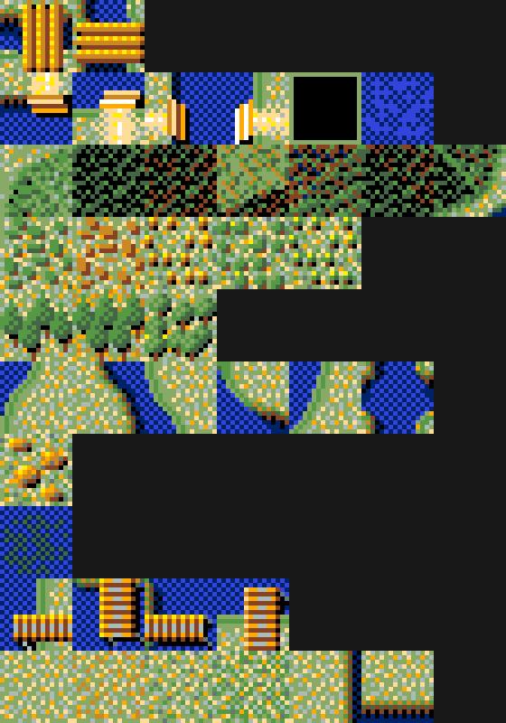
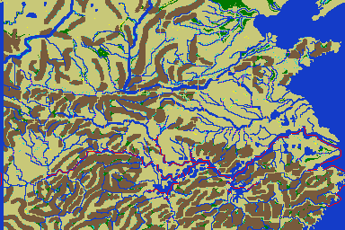

# 30 — 戰場（戰術）

**狀態：進場規則已解，戰鬥規則本身還沒碰。**

推論等級定義見 [`00-index.md`](00-index.md)。

## 1. 戰場怎麼被選出來

完整反組譯見 [`docs/re/05`](../re/05-battle-selection.md)。

| 路徑 | 戰場怎麼決定 | 旋轉 | 等級 |
|---|---|---|---|
| **攻城戰** | 據點編號直接當戰場編號 | 否 | confirmed |
| **野戰** | 依軍團所在格與其下方四格的**大地圖地形**即時產生 | 是 | confirmed |

**野戰的戰場是從世界地圖上長出來的，不是查表拿的。**
remake 若做成「隨機挑一張地形圖」，玩起來會完全不同。

## 2. 地形類型對映表（confirmed）

`sub_14C4C` 是一張範圍查表，位在 `dosv` 的 `KI.EXE` seg000 偏移 `0x982F`，
14 筆 × 3 byte（`[類型, 下限, 上限]`），命中就回傳類型，全部不中回傳 `0`。

| 類型 | 圖塊值 | 地形 | 等級 |
|---:|---|---|---|
| **1** | `0xB8`–`0xB9` | **跨水構造**（橋／渡口） | **confirmed** |
| **2** | `0xBA`–`0xBF` | **跨水構造**（同上，另一組） | **confirmed** |
| **3** | `0x70`–`0xA7`、`0xA9`–`0xAF` | 山地／丘陵，63 種 | 強證據 |
| **4** | `0x06`、`0x1D`、`0xB0`、`0xB6`–`0xB7` | 林地（一種） | 強證據 |
| **5** | `0xB1`–`0xB3` | 林地（另一種） | 強證據 |
| **6** | `0x0E`–`0x0F`、`0x1E`–`0x6F` | **水域**，84 種 | **confirmed** |
| **7** | `0xA8` | 水（純藍網點） | 強證據 |
| **8** | `0xCA` | **水上木構造**（碼頭／渡口） | 強證據 |
| **9** | `0xC0`–`0xC3` | **水上木構造**（橋／棧道） | 強證據 |
| **0** | 以上皆非 | 平原，最大宗 | 強證據 |



### 驗證方法與結果

把整張 384×256 地圖依**地形類型**上色（不是依圖塊），檢查空間關係
是否自洽。這比「看圖塊像什麼」硬得多——空間關係不是判讀時能安排的。



分佈：平原 44.13%、山地 27.57%、水域 22.93%、林地 2.19%＋1.84%、
其餘合計不到 1.4%。**這是一張中國地圖該有的比例**，
而且水域構成完整的河網與東側海岸，山地集中在西部與中部。

四鄰接檢查（背景值：任一格鄰接水域的比例約 **22%**）：

| 檢查 | 結果 | 判定 |
|---|---|---|
| 類型 1 鄰接水域或類型 5 | **159/159 ＝ 100%** | ✅ 零例外，遠高於背景值 |
| 類型 2 鄰接水域 | **53/53 ＝ 100%** | ✅ 零例外 |
| 類型 8 鄰接水域 | 624/634 ＝ **98.4%** | ✅ |
| 類型 5 鄰接水域 | 623/1809 ＝ **34.4%** | ❌ **推翻了「河岸」的判讀** |

### ⚠ 訂正：類型 5 不是「河岸」

初版把類型 5（`0xB1`–`0xB3`）判讀成「河岸／淺灘」，理由是圖塊縮圖
看起來像水陸交界。**兩條證據推翻它**：

1. 只有 34% 鄰接水域，僅略高於 22% 的背景值。
2. 放大看，`0xB1`／`0xB2`／`0xB3` 是**綠色樹叢**，不是水。
   實際鄰居是平原 50%、山地 26%、水域只有 14%。

類型 5 是**林地的另一種**，與類型 4 同族但圖塊不同。
（原本的判讀是在 16×16 的縮圖上做的——**縮圖不足以判讀圖塊，要放大。**）

### 順帶：跨水構造與道路網對上了

類型 **1、2、8、9 全部是跨水構造**（橋、渡口、碼頭、棧道），
而它們的圖塊值 `0xB8`–`0xBF`、`0xC0`–`0xC3`、`0xCA`
**全部落在 `docs/formats/05` §3 那個「可連接」值域 `0xB8`–`0xDD` 內**。

這讓「那張 768 筆的關係表是行軍用的道路網」從假說變成**強證據**：
被建進表裡的正是**過河點**——行軍路線上最關鍵的節點。

### 只有類型 1–7 會產生野戰戰場

`sub_14B63` 的分支：

```asm
and     bl, bl
jz      short loc_14BD0     ; 類型 0（平原）→ 另一條分支
cmp     bl, 8
jnb     short loc_14BD5     ; 類型 ≥ 8 → 另一條分支
mov     cl, bl
add     cl, 0CEh            ; 戰場編號 ＝ 0xCE + 類型
```

- 類型 **1–7** → 戰場編號 `0xCF`–`0xD5`
- 類型 **0**（平原）與 **8、9** 走別的分支，還沒讀

**平原被特別處理**是合理的——它是最大宗的地形，
專門給它一張戰場（或一組隨機戰場）比走通用路徑更划算。

### ⚠ 這張表的位址只對 `dosv`

`pc98` 的 `KI.EXE` 是另一次編譯（65,823 對 67,099 B），
同一個偏移 `0x982F` 讀到的是別的東西（已驗）。
**要 pc98 的表得在那一版裡另外找 `sub_14C4C` 的對應常式。**
這是 `CLAUDE.md` §8 第 9 條的實例——位址不能跨版本外推。

## 3. 戰場的形狀

見 [`docs/formats/07`](../formats/07-battle.md)：

- 每個戰場 **64 B 表頭 ＋ 3,968 格（64 × 62）＋ 64 B 尾段**
- 依進攻方向**轉 180 度**，且旋轉時**圖塊值要依三段規則換成鏡射版**
- 共 **214 個戰場**

## 3.5 戰術系統（說明書第 4 章，PDF p.19–22）

### 兵力換算：1 : 10

> 戦術では、**1兵士が戦略の兵数10人分に相当**します。

戰略上一支部隊 1000 人 → 戰場上 **100 個兵**。
六個編成位置滿編 6000 人 → 600 個兵。

> しかし、1つの戦場に全軍がはいることは出来ませんので、
> 残りは**予備兵として画面外に待機**します。

### 敗北條件是「補充耗盡」，不是「全滅」

> 兵士が戦闘して敵にやられると、**画面外に退却**し、待機中の兵が出陣します。
> これを待機している兵がなくなるまで繰り返し、
> その結果**先に兵が足りなくなると負け**となります。

戰場是一條輸送帶：場上有人倒下就從場外補一個進來，
**先補不出來的一方輸**。所以戰場容量與補充速度本身就是機制的一部分。

| 勝負條件 | 內容 |
|---|---|
| 勝 | 把對方軍團**全部趕出畫面** |
| 負 | 自己被趕出畫面 |
| 自動退卻 | **大將的體力接近 0 時自動退卻** |

### ⭐ 戰鬥中不能停止時間

> なお、**戦闘中は絶対に時間を止められません**。

與大地圖相反（大地圖上開任何非常駐視窗都會凍結世界，
見 `15-realtime.md` §2）。**戰術層是硬即時的。**
這對 remake 的輸入設計影響很大：戰術指令必須能在時間流動中下達。

### 疲勞度與有利／不利

> 疲労度が最大の兵が増えると、**軍団全体が弱くなり**、不利な状態になります。
> この逆で、**陣形をとった直後が一番有利な状態**と言えます。
> しかし、**敵も同じ状態の場合は通常と変わりません**。
> つまり、敵の不利な状態の時に有利な状態の味方をぶつけるようにすれば、
> **倍ぐらいの兵力差があっても勝つことができる**でしょう。

| 規則 | 等級 |
|---|---|
| 每個兵有**疲勞度**；滿疲勞的兵變多 → **整個軍團變弱** | 說明書 |
| 剛擺完陣形的瞬間最有利 | 說明書 |
| **有利／不利是相對的**——雙方同狀態時等於沒有加成 | 說明書 |
| 用「我方有利 vs 敵方不利」的時間差，**兵力差兩倍也能贏** | 說明書 |

「兩倍」是說明書給的量級，不是精確係數，**但它是可驗證的目標**：
反組譯出實際係數後可以拿這句話對照。

### 六個戰術指令（說明書 4.2）

| 指令 | 效果 | 代價／注意 |
|---|---|---|
| **突擊** | 全軍攻擊 | **疲勞得比平常快**。攻城戰的守方會開門出擊，而**開了的門這場戰鬥不能再關** |
| **攻擊** | 大將以外的兵攻擊 | — |
| **陣形** | **唯一能恢復疲勞度的指令** | 配合陣形線移動／陣形變更可把兵移到任意位置 |
| **城壁**（城壁移動） | 登上城牆攻擊 | 城牆寬度不夠時左右會有兵溢出登不上去，**下令前要注意陣形** |
| **守陣**（守備陣形） | 擺陣 → 敵人靠近就攻擊 → 敵人後退就回陣 | 徹底防守時有效，但**某些陣形反而不利** |
| **退卻** | 認輸回戰略畫面 | **一旦執行不能取消**，且要等全軍撤完才離開戰術畫面 |

「陣形是唯一能恢復疲勞的指令」把整個戰術節奏定住了：
**攻擊 → 累積疲勞 → 找空檔擺陣回復 → 再攻擊**。
突擊是高風險高回報（更快累但火力全開）。

### 攻城：門與梯子

| 規則 | 等級 |
|---|---|
| 可以破門，也可以架梯登城牆 | 說明書 |
| **梯子的位置每張地圖是固定的**，下城壁移動令時自動架 | 說明書 |
| **門從內側可以輕易打開**；梯子從城牆上方也能輕易架 | 說明書 |
| ⚠ 但**這只適用攻方**；守方要小心別讓對方做到 | 說明書 |

「門從內側容易開」＋「守方突擊會開門且關不回去」是同一件事的兩面：
**守方一旦突擊出擊，城門就永久敞開。**

### 部隊命令與陣形

| 項目 | 內容 |
|---|---|
| 選部隊 | 點該部隊情報框，出現**黃框**表示已選 |
| **沒有任何黃框時，命令對全軍生效** | 說明書 4.3 |
| **陣形線** | 決定在戰場的哪個位置擺陣：**自軍側／中央／敵軍側**三選一；攻城時特別重要 |
| **陣形變更** | **共 16 種陣形**；選了之後部下依陣形移動；也用來把兵左右調度 |
| 地圖移動 | 點縮小地圖，畫面以該處為中心 |

**16 種陣形**是可以直接去反組譯裡找的常數
（16 筆陣形表 × 六個位置的相對座標）。→ worklist

## 4. 還沒碰的

戰鬥規則本身——移動、攻擊、士氣、陣形、兵種相剋、擊破判定——一條都還沒解。
日文說明書第 11 章（`docs/reference/01`）有玩家視角的描述可以當線索，
但那是「怎麼打贏」不是「程式怎麼算」。

下一個入口：`loc_14BD0`／`loc_14BD5`（平原與類型 ≥ 8 的分支）。
