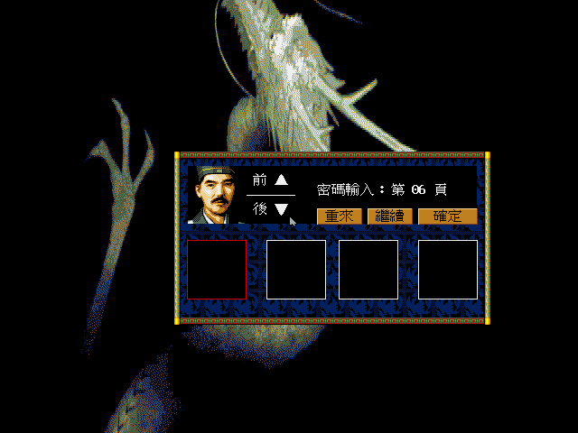

# 01 — 松崗 DOS/V 版首次實跑（DOSBox）

**狀態：DOS/V 版可開機並可由密碼頁進入開場；字型懸案結案。**

- 日期：2026-08-07
- 環境：`tools/dosbox.sh dosv`，DOSBox 0.74-3，`machine=vgaonly`、`cycles=fixed 20000`
- 素材：`workplace/orig/dosv/` 的可寫副本
- 推論等級：**畫面看到的都是 confirmed**

## 0. 2026-08-12 勘誤：畫面存在，但不阻擋原版啟動

舊版 `tools/dosbox.sh` 沒有在 autoexec 中執行 `START.BAT`，歷史 `1234` 截圖其實停在
DOSBox 命令列，不能當成密碼檢查失敗的證據。改以既有 `wolong-dosboxx:latest` 的
INT 33 integration 輸入橋接後，空白確認、`0000`、`1234` 都會從密碼頁進入原版開場。
完整的三組獨立重播、雜湊與不確定性見
[`18-dosv-password-verification.md`](18-dosv-password-verification.md)。

這是原始畫面上的正常「確定」操作，不涉及修改程式、猜說明書答案或將密碼頁重製到 remake。
它只解除 DOS/V oracle 的啟動邊界；是否在真實硬體採用同一行為，以及 `PASS.*` 的比較語意，
仍未由本次動態測試證實。

## 1. 結論先講：兩個 M0 懸案結案，同時撞到一個路障

| 懸案 | 結果 |
|---|---|
| 字型檔要不要玩家自備 | **不用。** `STDFONT.24`／`ASCFONT.24`／`ASCFONT.15` 三個檔不在封裝裡，畫面照樣顯示繁體中文。字型的實際來源後來由靜態分析定案：`END_S13/S14.DAT` ＋ `STR.EXE` 的 `INT 15h AH=50h` 服務，見 [`../re/29`](../re/29-font-service-int15.md) |
| 有沒有防拷 | **有。** 開場之後跳出「密碼輸入：第 NN 頁」的查說明書式防拷 |

## 2. 防拷的形狀

- 提示「**密碼輸入：第 NN 頁**」，NN 每次不同（實測看到 06 與 31）。
- 四個輸入框，**每框放一個字** → 密碼是說明書該頁的四個中文字。
- 三個按鈕：重來／繼續／確定。
- 「用 xdotool 打 `1234` 會換頁」是已撤回的歷史斷言：當時腳本沒有啟動遊戲。
  有效重播顯示四格不回顯數字，且空白確認即可放行；細節見 playtest 18。
- 遊戲確實使用 INT 33 滑鼠；DOSBox-X 的 `mouse_emulation=integration` 是這次讓原版收到
  點選的必要輸入橋接。

### 資料在哪

`PASS.MAP`（32,594 B）與 `PASS.SCH`（14,281 B），格式見
[`docs/formats/04`](../formats/04-map-sch-container.md)。
執行者是 **`YNFONT.EXE`** —— 它的字串表裡有四個 `'PASS'`。

**這兩個檔只有松崗版有，PC-98 原版沒有** → 防拷是松崗中文版另加的。

## 3. ⭐ 這個路障有一條繞路：oracle 改跑 PC-98 版

`docs/re/01` 已經確認兩版是同一份原始碼的兩次編譯（函式數 732 對 725，
23 個資料檔 byte-for-byte 相同）。而 **PC-98 版沒有 `PASS.*`，沒有防拷**。

所以：

| 要驗的東西 | 跑哪一版 |
|---|---|
| 玩法規則、AI 行為、資料結構、地圖與戰鬥畫面 | **PC-98**（沒有密碼關卡） |
| 繁中文字的排版與字型渲染 | DOS/V（要過密碼那關） |

**不必為了建立 oracle 去破解防拷。** 大部分要驗的東西 PC-98 都能給。

DOS/V 那一側之後仍要解決，兩條路：

1. **取得松崗中文版說明書**（本來就在待查清單上，`CLAUDE.md` §2）。
   這是正路，而且說明書本身還有指令表與數值可用。
2. 從 `YNFONT.EXE` 反組譯出比對邏輯。**這是最後手段**，
   而且只用於本機建立研究用的 oracle，不會進 remake 也不會散布。

## 4. 順帶確認的

- **淡入是真的。** 截圖在 5 秒與 10 秒各一張，前者明顯偏暗、後者飽和
  —— 與 `docs/re/02` 讀出來的亮度縮放（`sub_109D0` 從 `cl=0` 往上跑）對得上。
- 開場美術是 `OPEN_S*.DAT` 那一批，畫的是龍。
- 畫面版面是 640×400，與反組譯讀出來的列跨距 80 byte（640 寬）一致。
- 沒有音效卡的環境下 ALSA 會噴一整片錯誤但**不影響執行** —— 那是 DOSBox 的
  訊息不是遊戲的。

## 5. 歷史上的未完成項目

- 2026-08-07 時因輸入橋接失效而沒有看到遊戲本體；此項已由 2026-08-12 勘誤解除。
- PC-98 版還沒跑（要 DOSBox-X，`machine=pc98`，本 image 的 DOSBox 0.74 不支援）。
- 即時制的可重現性只設定好了（`cycles=fixed`），還沒實際驗證
  「同一串按鍵兩次跑出同一張圖」。
