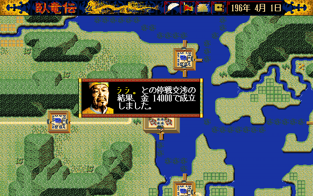

# 11 — 原版事件 6 fixture oracle

**狀態：事件 6 主要結果畫面已由原版 fixture 證實；不是自然長程存檔，也不封閉次要 formatter。**

- 日期：2026-08-10

本證據用來修正先前「只到 `NEW GAME`／讀檔選擇畫面」的暫時紀錄。完整長程遊戲測試仍依
接手要求略過；原始素材與原始存檔沒有被寫入。

## 輸入與雜湊

| 項目 | SHA-256 |
|---|---|
| PC-98 `KI.EXE` | `061917f9f3f5c03e29397a9c636d546052128a99b8c8ce31ded0e84cf2a481e8` |
| PC-98 原始 `SAVE.DAT` | `18aa181327d0a6f1410ebdd47a1a4281ef50a45d443acd52712724318aa1f62c` |
| DOS/V `KI.EXE` | `fffeba985231cda4d636e93d10f598470b1f691d00275e4aa38e285893d43868` |
| 使用者 DOS/V `SAVE.DAT` | `59e27270ee8192f63b08e012bf31a0b8da1477ce2c643fd487e6f8181b7650d2` |
| 一次性 fixture `SAVE.DAT` | `c695eec5ce61d5eda2eb5927d0ee33dd023d639c16ca47e01cdb45eb0fe24245` |
| PC-98 `TALK.DAT` | `537e563269e414da79381ff48184a98e062ca454eb5d12e16a5fcbd52b79cf6f` |
| 事件結果截圖 | `fd7cbfa4cf2d4e0773a33181c4c4ea7944020552f5facc847750f69f670fa72b` |

執行環境是 `wolong-dosboxx:latest`、DOSBox-X `2025.02.01` commit `32b2c24`，
`machine=pc98`、`cycles=20000`、`--network none`、UID/GID `1000:1000`。PC-98／DOS/V
原始目錄以唯讀方式掛載；可寫遊戲副本、fixture 與截圖都在 `/tmp`。

## 明示注入的 fixture

fixture 不是從原版自然時間線存出的檔案，而是為了讓已定位的事件 handler 有有效前置的
一次性測試資料：

1. 以使用者提供的 DOS/V 第 1 槽為基礎，將區塊 `+0x0000` 設為已由劇本資料證實的
   `196/4/1` 時鐘。
2. 將玩家勢力指標 `+0x0D` 設為 `0x0040`；將勢力 3 的 `+0x2A` 外交官設為同一
   存檔中所屬勢力 3 的有效武將 17。
3. 將區塊 `+0x52C0` 的第 1 筆事件寫成事件字 `0x0306`、Param `0`。依
   `sub_131AE` 的 dispatch，低 byte `0x06` 進入 `sub_13327`；高 byte `0x03`
   是回報方勢力 3。`sub_13327`／`sub_136C4` 的已追資料流不以此 Param 作狀態計算。

這些寫入只發生於 fixture；沒有修改 `workplace/orig/` 的任何檔案。

## 原版操作

以 PC-98 紅色游標閉迴路定位，步驟如下：

```text
啟動 KI.EXE
NEW GAME → NO
LOAD DATA → 第 1 槽
```

讀檔畫面顯示 `196年 4月 1日`，表示 fixture 確實由原版讀取。讀檔後原版在地圖上顯示
事件 6 結果視窗；按一次後回到地圖。



畫面中的日文主要語意是「停戰交涉的結果，金 14000 成立」。這與
`sub_13327` 的事件 6 主要結果路徑相符，證明的是原版 handler 的**主要結果呈現**，
不是 remake 的翻譯或泛用 modal。

## 採信界線

- 已提升：事件 6 raw fixture → 原版讀檔 → 主要停戰結果畫面的可回查證據。
- 已由 DOS/V IDA 與 remake 單測提升：事件 6／7 次要 raw index／條件／安全呈現接縫、
  事件 10 raw consumer、災害物件 16-update timer；DOS/V 數值硬體游標與 3×6 button
  glyph 另已由原始資產解碼；仍未提升的是 #72 缺失 formatter payload 的原版可見記憶
  內容、PC-98 視覺游標對拍與完整原版／remake 同狀態對拍。
- 本 fixture 的第二次原地按下因游標仍位於讀檔槽對應位置而開啟據點資訊；沒有觀察到
  可辨識的次要 TALK。這不足以證明次要分支不存在，仍採 fail-closed。
- 三平台正式包與推廣影片必須等剩餘串接與平台／parity gate 封口後才建立。
