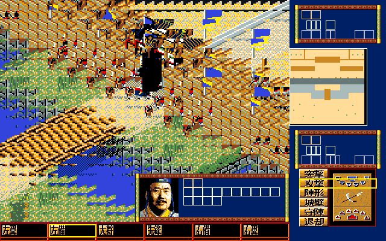
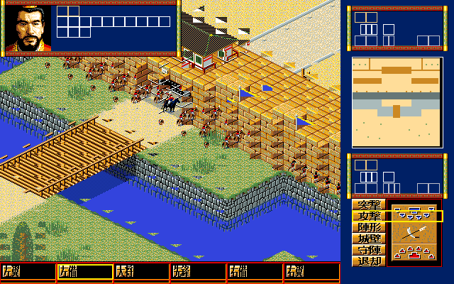

# 20 — 松崗 DOS/V 戰術版面 parity 重開

> ⭐ 2026-08-16：拿原版實錄影片對過了——**幾何全部落在 3 px 內**，
> 六個指令按鈕的字與位置完全一致；差的是**側欄的內容組成**（五項）、
> 戰場圖塊組的顏色、以及攻城的門強度條。清單見
> [`27`](27-original-video-frame-parity.md) §7。

**狀態：PARTIAL（主要幾何、右欄命令面板、底列 glyph、原版初始相機、
32×30 display grid、鄰格 consumer 與 VGA tile 重排已接入；同狀態戰場、
EGA mask 逐位元等價與動畫時序仍未完成）。**

- 日期：2026-08-12
- 原版來源：使用者松崗 DOS/V 錄影代表幀 `yt-wolong-natural-320s.png`、`400s.png`、`480s.png`
- 正規化：影片遊戲本體裁切後以最近鄰縮放為 320×200；原版幾何證據為錄影量測，不是 binary 常數。

| 區域 | 原版 logical | remake 640×400 | 結果 |
|---|---:|---:|---|
| 戰場／右欄分界 | `x=240` | `x=480` | 已修正；舊值 `x=248/496` 撤回 |
| 底列 | `y=184..199` | `y=368..399` | 已對齊 |
| 上 TALK | 約 `x=0..127, y=0..39` | `0,0,256,80` | 已對齊主要框位 |
| 下 TALK | 約 `x=112..239, y=144..183` | `224,288,256,80` | 已對齊主要框位 |
| 右欄 | `x=240..319` | `480,0,160,400` | 已修正主要比例 |

同類並排證據：[`parity/tactical-layout-side-by-side.png`](parity/tactical-layout-side-by-side.png)。

2026-08-12 勘誤後，右欄的 128×96 六列命令面板已從 `segment1+0x1800`
直接解碼，底列也已接入 `0x3000` 底板與 `0x3900..0x3D7F` 六個獨立 glyph。
尚未完成的是同一戰場狀態的逐像素取景與動畫時序；不把目前畫面升格為完整 pixel parity。

## 2026-08-12 相機／顯示串列勘誤

先前 renderer 每幀以玩家大將呼叫 `centreOn`，且用「地形 → 旗 → 投射物 → side 0 →
side 1」直接繪製；兩者都不是原版 runtime。依 IDA `.i64` 的 `sub_199F3`、
`sub_1DC9D`、`word_1E15C` producer 群與 `sub_1DDB4` consumer，本輪改為：

- 初始 world origin `0x24/0x0E`，換算後投影 origin `0x32/0x15`；
- 縮圖點選沿原版 `0001C0C6` 算式更新相機；
- 地形與動態物件先進同一份 deterministic display-list IR；
- 兵動畫使用每筆原版 `PoseStep`。

受控新畫面只證明原版初始相機可正確看到城門／橋樑，不代表 `sub_1DE95` 鄰格遮蔽或
完整同狀態 parity；詳細證據與剩餘 gate 見 `docs/re/20-ida-re-coverage-audit.md` §7。

## 2026-08-13 顯示格 consumer 與實際 tile 尺度

IDA Pro 9.4 完整讀完 `sub_1D971`、`sub_1DC9D`、`sub_1DD22`、
`sub_1DDB4`、`sub_1DE95`、`sub_1E085`、`sub_1E0E1`、`sub_1DFE8`、
`sub_1E011` 後，前一輪「16×32 tile 畫在 240×184 buffer 再 2× 放大」已證實錯誤。
原始圖形是 16×32 的編碼單位，但 `sub_1E011` 會把四段 16×8 重排成 VGA
上的 **32×16**；原版戰場 viewport 本來就是 **480×368**。

remake 現在直接在 480×368 合成，並依 32×30 display grid、23×15 anchor、
五組鄰格切片畫地形與物件。與既有 side-by-side 比較，城牆、河岸、橋與兵的
相對尺度已不再是舊版的 2× 高度錯誤。受控抓圖 SHA-256：
`63a1478684689028944f2d8ecd3903d94f6dff5a318676686c803694fd78473c`。

狀態仍是 PARTIAL：此 fixture 證明結構與尺度收斂，不取代松崗 DOS/V 同狀態
自然流程；EGA mask 的逐位元差異、動畫幀序與完整玩法路徑仍須另外驗收。

不同戰況的原版代表幀／新 renderer 並排如下；它只用來審核 tile 尺度、viewport
骨架與物件密度，不能冒充 same-state pixel diff。並排檔 SHA-256：
`cc9a4eb5d737a558d8af8652dcb85491010d0be68c60857fc6ab71823cae57b2`。

