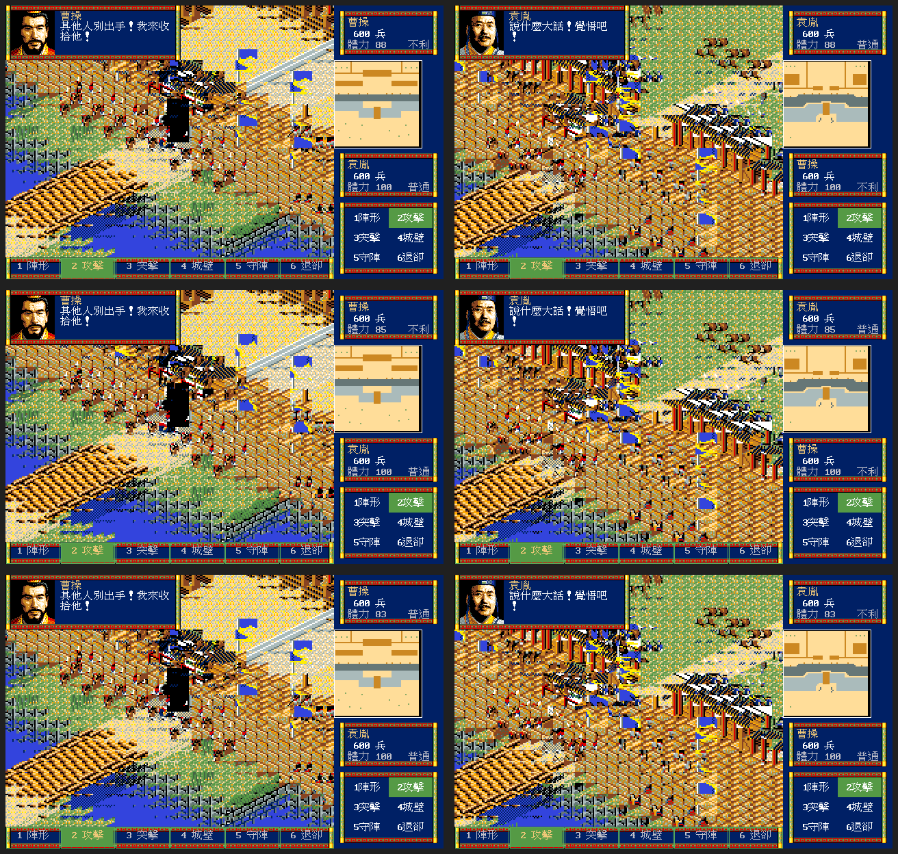

# 攻城／兩軍遭遇共用戰術骨架驗收

**狀態：PASS（共用幾何與原版指令面板已封口；不代表動畫逐像素 parity）**

- 日期：2026-08-12

## 結論

松崗 DOS/V 版的兩軍攻城（`combat.Siege`）與兩軍遭遇（`combat.Field`）在 remake
中共用同一份 640×400 戰術幾何契約。模式只切換戰場素材、城牆、攻守部隊、即時數值
與結算；不得切換 TALK、右欄、底列或輸入命中區。

固定區域為戰場 `0,0,480,368`、右欄 `480,0,160,400`、底部六命令
`0,368,480,32`、上方 TALK `0,0,256,80`、下方 TALK `224,288,256,80`。

`TestFieldAndSiegeShareExactDOSVBattleChrome` 驗證兩模式的矩形與命中區完全相同。
實際 GUI 以固定亂數種子 17，在 Docker／Xvfb 分別使用 `-open-siege` 與
`-open-battle` 擷取三個時點。修正 fixture 過度預跑後，兩種模式都能停留在運行中戰場。

對照圖 SHA-256：
`6cf59346aba1590cc1c918c6a4170567c1cd06ab6a01fc2f1a75d854e9527c86`。

## 邊界

- 純城兵、沒有敵方軍團的據點攻擊依原版既有證據走自動判定，不進手動戰術畫面。
- 本驗收不升格為命令 glyph、內框、動畫時序或逐像素 parity。
- 開戰 TALK 的攻守人物映射仍是強推論；這是內容證據等級，不是版面分岔。
