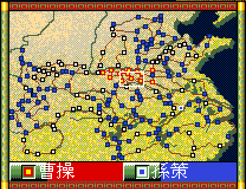

# 29 — 縮小地圖的據點標記接上原版的四種顏色

**狀態：✅ 已實作並留下截圖。** 四種顏色、4×4 的形狀、視野框都照原版；
`docs/playtest/27` §4 那兩項「縮小地圖」差異結案。

- 日期：2026-08-16
- 出處：[`../re/62`](../re/62-strategy-minimap.md)、[`../spec/35`](../spec/35-strategy-minimap.md)
- remake 側：`WOLONG_SHOT_CMD=wlgame tools/shot.sh out.png -direct -scenario 0 -player 0 -open-window -2`
- 原版側：`workplace/promo-live/original-video/original.mp4` 的 **00:01:00**
  （`ffmpeg -ss 60 -i original.mp4 -frames:v 1 f.png`，再裁 `crop=311:242:645:106`）。
  **影格不入庫**——那是原版畫面，照 `CLAUDE.md` §9 不散布；要看就照上面重跑

## 1. 改了什麼

| | 之前 | 現在 |
|---|---|---|
| 據點標記 | 全部同一種深藍（底圖自帶）| 四種顏色，照所屬勢力 |
| 視野框 | 沒有 | 20×12 的白框 |
| 圖例第二格 | 「第一個存活的非玩家勢力」 | `g.minimapFaction`，點右半格換下一個 |

四種顏色（`sub_15CE0` 的屬性 → `GAMEPAL.BRG` 第 0 組色號）：

| 據點屬於 | 外框 | 中心 |
|---|---|---|
| 無所屬 | 0 黑 | 15 白 |
| 自勢力 | 10 紅 | 12 黃 |
| 圖例第二格盯著的 | 15 白 | 3 藍 |
| 其餘勢力 | 8 深藍 | 3 藍 |

## 2. 與原版影格的比對

同一塊區域（劇本 1 開局，玩家所仕曹操）逐項看：

| 項目 | 原版 | remake | 判定 |
|---|---|---|---|
| 標記形狀 | 4×4，外框一圈 ＋ 中心 2×2 | 同 | ✅ |
| 無所屬 | 黑框白心 | 黑框白心 | ✅ |
| 自勢力 | 紅框黃心 | 紅框黃心 | ✅ |
| 其餘勢力 | 深藍框藍心 | 深藍框藍心 | ✅ |
| 盯著的勢力 | 白框藍心 | 白框藍心 | ✅ |
| 視野框 | 白框 20×12 | 白框 20×12 | ⚠ 原版是一張美術，remake 畫線 |
| 底圖（陸海道路）| 黃綠陸地 ＋ 深藍海 | 同（`ICONGRF` 段 2 直接用）| ✅ |

⚠ **這不是逐像素比對。** 影片是再編碼過的（[`27`](27-original-video-frame-parity.md) §1），
只能比顏色分類與形狀，不能比 RGB。

## 3. 未解

| 項目 | 為什麼 |
|---|---|
| 22 勢力的選擇視窗 | 原版點圖例右半格會開一個兩欄的選單（[`../re/62`](../re/62-strategy-minimap.md) §4.2）。**行為已解、版面未解**，remake 先用「點一下換下一個」代替 |
| 視野框的美術 | 原版在 `word_10D4C`，尺寸沒從程式碼讀到 |
| 點地圖區（熱區 `0x16`）| 原版做什麼沒讀 |
