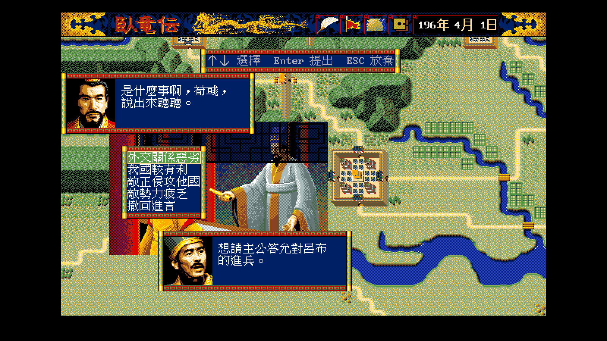
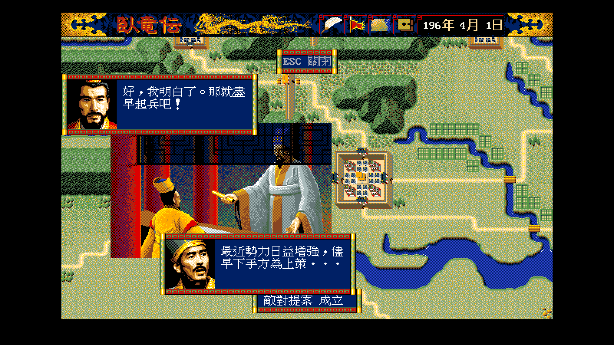

# 34 — 進言的畫面驗收：插圖 ＋ 兩個框 ＋ 五列選單

**狀態：通過。** 兩個講話框各說各的、五列選單完整放進框內、
說話者靠肖像分辨（文字裡沒有「君主：」「軍師：」）。

- 日期：2026-08-17
- 規格：[`../spec/45`](../spec/45-advise-scene-layout.md)、
  [`../spec/44`](../spec/44-advise-original-text.md)
- remake 側：`WOLONG_SHOT_CMD=wlgame tools/shot.sh <out>.png -direct
  -scenario 0 -player 0 -seed 7 -open-advise [-advise-menu]`
- 劇本 1（196 年 4 月 1 日），玩家所仕勢力 0（君主曹操、軍師荀彧），
  進言指令＝敵對提案，對象＝呂布

## 1. 停在五選一的理由選單

逐項對規格：

| 項目 | 規格 | 畫面 |
|---|---|---|
| 插圖 | `IVENTGRF` 第 0 頁，(64, 144) | ✅ 在兩個框中間 |
| 上框 | (0, 80) 256×80，君主 | ✅ 曹操「是什麼事啊，荀彧，說出來聽聽。」（TALK #86 ＋ 變體 1）|
| 下框 | (128, 288) 256×80，軍師 | ✅ 荀彧「想請主公答允對呂布的進兵。」（#89）|
| 選單 | (80, 176)、112×96（6 字 × 5 列，[`../spec/45`](../spec/45-advise-scene-layout.md) §2.2）| ✅ 四個理由 ＋ 撤回進言，第五列完整在框內 |
| 說話者 | 靠肖像分辨 | ✅ 兩個框的臉不同，句子裡沒有標記 |

⭐ **`{4}` 展開成軍師的名字**（荀彧），`{3}` 展開成對象的君主（呂布）——
兩個插入點都取自世界狀態，不是寫死的。

## 2. 提出理由之後

`-advise-menu` 不加時，fixture 會替玩家選「我國較有利」：

- 下框換成軍師說出那一列：#104「最近勢力日益增強，儘早下手方為上策．．．」
  ＝ `base16 + 位置 + 1` ＝ 102 + 1 + 1
- 上框換成君主的回答：#121「好，我明白了。那就盡早起兵吧！」
  ＝ `base16 + 位置×9 + 結果×3 + 6 + 變體` ＝ 102 + 9 + 3 + 6 + 1

⭐ **變體 1 是曹操的說話型**（武將 `+0x1E`），不是隨便挑的一則——
換一個君主會拿到同一組意思的另一種措辭。

截圖是把逐句節拍跑完之後的狀態——原版每一句都要按鍵
（[`../spec/45`](../spec/45-advise-scene-layout.md) §1.1）。

## 3. 修掉的兩個東西

| 症狀 | 原因 |
|---|---|
| 按鍵提示與畫面底部的事件視窗疊在一起 | 提示原本畫在 `screenH−16`，而事件視窗佔 360–392。提示移到橫幅與上框之間 |
| 提示的字被切成看不出是什麼 | `chrome.Window` 的邊框是 8 px，**兩塊高的框整個都是邊、沒有內部**。改成四塊高（內容 16 px ＝ 一個全形字）|

## 4. 未解

| 項目 | 現況 |
|---|---|
| 逐句節拍 | 原版每句要等玩家按鍵才往下走；remake 直接顯示最新一句 |
| 插圖之外的畫面 | 原版這一頁底下是不是還留著大地圖沒驗過，remake 留著 |
| 選單的反白樣式 | 原版怎麼畫游標列沒解，remake 用自己的反白條 ＋ `>` |
