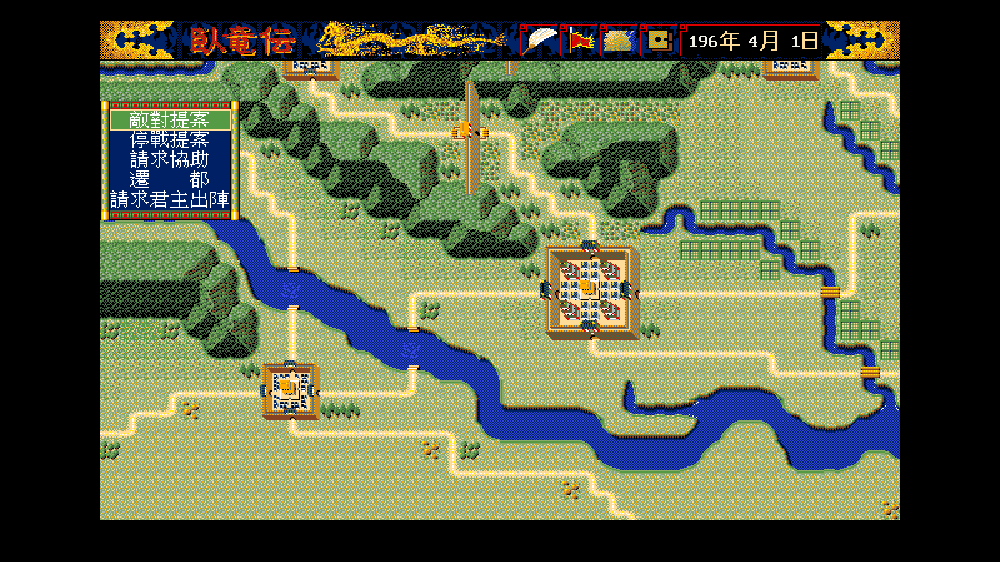
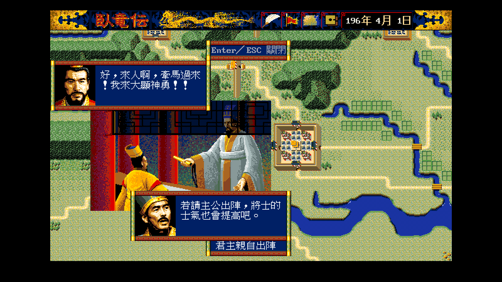

# 35 — 進言的五項與「請求君主出陣」的定案畫面

**狀態：通過。** 選單五列與原版 `TALK.DAT` #77 逐字相同；
請求出陣的三句對話與原版實錄影片 4 分 30 秒那一幕同一組訊息。

- 日期：2026-08-17
- 規格：[`../spec/49`](../spec/49-advise-relocate-and-sortie.md)、
  [`../spec/45`](../spec/45-advise-scene-layout.md)
- remake 側：`WOLONG_SHOT_CMD=wlgame tools/shot.sh <out>.png -direct
  -scenario 0 -player 0 -seed 7 {-advise-menu | -advise-sortie}`
- 劇本 1（196 年 4 月 1 日），玩家所仕勢力 0（君主曹操、軍師荀彧）

## 1. 進言的五項



位置與大小也照原版：`sub_16224` 的 `dx = 400h` ⇒ 粗格 (0, 4) ⇒ **(0, 64)**，
框 **112 × 96**（6 個字 × 5 列，[`../spec/45`](../spec/45-advise-scene-layout.md) §2.2）。

五列直接取自 `TALK.DAT` #77（同一個呼叫的 `cx = 4Dh`）：

```
　敵對提案　／　停戰提案　／　請求協助　／　遷　　都　／請求君主出陣
```

⚠ 第三列原版寫**「請求協助」**，而 remake 內部的
`persuasion.Cooperate.String()` 是「協力要請」。
**選單文字屬於松崗版的原文**，不能拿內部術語頂替——
`TestAdviseCommandLabelsComeFromTalk` 就是擋這個。

第四、五項先前根本不在選單上：遷都的判定
（`capital.AcceptRelocation`）寫好了但**沒有任何呼叫端**，
請求出陣則整項沒有。

## 2. 請求君主出陣



截圖停在**第一句**——`sub_12216` 讓原版每一句都等按鍵，
remake 照做了（[`../spec/45`](../spec/45-advise-scene-layout.md) §1.1），
所以還沒講話的下框整個不畫。

三句都對得上（`sub_13B08`，[`../spec/49`](../spec/49-advise-relocate-and-sortie.md) §1）：

| 位置 | 索引 | 內容 |
|---|---:|---|
| ① 上框 君主 | 396 ＋ 變體 | 「軍師，是要我出陣嗎？」 |
| ② 下框 軍師 | 399 | 「若請主公出陣，將士的士氣也會提高吧。」 |
| ③ 上框 君主 | 400 ＋ 4 ＋ 變體 ＝ **401** | 「好，來人啊，牽馬過來！我來大顯神勇！！」 |

⭐ **這正是原版實錄影片 4 分 30 秒那一幕**
（`workplace/promo-live/original-video/original.mp4`）。
先前 [`../spec/42`](../spec/42-event-scene-speakers.md) 把那一句掛在
「上框在結果階段的內容，來源還沒找到」——它不是外交事件，
是進言的第五項。

曹操的說話型是 1，所以第三句拿到 401 而不是 400。

## 3. 未解

| 項目 | 現況 |
|---|---|
| 遷都的畫面 | 目標用一覽表挑，原版是地圖選點（`sub_17400`）。沒有截圖 |
