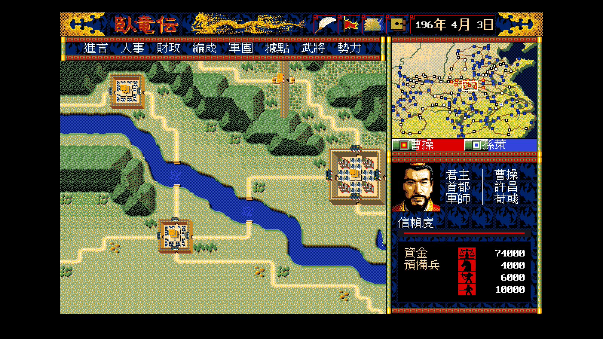

# 36 — 視窗底紋畫上去了

**狀態：通過。** 深藍視窗的內部改成原版的黑底 ＋ 深藍龍紋，
排法用實機截圖驗過（三塊乾淨區域 96.7%／99.0%／99.0%）。

- 日期：2026-08-17
- 規格：[`../formats/03`](../formats/03-grf-images.md) §5.5
- 檢查工具：`tools/py.sh tools/window_texture_check.py`
- 原版側：`workplace/dosbox/shots/x04.png`（DOS/V 實跑，640×400 真實像素）
- remake 側：`WOLONG_SHOT_CMD=wlgame tools/shot.sh out.png -direct
  -scenario 0 -player 0 -seed 7 -open-window -2`

## 1. 畫面



指令列、縮小地圖下面的勢力列、自勢力情報那三個深藍視窗裡都看得到龍紋。
米色的一覽表視窗不套（原版也只有深藍那一種有）。

## 2. 排法

```
像素 (x, y) ＝ tile[y mod 32][x mod 32]
```

⭐ **磚塊釘在螢幕上，不是釘在視窗左上角。** 視窗往右移一格，
裡面的紋路不跟著移。

點陣是 `ICONGRF.DAT` 檔尾的 128 byte（32×32、1 bpp、每列 4 byte），
兩版完全相同。

## 3. 怎麼驗的

不猜排法：**對視窗內部的每一列，去找它對應磚塊的第幾列**。
讀出來的序列是乾淨的遞增 ＋ 回捲（6, 7, …, 31, 0, 1, …），
週期一眼就是 32。三塊乾淨區域各自算最佳位移，答案都是 (0, 0)。

> ⚠ **量週期之前先確認樣本夠不夠長。** 這張截圖裡最高的一塊純底紋
> 只有 50 列，位移 96 的自相關沒有重疊可以算。

## 4. 未解

| 項目 | 現況 |
|---|---|
| 取用端 | `KI.EXE` 裡哪一段程式把這 128 byte 鋪上去的還沒找到（三條路都排除了）。**排法已經由實機畫面定案**，取用端只影響「還有沒有別的用法」|
| 米色視窗 | 一覽表那種米色底原版有沒有紋路沒量過（截圖裡那一片是純色）|
