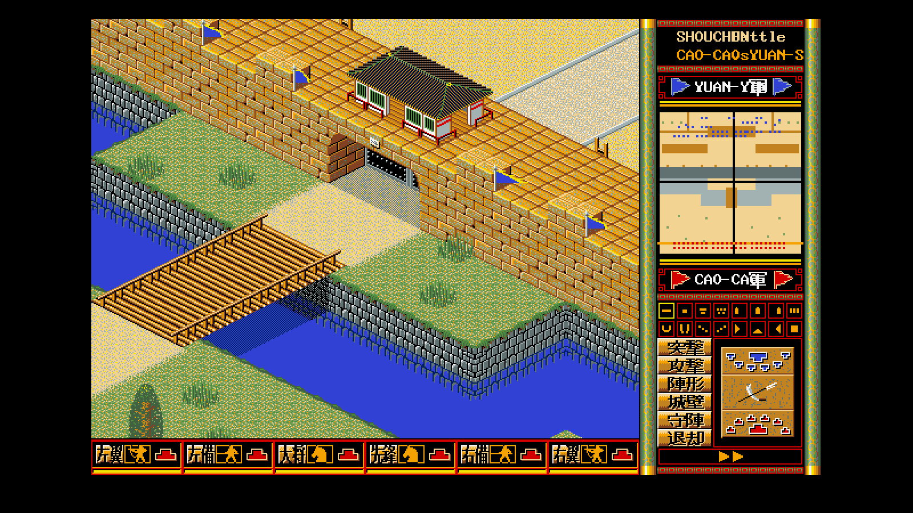
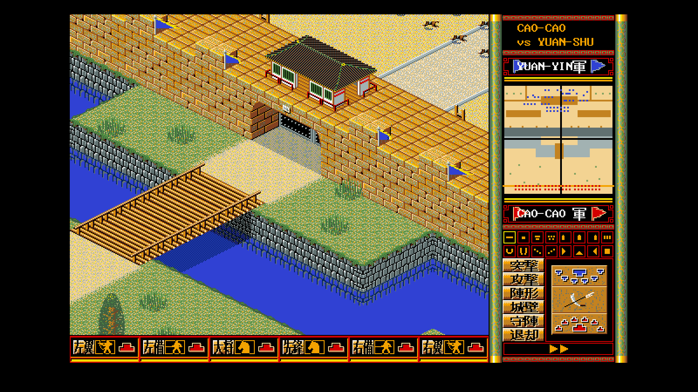
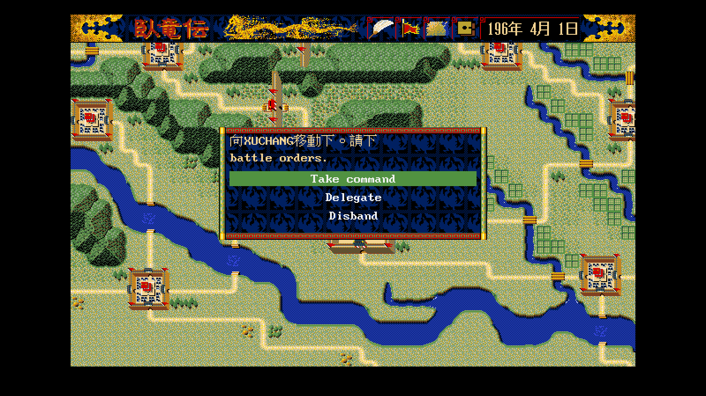
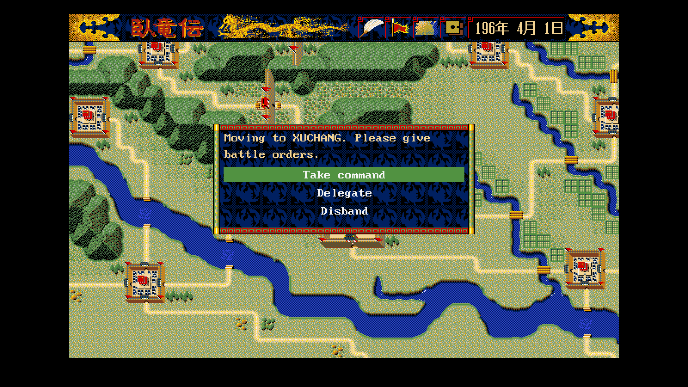
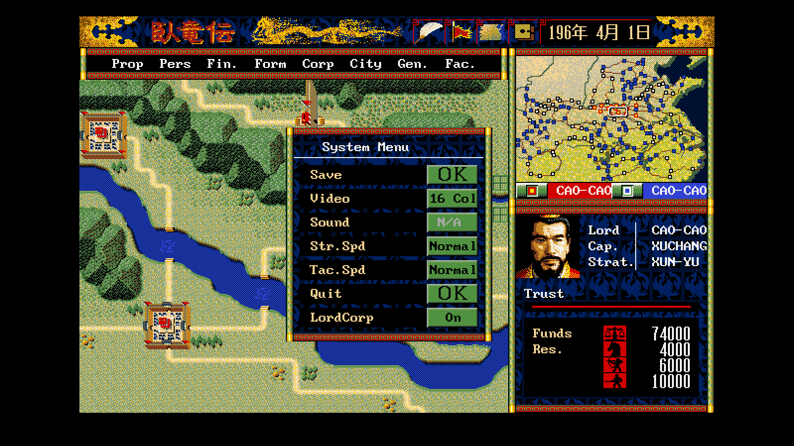
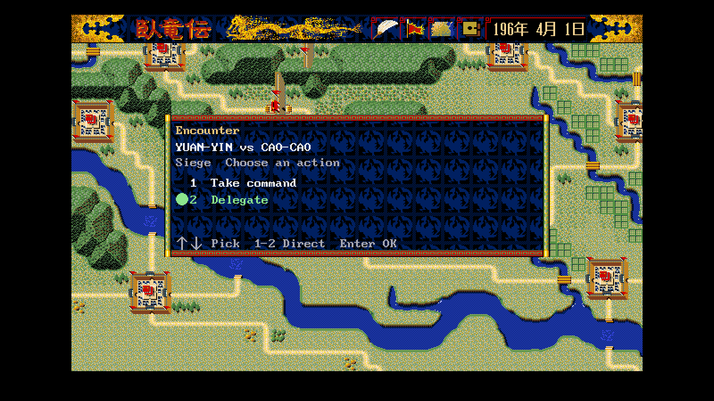

# 47 — 英文版逐畫面調整前後

**狀態：confirmed。** 十張英文畫面逐張看過並修完，繁中回歸逐位元組相同
（可重現的那兩張）。

- 日期：2026-08-26
- 對象：remake（`cmd/wlgame`），不涉及原版
- 規格：[`../spec/87`](../spec/87-latin-screen-layout.md)
- 拍法：`WOLONG_SHOT_CMD=wlgame tools/shot.sh <out> -lang en -direct
  -seed 1 -shot-frames 110 <畫面旗標>`

## 1. 修掉的四類

| 症狀 | 成因 | 處置 |
|---|---|---|
| 行軍抬頭是中文、還被切一半 | TALK 變數的 key 給了數值 `2`，`Marker` 存的是 ASCII `'2'` → fail-closed 走 fallback | key 改 `'2'`；抬頭再折一次行 |
| `YUAN-YIN 對 CAO-CAO` | 句子是拼出來的，逐句表永遠命中不了 | 詞表加片語層（46 條）|
| 系統選單值停在「普通」「可」 | 值先補了半形空白才查表，補完的字串不在表裡 | `sysValueLine` 先翻再補白 |
| `SHOUCHBNttle`、`CAO-CAOsYUAN-S` | 標題三段照原版的固定 x 畫，羅馬字放不下互相蓋 | 半形語系改成兩行的對戰列 |

## 2. 沒動的：原版美術上的中文

攻城戰右側的六個指令鈕、底下六個編成格、將旗上的「軍」、頂欄的
「年」「月」「日」、金額鍵盤的「取消／最大／決定」——**都是原版圖庫的
像素**（`g.battleFormationStrip`、`g.battleFrame`、橫幅圖、96×64 鍵盤資源）。
翻它們等於重畫原版美術，本專案不做（`docs/spec/87` §2）。

## 3. 繁中回歸

改動前後各拍一次（`git stash` 對照），逐位元組比對：

| 畫面 | 結果 |
|---|---|
| 主畫面 ＋ 系統選單 | **相同** |
| 行軍指示 | **相同** |
| 攻城戰 | 不可比——見下 |

⚠ **攻城戰的截圖本身不可重現**：同一顆執行檔、同一個 `-seed 1
-shot-frames 110`，連跑兩次雜湊就不同。所以那一張的「前後不同」
**不構成退步的證據**，也不構成沒退步的證據。這一張要對拍得先解決
戰術畫面的時間步（`CLAUDE.md` §9：截圖驗收要帶固定亂數種子**與固定時間步**）。
本輪改到的戰場程式碼全部包在 `Latin()` 分支裡，繁中走的是原本那條。

## 4. 未解

| 缺口 | 下手點 |
|---|---|
| 戰術畫面的截圖不可重現 | 找出 `-shot-frames` 之下仍隨牆鐘走的那一段（動畫幀？音訊回呼？），改成照 tick 推進 |
| 半形語系的戰場標題沒有地名 | 見 `docs/spec/87` §9 |
