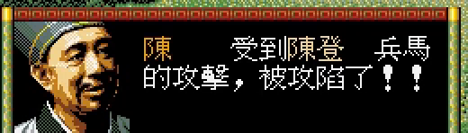
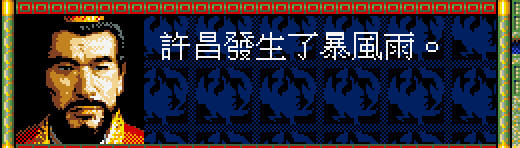
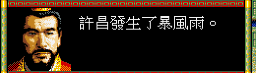
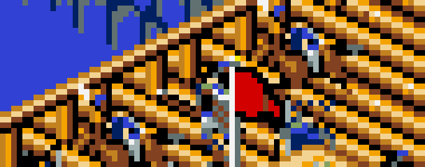
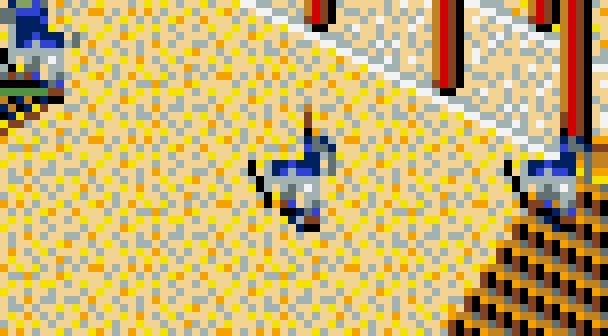
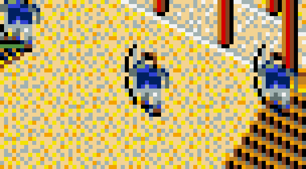

# 48 — 三處顯示修正的前後對照

**狀態：confirmed。** 使用者看推廣片回報的三件事都成立，逐項比過實機之後修完。

- 日期：2026-08-26
- 規格：[`../spec/88`](../spec/88-display-polish-parity.md)
- 原版側：松崗 DOS/V 實機錄影（`workplace/promo-live/promo-dosv-main/o5-battle.mp4`）
  與 `workplace/promo-live/probe-march/e10.png`；PC-98 oracle 交叉驗證

## 1. TALK 對話框的底

| 原版（松崗 DOS/V 實機）| remake（修正前）| remake（修正後）|
|---|---|---|
|  |  |  |

量到的：原版框內 `(0,0,0)` 6,298 px；remake 修正前黑 7,459 px ＋
**龍紋藍 `(0,32,97)` 5,801 px**；修正後 13,243 px 全黑、一個藍點都沒有。

系統選單那一格**沒有被改到**（仍有 `(0,32,97)` 3,436 px）——
原版的系統選單本來就是藍底龍紋（[`39`](39-system-window-parity.md) 逐像素 PASS）。

## 2. 小兵只畫得出一半

| 原版（DOS/V，橋上）| remake（修正前）| remake（修正後）|
|---|---|---|
|  |  |  |

修正前只有頭與上身，修正後有腿。開闊地那一張前後差 **96 px**＝三個兵的下半。

⚠ **對拍沒抓到這件事。** `SAVE-E` 那個 fixture 修正前後**逐位元組相同**——
那一格的兵靠著城壁，鄰格高度本來就把深度範圍撐開了。
**已量過的兩個局面都在城壁邊，而會出事的是開闊地。**

## 3. 「月結」那個框一直在

量過：大地圖 330 幀裡第 148 幀出現，之後 **182 幀一直沒消失**。
`g.lastEvent` 從頭到尾沒有人清掉。原版的大地圖沒有這個框
（`o2-strategy.mp4`、`o4-march.mp4` 全程沒有）。

改成六秒後自己消失，與手機版同一個值。

## 4. 推廣片裡的三種對話框

使用者說「對話框底色不一致」——那不只是 §1，還有一個獨立成因：
**推廣片的靜態圖是不同世代拍的**。

| 圖 | 拍攝時期 | 那時候的框 |
|---|---|---|
| `wlgame-event3-choice.png` | 2026-08-10 | 純藍底，**字壓在肖像上** |
| `m7-review-321.png` | 更早 | 純藍底，HUD 還是舊版 |
| 動態段 | 2026-08-26 | 藍底龍紋 |

所以同一支片子裡有三種樣子。現行版本的幾何早就沒有重疊
（肖像右緣 232、文字起點 240），那張圖只是沒重拍。

> **規則**：**推廣片裡的靜態圖會凍結當時的 UI。**
> 重剪推廣片要連靜態圖一起重拍，不能只換動態段。

## 5. 未解

| 缺口 | 下手點 |
|---|---|
| 對拍沒有開闊地的 fixture | `playtest/40` 量的兩個局面都在城壁邊；要擋住這一類回歸得再加一個開闊地的 fixture |
| 事件列本身是 remake 自創 | 原版怎麼提示月結（如果有）沒查過 |
