# 56 — 實機對拍：AppImage 走「選呂布 → 對曹操宣戰 → 編成攻城」

**狀態：完成。十五個關卡兩邊都拍到並逐關對照過（第十六個只有 remake 側，原因在 §6）；
指令列逐像素 0 px、編成面板的差異只有原版錄影裡的游標。
找到七項差異，其中兩項共用同一個根因（啟動殼層拿不到調色盤），一項待驗。**

- 日期：2026-09-01
- remake 側：`dist-all/packages/wolong-remake-linux-amd64-20260830.AppImage`
  （完整版，內含遊戲檔案）SHA-256
  `693f2f7e58d663aab22ec86749c21eb8d8154581ad37d93033f363b07cf3d903`
- 原版側：松崗 DOS/V，`workplace/orig/dosv/` 唯讀掛載，DOSBox-X
  `core=normal`／`cycles=fixed 20000`
- 新增工具：`tools/wlgame_capture.sh`——remake 的鍵盤／滑鼠時間軸擷取，
  與 `tools/dosv_capture.sh` 成對，輸出同樣是 640×400，可直接送
  `tools/parity_diff.py`

## 1. 為什麼是劇本一

呂布**只有劇本一（「呂布歸天」，196 年 4 月 1 日）**是可選勢力：
編號 13、君主呂布、軍師陳宮、首都徐州、武將 4、據點 7。
曹操是編號 0、首都許昌、據點 14。兩者的數字都直接從
`SINARIO.DAT` 的勢力表取（`docs/formats/08` §1.5），不是從畫面抄的。

## 2. 兩邊的操作序列（可重跑）

原版是滑鼠，remake 是鍵盤，這是兩邊本來就不同的地方
（remake 的鍵盤捷徑是自己加的，滑鼠路徑照原版）。

### 2.1 原版

```sh
tools/dosv_capture.sh <輸出目錄> \
"wait:125;click:320,215;wait:3;click:300,190;wait:4;\
click:144,326;wait:0.6;click:144,326;wait:0.6;click:144,326;wait:0.6;click:144,326;wait:1;\
click:450,326;wait:1;press;wait:2;click:360,336;wait:6;\
click:0,0;wait:0.5;click:37,0;press;wait:1;\
click:5,5;press;wait:2.5;click:200,134;press"
```

座標的三條規則，少一條就會「點了沒反應」：

| 情境 | 換算 |
|---|---|
| 選單／視窗開著 | 視窗 x ＝ 遊戲 x，**視窗 y ＝ 遊戲 y × 1.2**（`tools/dosv_capture.sh`）|
| 停在大地圖 | 先 `click:0,0` 歸零，之後**兩軸都除以 9.6**（`docs/playtest/38` §1）|
| 彈出選單的第二列以後 | 用 `tap:x,y,5` 單獨瞬按，**不要接 `press`**（`docs/playtest/54`）|

用得到的落點：

| 目標 | 座標 |
|---|---|
| 新遊戲ＹＥＳ | `click:320,215` |
| 第一章 | `click:300,190` |
| 勢力清單 ▼ | `click:144,326`（一下捲一列）|
| 呂布（捲四列後的第 10 列）| `click:450,326` ＋ `press` |
| 君主卡「確定」 | `click:360,336` |
| 指令列開關 | `click:0,0` → `click:37,0` ＋ `press` |
| 指令列八格 | 進言 `5,5`／編成 `20,5`／軍團 `25,5`（＝遊戲 x 48／192／240 ÷ 9.6）|
| 一覽表第一列 | `click:200,134` ＋ `press` |
| 編成「確定」 | `click:324,336`（＝熱區 `0x44` 的 (280,272,88,16) 中心）|

### 2.2 remake

```sh
WOLONG_WLGAME_BIN=dist-all/packages/wolong-remake-linux-amd64-20260830.AppImage \
WOLONG_WLGAME_SCENARIO_ARGS= \
tools/wlgame_capture.sh <輸出目錄> \
"wait:3;key:Return;wait:1;key:Return;wait:1;key:Return;wait:2.5;\
keyrep:Down,13;wait:1;key:Return;wait:1;key:Return;wait:1;key:Return;wait:1.5;\
key:p;wait:1;key:Return;wait:1.2;key:Return;wait:0.8;key:Return" \
-speed 4 -audio /tmp
```

三個要點：

1. **`WOLONG_WLGAME_SCENARIO_ARGS=` 一定要清空。** `-scenario`／`-player`
   本身就在直啟白名單裡（`cmd/wlgame/launcher.go` 的 `directStartFlagWasPassed`），
   帶著它們會跳過啟動殼層，拍不到新遊戲那四層。
2. **`-audio /tmp` 是為了讓完整包在無音效卡的容器裡跑得起來。**
   完整版 AppImage 會自己找旁邊的 `audio/`，找到之後開 ALSA 失敗會讓視窗根本不出現。
   指到一個沒有 ogg 的目錄就會靜音跑。
3. **AppImage 在容器裡沒有 FUSE**，`tools/wlgame_capture.sh` 用魔數
   （ELF 標頭第 8–10 byte `41 49 02`）認出 AppImage 之後先 `--appimage-extract`
   再跑解出來的 `AppRun`。

## 3. 逐關卡對照

| # | 關卡 | 原版 | remake | 結果 |
|---:|---|---|---|---|
| 1 | 新遊戲ＹＥＳ／ＮＯ | 有 | 有 | 一致 |
| 2 | 劇本選單 | 四章 ＋ 各自的年月日 | 同 | 一致 |
| 3 | 勢力清單（第 1 頁）| 曹操…金旋 十列 | 同 | 內容一致，**底色不同**（§4.1）|
| 4 | 勢力清單（捲到呂布）| ▼ 四下 → 呂布在第 10 列 | ↓ 十三下 | 欄位與數值一致 |
| 5 | 君主卡 | 呂布／陳宮／徐州／4／7 | 同 | 肖像、欄位、數字逐像素相同，**兩顆鈕的顏色不同**（§4.7）|
| 6 | 主畫面 | 鏡頭在徐州 | 同 | 一致 |
| 7 | 指令列 | 進言 人事 財政 編成 軍團 據點 武將 勢力 | 同 | ⭐ **逐像素 0 px PASS** |
| 8 | 進言 → 目標勢力清單 | 「請選擇交戰之勢力。」＋ 五欄 | 同 | 版面一致，**外交欄的值不同**（§4.5）|
| 9 | 說服開場 | 呂布 #87 ＋ 陳宮 #89 ＋ `IVENTGRF` 插圖 | 同 | 一致 |
| 10 | 君主的第一反應 | 呂布 #97「要是沒有勝算，那就不能答允！」 | **沒有這一句** | §4.3 |
| 11 | 五項理由選單 | 外交關係惡劣／我國較有利／敵正侵攻他國／敵勢力疲乏／撤回進言 | 同 | 一致 |
| 12 | 編成候選清單 | 張遼、陳登（**排除君主與軍師**）| 呂布、張遼、陳登 | §4.2 |
| 13 | 編成面板 | 張遼／總兵力 6000／士氣 200／六槽各 1000／預備兵 2000・3000・4000 | 同 | ⭐ **74 / 46,080 px，而那 74 px 全是原版錄影裡的滑鼠游標** |
| 14 | 編成成功 | 主將台詞 #453「我一定取回敵人的首級。」＋ 肖像 | 只有事件列「張遼 編成完畢」 | §4.4 |
| 15 | 軍團指令 | 彈出選單：位置確認／行軍指示 | 「軍團」直接開一覽，行軍另綁 `M` | §4.6 |
| 16 | 說服結果 | 未取（選單的第二列以後點不到，§6）| 四個理由逐一試過，196/4/1 全部「說服失敗」 | 只有 remake 側 |

第 16 列不是 remake 的缺陷：196 年 4 月 1 日的局面下，敵對提案那一池的四個理由
（外交關係惡劣／我國較有利／敵正侵攻他國／敵勢力疲乏）**沒有一個成立**——
呂布→曹操 交友度 42、門檻是 `0x80 + 好戰 15 + 15` ＝ 158（raw 170 不算惡劣）；
據點 7 對 14，`7 ×(15+20) ＝ 245 < 14 × 25 ＝ 350` 不算有利；曹操沒在侵攻他國，
資金 74,000 也不算疲乏。所以呂布這一天不會答應打曹操，**這是規則層算出來的，不是隨機**。

## 4. 差異

### 4.1 新遊戲的勢力清單是黑底白字，原版是米色底黑字

同一塊（遊戲座標 x 330–400、y 150–250）的顏色分佈：

| | 底 | 字 |
|---|---|---|
| 原版 | `(243, 211, 146)` | `(0, 0, 0)` |
| remake | `(0, 0, 0)` | `(200, 200, 210)` |

外框、欄位標題、▲／▼、數字欄與「－－－」逐像素相同——
拿視窗矩形 (128, 96, 400, 192) 去 `parity_diff.py`，
不同的只有本體底色與中文名字那幾欄（名字的筆畫落在不同底色上）。

⭐ **這是啟動殼層獨有的**：遊戲中的一覽表（武將一覽、勢力一覽）remake
畫的已經是米色底黑字，與原版一致。沒跟上的只有新遊戲這一張。

底色的來源就在 `cmd/wlgame/factionlist.go:173`：

```go
vector.DrawFilledRect(screen, …, color.Black, false)   // ← 這裡應該是 chrome.Sheet
ink := g.paletteInk(strategyInkNormal, chrome.Paper)
dim := g.paletteInk(strategyInkDim, color.RGBA{200, 200, 210, 255})
```

`chrome.Sheet`（色 9，`(243, 211, 146)`）就是「清單視窗的米色底」，
字色對應 `chrome.Ink`（色 0）。這一張用的是 `color.Black` ＋ 深藍底那一組字色。

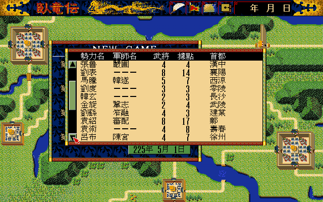
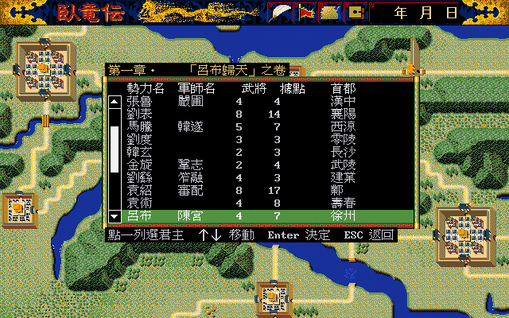

### 4.2 編成候選清單多了君主

原版的候選是**張遼、陳登**兩人；remake 走啟動殼層時列出**呂布、張遼、陳登**，
呂布那一列的「身分」欄還寫著「君主」。

原因不是規則寫錯：`docs/spec/76` 把「主君能不能編成」做成系統選單的一列，
預設放行是使用者裁定的 remake 差異，對拍要用 `-lord-corps=false`。
**但那個旗標只接在直啟分支**——`cmd/wlgame/main.go:1769` 的
`g.lordCorps = *lordCorpsFlag` 在 `if (*directStart || directStartFlagWasPassed())`
裡面，走啟動殼層那條 `else` 完全不會執行，所以正常玩家路徑永遠是「放行」，
命令列也關不掉。

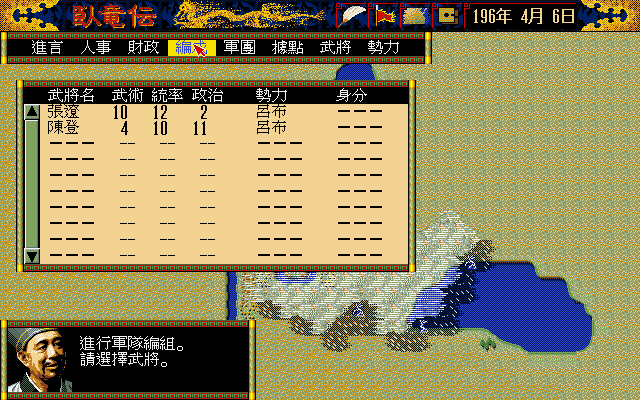
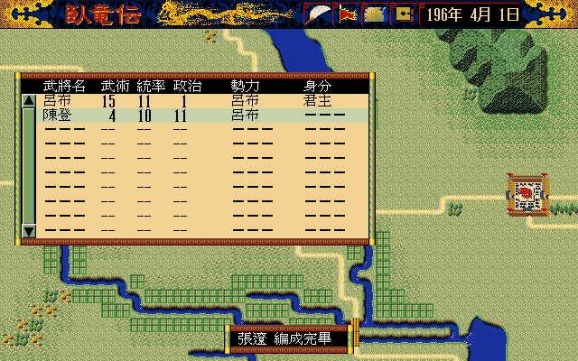

### 4.3 進言進入說服迴圈之前，少了君主的那一句

原版的順序是三句：

```
① 君主   #86 + 說話類型      呂布是類型 1 → #87「是什麼事啊，陳宮，說出來聽聽。」
② 軍師   #86 + 3 = #89       「想請主公答允對曹操的進兵。」
③ 君主   #86 + 4 + 2×3 + 1 = #97  「要是沒有勝算，那就不能答允！」
```

第三句演完才出五項理由選單。remake 只演了 ①②，選單就跳出來，
上框停在 ①。

出處在 `cmd/wlgame/advise.go:391`：

```go
switch reaction := persuasion.FirstReaction(g.adviseCmd, s, queued); reaction {
case persuasion.AskReason:
    g.sess = persuasion.Begin(g.adviseCmd, s)   // ← 這裡沒有 adviseSay
default:
    …
    g.adviseSay(adviseLord, persuasion.TalkReplyIndex(base, reaction, g.playerTalkVariant()))
```

`TalkReplyIndex` 在 `default` 分支叫得到，`AskReason` 這一支沒叫。
說話類型的選法本身是對的——同一顆 AppImage 在「已經交戰中」那條路
（4 月 17 日那一輪）顯示的是 #100「現在交戰中的是哪個國家！！你說說看啊！」，
正好也是類型 1 的變體。

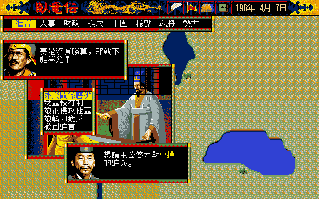
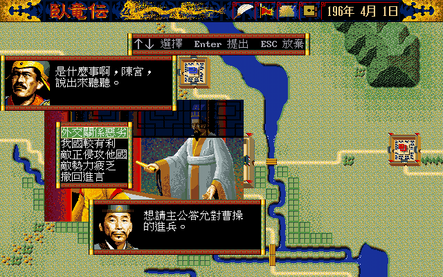

### 4.4 編成成功後少了主將的台詞

原版按下「確定」之後跳一張肖像框，張遼說 #453「我一定取回敵人的首級。」，
按掉才回武將一覽。remake 直接回一覽，只有畫面底部事件列的
「張遼 編成完畢」——那一行是 remake 自己的字，不是 `TALK.DAT` 的。
`grep 453` 在 `cmd/`、`internal/` 都沒有命中。

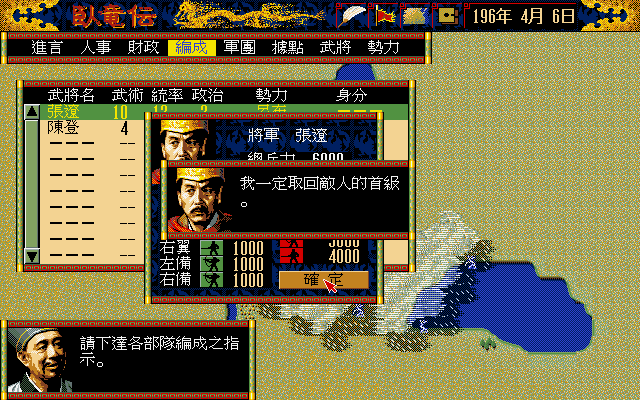

### 4.5 目標勢力清單的外交欄：原版「險惡」，remake「普通」（待驗）

| | 日期 | 曹操那一列的外交 |
|---|---|---|
| 原版 | 196/4/7 | **險惡** |
| remake | 196/4/5、196/4/8 | 普通 |

劇本檔的初值站在 remake 這邊：交友度矩陣（檔案偏移 `0x0680`、跨距 24）
裡 呂布→曹操 是 `0xAA`＝42，一級 20 分 ⇒ 顯示索引 3 ＝「普通」。
所以差別不在讀檔，在**頭一週有沒有把它降下去**：要顯示「險惡」得掉到 39 以下，
也就是至少 −3。

remake 的漂移只在 `runStrategicAI` 裡（新遊戲一次 ＋ 每月一次），
玩家勢力走 `driftPlayerFriendship`，對排序第一名 −1。原版看起來在同一段時間內
扣得更多。**這一項標成假設待驗**：要定案得在原版側逐日截 `勢力一覽`，
把降幅與時點量出來，再回頭讀 `sub_12BD9` 那一段。

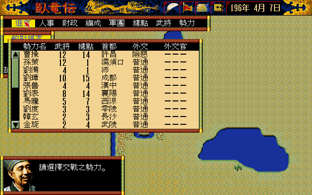
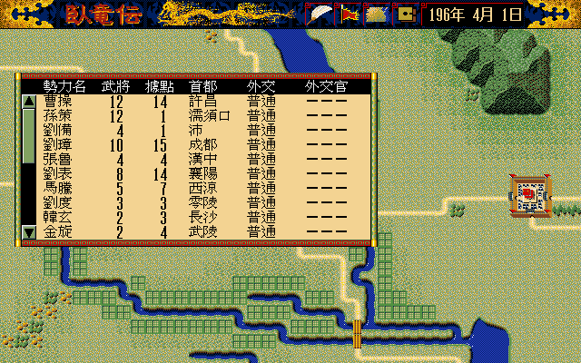

### 4.6 「軍團」在原版是彈出選單

原版點指令列的「軍團」會跳一張兩列的彈出選單：**位置確認／行軍指示**。
remake 的「軍團」（滑鼠或 `C`）直接開軍團一覽，行軍另外綁在 `M`，
沒有這一層選單。

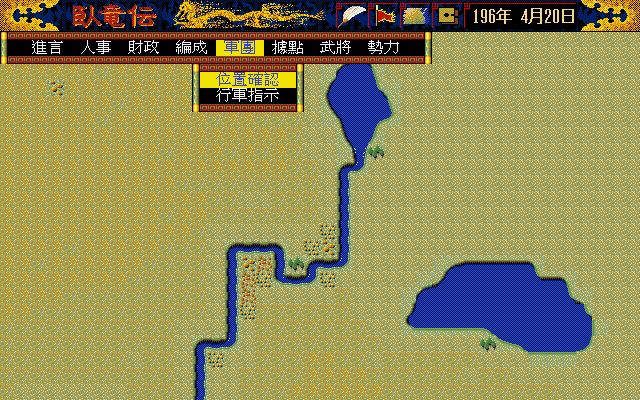

### 4.7 君主卡的兩顆鈕：原版米色，remake 灰色

君主卡的 1,859 個不同像素**全部落在 x 320–384、y 240–288**，也就是
「自定」「確定」兩顆鈕。肖像、欄位標題、「徐州」、數字 4 與 7 的每一欄
逐像素相同（數字的白像素欄位兩邊都是 264、267、269–277、281–283、288–295）。

| | 鈕的底 |
|---|---|
| 原版 | `(243, 211, 146)` |
| remake | `(210, 210, 210)` |

⭐ **這一項與 §4.1 是同一個根因。** 兩顆鈕走的是共用的 `dlButton`
（`cmd/wlgame/displaylist.go:84`），底色查的是調色盤索引 `0x07`；
而查表的 `paletteInk`（`cmd/wlgame/strategyhud.go:317`）開頭是

```go
if g.lib == nil || g.world == nil {
    return fallback
}
```

**啟動殼層的 `g.world` 是 nil**——那一頁預覽用的世界存在另一個欄位
`launcherPreviewWorld`（`cmd/wlgame/main.go:234`）。所以殼層畫的每一個
UI 顏色都退回硬寫的近似值，不是原版調色盤。

反證很乾淨：**同一支 `dlButton` 進了遊戲就對了**——編成面板的「確定」鈕
在 §3 第 13 列是逐像素相同的，因為那時候 `g.world` 已經有了。

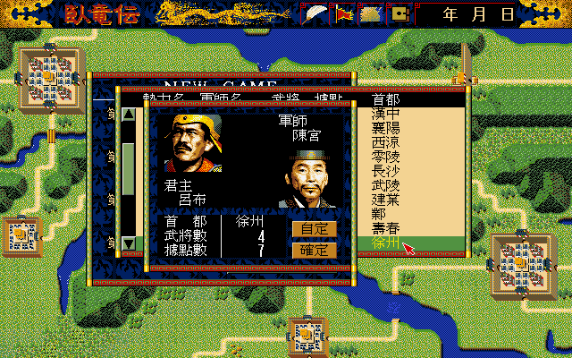
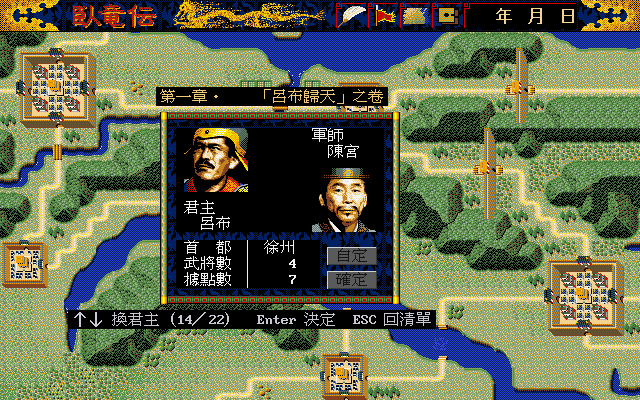

## 5. 對不上的地方，為什麼對不上

**日期一定會漂。** 這一款是即時制，兩邊各自跑自己的時鐘：同一串操作，
原版三次跑出 4/2、4/5、4/6，remake 在最低速檔停在 4/1。
原因有兩層——原版的預設戰略速度檔與 remake 的 `-speed` 不是同一格，
而且 `wait:` 是**牆鐘**時間，主機負載高的時候同樣的 `wait:5` 對應到的模擬時間更少
（這一輪量到主機 load 一度到 31，14 核）。

所以這一份的判準是「**同一個關卡的畫面**」，不是「同一個時刻的畫面」。
要做逐像素就得先讓兩邊停在同一個狀態——`docs/spec/90` 的做法是拿原版存檔
餵 `-load-slot`，那條路已經在 `docs/playtest/37`／`40`／`42` 走過。

## 6. 未解

| 項目 | 缺什麼 |
|---|---|
| 原版的行軍目的地一覽與三選一 | **「軍團」彈出選單的第二列「行軍指示」點不到。** 四輪都停在第一列「位置確認」：`tap:25,10,5`、`tap:25,9,5`、`click:25,10;press` 三種送法都一樣。這與 `docs/playtest/42` §5 記的是同一類限制——`playtest/54` 證明的是「**能把選單開起來而不選走第一列**」，不等於「點得到第二列」。remake 側已有（`d6`／`d7`）|
| 原版的攻城結算 | 卡在上一列。remake 側在 196/4/8「張遼 對 城兵　攻方勝　兵力 1000→960／910→60　據點損害 54　攻下 譙」|
| §4.5 的外交欄降幅 | 原版側缺逐日量測 |
| 攻城**戰場**（不是結算）| 兩邊都一樣：空城攻城是自動判定，不進戰術畫面（`internal/state/corps.go` 的 `fightGarrison`；原版 `sub_14ED7` 的 `cmp bx, 4200h`）。要看到戰場得等守方有軍團駐守，而那一刻兩邊不會同時發生 |

## 7. 順帶量到的

- **AppImage 本身沒問題**：解出來的 `AppRun` 在無 X 的容器裡開得起來、
  中文字型載得到、原版素材讀得到、四層新遊戲走得完、能編成、能行軍、能打下城。
- **兩邊的曹操都很早就對呂布宣戰**：原版在 196/4/9 跳訊息框「曹操　對我發出宣戰佈告了。」
  （`probe-lubu-march3/m10`）；remake 在 4/17 的目標勢力清單上，曹操那一列的外交已經是
  紅色的「交戰」。方向一致，時點各自不同——這正是 §5 說的即時制。
  ⚠ 副作用：**一旦被宣戰，玩家自己的「敵對提案」就短路**成 #100
  「現在交戰中的是哪個國家！！你說說看啊！」（`persuasion.FirstReaction` 的
  `atWarWithThem → AlreadyAtWar`），所以這一輪的宣戰要在開局頭幾天內做完。
- remake 的行軍目的地一覽是**照距離排序**的（`cmd/wlgame/corps.go` 的
  `pickDestination`），原版沒有距離欄也沒有這個排序。這是既有文件已經標記過的
  remake 便利，不是這一輪新發現的差異。
