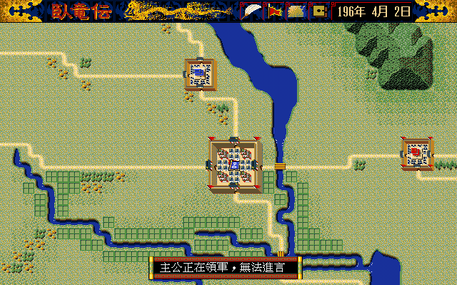

# 57 — 重打包後的 AppImage 複驗（呂布這條流程）

**狀態：完成。** [`56`](56-lubu-flow-parity.md) 的修正是拿原始碼重建的執行檔驗的，
這一份把同一批修正重打成 AppImage 之後再驗一次。**六個可對齊的關卡數字與 `56` 完全一致**，
沒有「原始碼對、包出來不對」的落差。原版側今天重跑一次當正對照，
與 9 月 1 日存下的參考圖**逐像素相同**。

- 日期：2026-09-02
- remake 側：`dist-all/packages/wolong-remake-linux-amd64-20260902.AppImage`
  （完整版，內含遊戲檔案），SHA-256
  `db3909bfaa82f495b5ff97f3e598560f1810e8a9fbf5bd3b012d11de0c8526ed`

- 包裡的執行檔 `usr/bin/wlgame`，SHA-256
  `cb9b2a6937406d906e882f91ada04ab3232158196a7a87b2bf566129a3871698`
- 原版側：松崗 DOS/V，`workplace/orig/dosv/` 唯讀掛載，DOSBox-X
  `core=normal`／`cycles=fixed 20000`
- 打包：`tools/release_appimage.sh 20260902`（只重打 Linux amd64，其餘產物不動）

## 1. 這一輪要回答的問題

`56` 回答的是「remake 的行為對不對」，這一份只回答一個更窄的問題：
**把修好的原始碼包成 AppImage 之後，跑出來的畫面還是同一個嗎。**

分兩層各自有獨立證據：

| 層 | 問題 | 證法 |
|---|---|---|
| 包裝 | 這顆 AppImage 真的含這批修正嗎 | 解開後對 `usr/bin/wlgame` 找新字串，**並拿舊包當負對照** |
| 行為 | 跑起來的畫面與原版相同嗎 | 六個關卡逐像素，與 `56` 的數字比對 |

### 1.1 包裝層：正負對照各一

`主公正在領軍，無法進言` 是這批修正才有的字串（[`../spec/111`](../spec/111-lord-with-corps-blocks-advise.md)）：

| 字串 | 20260830（修正前）| 20260902（修正後）|
|---|---:|---:|
| `主公正在領軍，無法進言` | **0** | 3 |
| `位置確認` | 2 | 3 |
| `行軍指示` | 8 | 9 |

⚠ **只有第一列有鑑別力。** `位置確認`／`行軍指示` 兩個詞在舊包裡就有
（行軍那條路徑本來就在），拿它們當判準會得到「兩包都有，看起來都對」。
**負對照要真的是零**，不然那一列只是在自我確認。

## 2. 逐關卡結果

原版參考圖沿用 `56` 的那一批（來源與座標規則見 `56` §2），rect 也沿用同一組，
數字才可比。

| 關卡 | rect | `56`（原始碼建置）| 本輪（AppImage）| 判定 |
|---|---|---:|---:|---|
| 勢力清單本體 | `152,104,368,160` | 0 / 58,880 | **0 / 58,880** | PASS |
| 君主卡 | `160,112,240,192` | 0 / 46,080 | **0 / 46,080** | PASS |
| 指令列 | `0,32,432,32` | 0 / 13,824 | **0 / 13,824** | PASS |
| 進言上框 | `0,80,256,80` | 30 / 20,480 | **30 / 20,480** | NEAR |
| 編成面板 | `144,112,240,192` | 74 / 46,080 | **74 / 46,080** | NEAR |
| 軍團選單 | `184,56,120,56` | （沒比過）| 4,298 / 6,720 | 見 §3 |

兩個 NEAR 的殘差都是**原版錄影裡的滑鼠游標**，不是 remake 畫錯的像素（`56` §3）。

### 2.1 與上一輪的 remake 產物互比

比「AppImage vs 原始碼建置」更直接的一層：同一個關卡，兩邊的 remake 截圖互比。

| 關卡 | 差異 |
|---|---:|
| 勢力清單（整張 640×400）| 0 / 256,000 |
| 進言上框那一張（整張）| 0 / 256,000 |
| 君主卡（整張）| 0 / 256,000 |
| 編成成功台詞（整張）| 0 / 256,000 |
| 軍團選單（rect）| 0 / 6,720 |
| 編成面板（整張）| 48 / 256,000 —— **全部落在橫幅的日期**（4 月 1 日 vs 4 月 2 日），橫幅以下 0 / 235,520 |

日期會差是即時制的必然（`56` §5），與包裝無關。

## 3. 軍團選單的 63.96% 不是回歸

`184,56,120,56` 這一格 FAIL，數字是 4,298 / 6,720。**上一輪的 remake 截圖拿同一個
rect 比同一張原版參考，得到的是同一個 4,298**，而兩張 remake 截圖彼此是 0 / 6,720。

成因在 `56` §6 已經記過：**那張原版參考是另一個局面**（4/20、讀了存檔、
游標停在第一列），拿來做逐像素本來就不成立。位置與兩列文字對得上，
框本身要等一張同狀態的原版參考才能比。

## 4. 原版側的正對照

用存下來的參考圖做對拍，前提是「原版今天跑出來還是同一張」。這一輪重跑一次驗它：

| 關卡 | 今天重跑 vs 9/1 存檔 |
|---|---:|
| 勢力清單 `152,104,368,160` | 0 / 58,880 |
| 君主卡 `160,112,240,192` | 0 / 46,080 |

兩張都是**開局前**的畫面，不受遊戲時鐘影響，所以可以逐像素重現；
`56` §5 講的日期漂移只影響進遊戲之後的畫面。

`tools/parity_diff.py --selftest` 也跑過（同圖每區 0、平移 1 px 每區非 0）。

## 5. 進言閘的端對端驗證

六項修正裡，五項在 §2 的關卡有逐像素證據，只有「君主帶著軍團時進言關掉」
（[`../spec/111`](../spec/111-lord-with-corps-blocks-advise.md)）沒有對應的原版畫面可比——
**原版根本走不到這個狀態**，它的編成候選排除君主。所以這一項改用端對端實跑驗：

```
選呂布 → 主畫面 → 編成 → 候選第一列（呂布）→ 確定 → ESC → 進言
```

拍到的三張：

1. `t2-formed`：事件列「呂布　編成完畢」，**沒有跳台詞框**——主公型那三格
   （TALK 446–448）是空的，取到空字串就不開框（[`../spec/109`](../spec/109-formation-leader-line.md)）。
   候選清單同時少了呂布，剩張遼與陳登。
2. `t3-back`：回到主畫面。
3. `t4-advise-blocked`：按 `p` 之後**進言選單沒有開**，事件列印
   「主公正在領軍，無法進言」。



判準與「請求君主出陣」共用 `World.LordLeadsCorps()`（`internal/state/advise.go`），
單元測試在 `internal/state/advise_test.go` 的 `TestLordLeadsCorpsSharedWithSortie`
與 `TestLordLeadsCorpsAfterManualFormation`。

## 6. 重跑用的指令

```sh
# 打包
tools/release_appimage.sh 20260902

# remake 側（主流程）
WOLONG_WLGAME_BIN=dist-all/packages/wolong-remake-linux-amd64-20260902.AppImage \
WOLONG_WLGAME_SCENARIO_ARGS= \
tools/wlgame_capture.sh rev0902-a \
"wait:4;key:Return;wait:1.3;key:Return;wait:1.3;key:Return;wait:3.2;\
keyrep:Down,13;wait:1.3;shot:s1-list;key:Return;wait:1.3;shot:s2-card;\
key:Return;wait:1.3;key:Return;wait:2;key:p;wait:1.3;key:Return;wait:1.6;\
key:Return;wait:1.1;key:Return;wait:2;key:Return;wait:2;shot:s5-askreason;\
key:Return;wait:1.6;shot:s6-reasons;key:Escape;wait:1.3;key:a;wait:2;shot:s7-cands;\
key:Down;wait:0.6;key:Return;wait:0.8;key:Return;wait:2;shot:s8-formpanel;\
key:Return;wait:2.4;shot:s9-formsaid;key:Return;wait:1.3;key:Escape;wait:1.3;\
key:c;wait:1.6;shot:s10-corpsmenu" -speed 4 -audio /tmp

# 原版側正對照（開局前的兩張，與時鐘無關）
tools/dosv_capture.sh rev0902-orig \
"wait:150;click:320,215;wait:3;click:300,190;wait:5;\
click:144,326;wait:0.8;click:144,326;wait:0.8;click:144,326;wait:0.8;\
click:144,326;wait:1.5;shot:o-list;click:450,326;wait:1.5;press;wait:3;shot:o-card"
tools/py.sh tools/parity_crop.py <上面的 png> <400 版>
```

## 7. 這一輪踩到的

- **擷取失敗有兩種，長得不一樣。** 第一次跑主流程時容器裡的 `glfw: X11: Failed to
  open display :99`——Xvfb 起來的檢查過了，wlgame 開視窗還是失敗。同一支腳本
  接著跑的第二輪一次就過，判斷是主機負載造成的競態（當時 load 113／14 核，
  後來到 143）。**重試前先看是哪一種失敗**：時間軸走錯位會留下截圖，
  這一種一張都沒有。
- **原版側不必每輪重跑。** 原版是唯讀的，參考圖存著就是 oracle；
  重跑的價值在於**確認 oracle 還原得出來**（§4），不在於重新取樣。
  高負載時重跑原版反而更不可信——`wait:` 是牆鐘，模擬時間會落後。

## 8. 未解

沿用 `56` §6，沒有新增：軍團選單的同狀態原版參考、原版的行軍目的地一覽、
原版的攻城結算、捲軸滑塊那 1 px。
